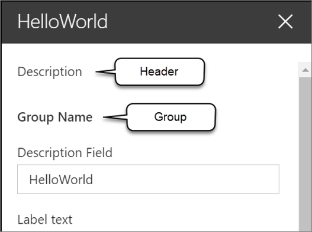

In this unit, you'll learn how to use the property pane in your SharePoint Framework client-side web part components.

## Overview

The property pane has three key elements: pages, headers, and groups.


A page is the entire visible panel of the property pane shown in the task pane.

The header is an optional section at the top of the property pane. It includes a description that you can set from the web part's code.

Each page on the property pane contains one or more groups. Groups contain one or more field controls used to display or collect information from the user.

We can have different groups that contain different fields and that allows us to group things within a specific page.



The SharePoint Framework API includes the following property pane field controls you can use in your custom web parts:

- label
- textbox
- checkbox
- dropdown
- link
- slider
- toggle

The label control is used to display text, while the other controls are used as form controls for the user to modify the public properties on the web part.

Developers can also create custom property pane field controls, or use third-party controls, when one of the existing controls doesn't meet the business requirements.

> [!NOTE]
> In this module and in the SharePoint Framework documentation on property pane controls, you will see the terms **property pane field**, **property pane field control**, and **property pane control** all used to refer to property pane controls. You can consider these terms to be synonymous.

## Implementing the header, groups, and fields

The property pane is defined by your web part using a specific method. The SharePoint Framework will call the `getPropertyPaneConfiguration()` method on your web part to retrieve an object that implements the `IPropertyPaneConfiguration` interface.

The returned object contains a single property `pages` that returns an array of property pane pages:

```typescript
protected getPropertyPaneConfiguration(): IPropertyPaneConfiguration {
  return {
    pages: [
      {
        header: {
          description: strings.PropertyPaneDescription
        },
        groups: [
          {
            groupName: strings.BasicGroupName,
            groupFields: [
              PropertyPaneTextField('description', {
                label: strings.DescriptionFieldLabel
              })
            ]
          }
        ],
      }
    ]
  };
}
```

Each page has an optional `header` property and a `groups` array. Each group can have a name and collection of fields assigned to it.

In the previous code, notice the single group has a name and a single text field control. This field control is mapped to the `description` property on the web part, defined in the web part's interface.

## Implement web part properties with the property pane

Let's look at how you can implement custom properties on your web part and enable users to modify their values using the property pane.

The first step is to define the web part interface that's created as part of the web part creation process. This interface is located in the same file as the web part class. These properties will be mapped to specific field controls in your property pane.

```typescript
export interface IHelloPropertyPaneWebPartProps {
  description: string;
  myContinent: string;
  numContinentsVisited: number;
}
```

Next, you need to import the field control objects into your web part's class. These controls are located in the **@microsoft/sp-property-pane** package.

```typescript
import {
  IPropertyPaneConfiguration,
  PropertyPaneTextField,
  PropertyPaneSlider
} from '@microsoft/sp-property-pane';
```

The last step is to add controls to the `groupFields` array in a group for a page returned in the `getPropertyPaneConfiguration()` method. The first argument in each control's reference is the name of the property it maps to:

```typescript
protected getPropertyPaneConfiguration(): IPropertyPaneConfiguration {
  return {
    pages: [{
      groups: [{
        groupFields: [
          PropertyPaneTextField('description', {
            label: strings.DescriptionFieldLabel
          }),
          PropertyPaneTextField('myContinent', {
            label: 'Continent where I currently reside',
            onGetErrorMessage: this.validateContinents.bind(this)
          }),
          PropertyPaneSlider('numContinentsVisited', {
            label: 'Number of continents I\'ve visited',
            min: 1, max: 7, showValue: true,
          })
        ]
      }]
    }]
  };
}
```

## Handle property field control changes

The next step to customizing the property pane is to define how you want to handle changes to the properties in the property pane. The property pane has two different modes: **reactive** and **non-reactive**.

The default mode is reactive. In this mode, changes the value of the property pane controls are immediately applied to the associated properties of the web part.

In the non-reactive mode, changes to field controls aren't immediately applied to the associated property of the control. The user must select the **Apply** button at the bottom of the property pane that is only rendered when the web part's property pane is in non-reactive mode.

> [!NOTE]
> The non-reactive mode of client-side web part property panes matches how legacy server-side web part property panes worked.

When properties change from edits in the web part's property pane, the SharePoint Framework will call the `render()` method again to re-render the web part with the new property values.

### Modify the property pane configuration mode

To change the property pane from the default reactive mode to be non-reactive, you'll override a property on the web part's base class: `disableReactivePropertyChanges`. This property is set to `false` by default, but overriding it to return `true` will set the property pane to non-reactive.

```typescript
export default class HelloPropertyPaneWebPart extends BaseClientSideWebPart<IHelloPropertyPaneWebPartProps> {
  public render(): void { /* .. */ }

  protected get disableReactivePropertyChanges(): boolean {
    return true;
  }
}
```

## Add configuration properties to React client-side web parts

In the case where you're using React to implement client-side web parts, you'll likely want to handle the case when properties are changed if you're using the web part's properties in the React control.

Let's start with a simple React client-side web part. The properties on the web part, in this case, the `description` property is set on the public property of the React control:

```typescript
public render(): void {
  const element: React.ReactElement<IHelloWorldWebPartProps> = React.createElement(HelloWorldComponent, {
    description: this.properties.description
  });

  ReactDom.render(element, this.domElement);
}
```

Within the React control, implement two React lifecycle event handlers. The method `componentDidMount()` is called when the control is initially loaded on the page, while the `componentDidUpdate()` is called when the properties on the component change. In this case, both methods will call the `doSomething()` method that will handle the property's value:

```typescript
public componentDidMount(): void {
  this.doSomething(this.props.description);
}

public componentDidUpdate(prevProps: IHelloWorldWebPartProps,
                          prevState: IHelloWorldWebPartState): void {
  if (this.props.description !== prevProps.description) {
    this.doSomething(this.props.description);
  }
}

private doSomething(description: string): void {
  // Do something with the property
}
```

## Summary

In this unit, you learned how to use the property pane in your SharePoint Framework client-side web part components.
