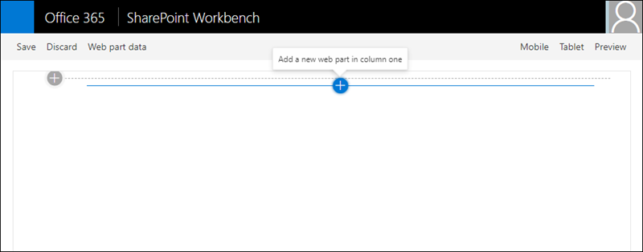
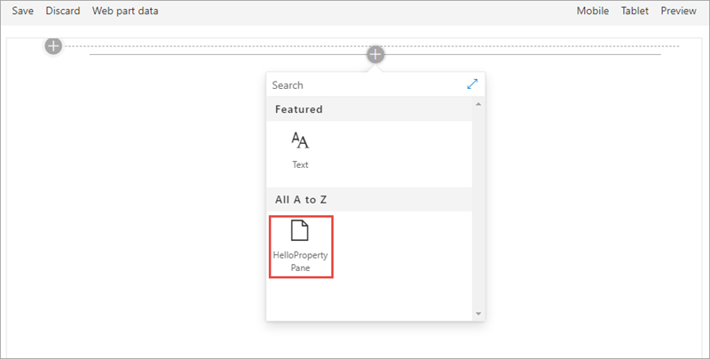
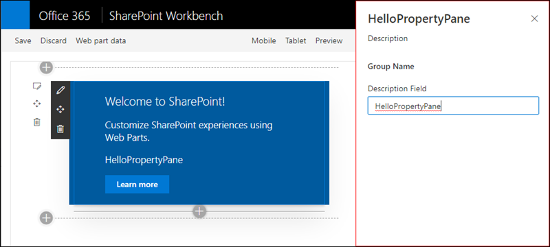
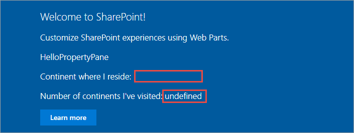
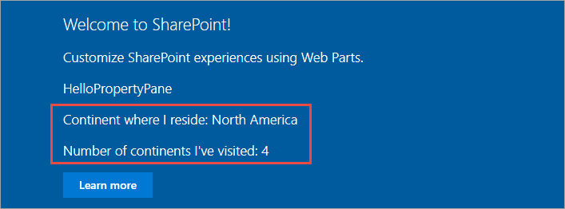
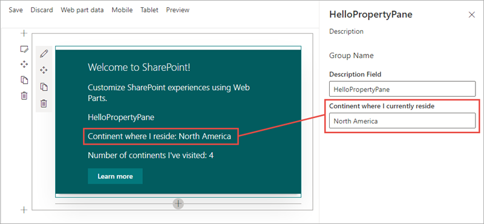
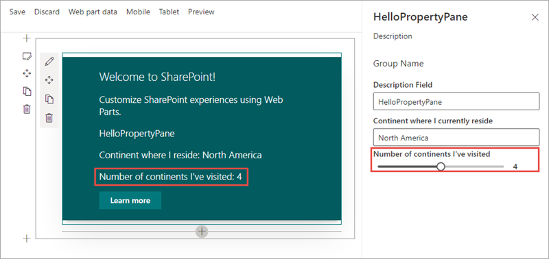
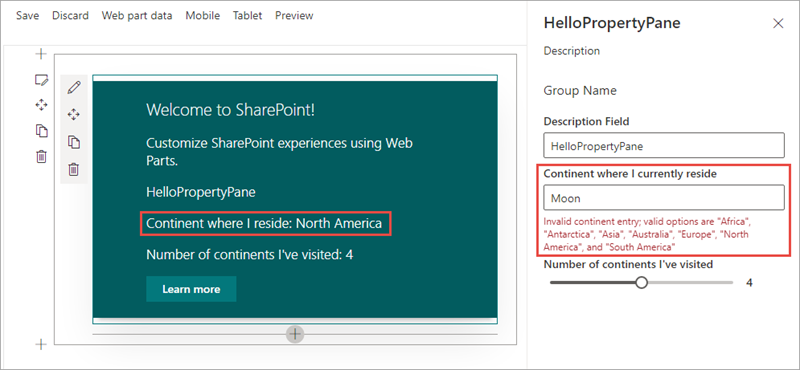

In this exercise, you'll manipulate the property pane for a SharePoint Framework client-side web part with controls, groups, and pages.

## Create a new ShareaPoint Framework solution and web part

Open a command prompt and change to the folder where you want to create the project.

Run the SharePoint Framework Yeoman generator by executing the following command:

```shell
yo @microsoft/sharepoint
```

Use the following to complete the prompt that is displayed (*if additional options are presented, accept the default answer*):

- **What is your solution name?:** HelloPropertyPane
- **Which baseline packages do you want to target for your component(s)?:** SharePoint Online only (latest)
- **Where do you want to place the files?:** Use the current folder
- **Do you want to allow the tenant admin the choice of being able to deploy the solution to all sites immediately without running any feature deployment or adding apps in sites?:** No
- **Will the components in the solution require permissions to access web APIs that are unique and not shared with other components in the tenant?:** No
- **Which type of client-side component to create?:** WebPart
- **What is your Web part name?:** HelloPropertyPane
- **What is your Web part description?:** HelloPropertyPane description
- **Which framework would you like to use?:** No JavaScript framework

Next, verify everything is working. Execute the following command to build, start the local web server, and test the web part in the local workbench:

```shell
gulp serve
```

When the browser loads the local workbench, select the **Add a new web part** control:



Select the **HelloPropertyPane** web part to add the web part to the page:



Select the **edit web part** control to the side of the web part to display the property pane:



## Add New Properties to the web part

With a working web part, the next step is to customize the property pane experience. Create two new properties that will be used in the web part and property pane. Open the file **.\src\webparts\helloPropertyPane\HelloPropertyPaneWebPart.ts**. Locate the interface `IHelloPropertyPaneWebPartProps` after the `import` statements. Add the following two properties to the interface:

```typescript
myContinent: string;
numContinentsVisited: number;
```

Update the web part rendering to display the values of these two properties. Within the `HelloPropertyPaneWebPart` class, locate the `render()` method and find the following line in the HTML output:

```html
<p class="${ styles.description }">${escape(this.properties.description)}</p>
```

Add the following two lines after the line you located:

```html
<p class="${ styles.description }">Continent where I reside: ${escape(this.properties.myContinent)}</p>
<p class="${ styles.description }">Number of continents I've visited: ${this.properties.numContinentsVisited}</p>
```

At the moment, the web part will render a blank string and **undefined** for these two fields as nothing is present in their values:



This can be addressed by setting the default values of properties when a web part is added to the page. Open the file **.\src\webparts\helloPropertyPane\HelloPropertyPaneWebPart.manifest.json**.

Locate the following section in the file: `preconfiguredEntries[0].properties.description`. Add a comma after the `description` property's value and add the following two lines after the `description` property:

```json
"myContinent": "North America",
"numContinentsVisited": 4
```

> [!TIP]
> While the **gulp serve** task monitors the project's files for changes to rebuild and reload the local workbench, changes to the manifest and configuration files require restarting the local web server.

In the command prompt, press <kbd>CTRL+C</kbd> to stop the local web server. Rebuild and restart the local web server by executing the command **gulp serve**. When the SharePoint workbench loads, add the web part back to the page to see the properties.



## Extend the property pane

Now that the web part has two new custom properties, the next step is to extend the property pane to allow users to edit the values.

Add a new text control to the property pane, connected to the **myContinent** property. Open the file **.\src\webparts\helloPropertyPane\HelloPropertyPaneWebPart.ts**. Locate the method `getPropertyPaneConfiguration()` and within it, locate the `groupFields` array. Add a comma after the existing `PropertyPaneTextField()` and add the following code to add a second text field control:

```typescript
PropertyPaneTextField('myContinent', {
  label: 'Continent where I currently reside'
})
```

If the local web server isn't running, start it by executing **gulp serve**. Once the SharePoint workbench is running again, add the web part to the page and open the property pane. Notice you can see the property and text box in the property pane. Any edits to the field will automatically update the web part:



Next, add a slider control to the property pane, connected to the **numContinentsVisited** property. In the **HelloPropertyPaneWebPart.ts**, at the top of the file, add a `PropertyPaneSlider` reference to the existing `import` statement for the `@microsoft/sp-webpart-base` package.

Scroll down to the method `getPropertyPaneConfiguration()` and within it, locate the `groupFields` array.

Add a comma after the last `PropertyPaneTextField()` call, and add the following code:

```typescript
PropertyPaneSlider('numContinentsVisited', {
  label: 'Number of continents I\'ve visited',
  min: 1, max: 7, showValue: true,
})
```

Notice the property pane now has a slider control to control the number of continents you've visited:



## Add control validation

In a previous step, the user was given a property where they could enter the name of the continent in which they live. Now add validation logic to ensure they enter a valid continent name.

In the **HelloPropertyPaneWebPart.ts**, add the following method to the `HelloPropertyPaneWebPart` class. This method takes a string as an input and returns a string. This allows you to do custom validation logic. If this method returns an empty string, the value is considered valid; otherwise, the returned string is used as the error message.

```typescript
private validateContinents(textboxValue: string): string {
  const validContinentOptions: string[] = ['africa', 'antarctica', 'asia', 'australia', 'europe', 'north america', 'south america'];
  const inputToValidate: string = textboxValue.toLowerCase();

  return (validContinentOptions.indexOf(inputToValidate) === -1)
    ? 'Invalid continent entry; valid options are "Africa", "Antarctica", "Asia", "Australia", "Europe", "North America", and "South America"'
    : '';
}
```

Now you can connect the validation method to the text field control you previously added. Locate the text field that is associated with the **myContinent** property.

Add the following code to the options object passed into the `PropertyPaneTextField()` call as the second parameter: `onGetErrorMessage: this.validateContinents.bind(this)`. The text field control should now look like the following code:

```typescript
PropertyPaneTextField('myContinent', {
  label: 'Continent where I currently reside',
  onGetErrorMessage: this.validateContinents.bind(this)
}),
```

If the local web server isn't running, start it by executing **gulp serve**. Once the SharePoint Workbench is running again, add the web part to the page and open the property pane. Enter the name of a non-existent continent to test the validation logic:



Notice the property value isn't updated when the control's input is invalid.

## Summary

In this exercise, you'll manipulate the property pane for a SharePoint Framework client-side web part with controls, groups, and pages.
