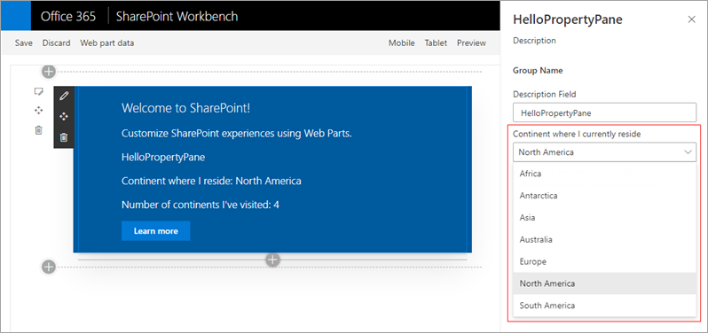

In this unit, you'll learn about custom property pane controls for client-side web parts.

## Overview

The SharePoint Framework API for client-side web parts includes the following property pane field controls you can use in your custom web parts:

- label
- textbox
- checkbox
- dropdown
- link
- slider
- toggle

Developers can also implement a custom property pane field when you want to customize how the control is rendered.

## Implement custom property pane field controls

To implement a custom property pane field control, you'll first import the `PropertyPaneCustomField` class from the **@microsoft/sp-property-pane** class.

Next, add a property to your web part's interface and map it to the field control. This is done the same way you map one of the provided controls to a property: specify the property by name as the first argument in the control:

```typescript
import { PropertyPaneCustomField } from '@microsoft/sp-property-pane';

export interface IHelloPropertyPaneWebPartProps {
  customField: string;
}

export default class HelloPropertyPaneWebPart extends BaseClientSideWebPart<IHelloPropertyPaneWebPartProps> {
  protected get propertyPaneSettings(): IPropertyPaneSettings {
    return {
      pages: [{
        header: { description: strings.PropertyPaneDescription },
        groups: [{
          groupName: strings.BasicGroupName,
          groupFields: [
            PropertyPaneCustomField('customField', { /* ... */ } ),
          ]
        }]
      }]
    };
  }
}
```

The `PropertyPaneCustomField` field control enables developers to define a custom rendering for the control. To do this, implement a method that accepts a single `HTMLElement` parameter. This element is a reference to the `<div>` where the control is rendered on the page.

```typescript
private _customFieldRender(elem: HTMLElement): void {
  elem.innerHTML = '<div><h1>This is a custom field.</h1></div>’;
}
```

Finally, bind the function to the `onRender` property on the `PropertyPaneCustomField` properties:

```typescript
groupFields: [
  PropertyPaneCustomField('customField', {
    onRender: this._customFieldRender.bind(this);
  })
]
```

## Create custom property pane controls

The `PropertyPaneCustomField` field control enables developers to define how the controls are rendered. all the code for rendering the control is in the web part where it's used.

While this solution will work for many one-off scenarios, you may have more complicated business requirements. In this scenario, you can create custom property pane controls that give you more control and are reusable across web part projects.



To use a custom field control in your web part, you'll just import it into the project and add a reference to it like the included field controls:

```typescript
groupFields: [
  PropertyPaneContinentSelector('myContinent', <IPropertyPaneContinentSelectorProps>{
    label: 'Continent where I currently reside',
    disabled: false,
    selectedKey: this.properties.myContinent,
    onPropertyChange: this.onContinentSelectionChange.bind(this),
  })
]
```

In the next unit, you'll create the custom field control shown in the figure above.

## Summary

In this unit, you'll learn about custom property pane controls for client-side web parts.
