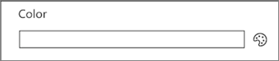
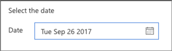
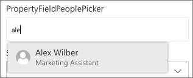

In this unit, you'll learn how you can use third-party controls from the popular PnP SPFx reusable property pane controls project.

## Overview

The property pane field controls included in the SharePoint Framework API are basic input controls. They enable developers to provide users an experience to edit public properties on the web part. These basic controls don't contain any special logic or detail about the current SharePoint site.

For example, if you wanted to provide an experience for your users to select an existing SharePoint list from the current site from a list in the property pane, you'll have to write the code to retrieve all the SharePoint lists and display them in the property pane.

This common requirement could be simplified so that a developer could create a custom property pane field control that, when added to the property pane, contained the logic to retrieve all lists from the current SharePoint site and display them in a dropdown control. You could also include settings on the control to include or exclude hidden lists, exclude SharePoint infrastructure lists such as the Master Page Gallery or Client Side Assets library, or other settings.

These *smart controls* can then be used across multiple SharePoint Framework client-side web part projects, simplifying the code in those projects because they don't have to populate the property pane with a list of all SharePoint lists in the site.

## Property pane controls for the SharePoint Framework

The SharePoint Patterns and Practices (PnP) group provides an open-source library, the **PnP reusable property pane controls**, containing reusable controls for use in the SharePoint Framework client-side web part property pane. These controls include this reusable logic that is tied to the current SharePoint site.

You can learn more about these controls at **https://sharepoint.github.io/sp-dev-fx-property-controls**.

This library contains multiple controls that you can use in your projects. Some of the controls include:

- **PropertyFieldColorPicker**: Select a color from a swatch or using the RGB values.

    

- **PropertyFieldDateTimePicker**: Select a date and time from a friendly picker control.

    

- **PropertyFieldListPicker**: Select a SharePoint list or lists from the current site.

    

- **PropertyFieldPeoplePicker**: Select people or groups from the current site's directory.

    

## Use the PnP reusable property pane controls in your project

To use the PnP reusable property pane controls in your project, you start by first installing the npm package that contains the controls:

```console
npm install @pnp/spfx-property-controls --save
```

Next, import only the controls into the web part file that you want to use.

```typescript
import {
  PropertyFieldListPicker,
  PropertyFieldListPickerOrderBy
} from '@pnp/spfx-property-controls/lib/PropertyFieldListPicker’;
```

> [!TIP]
> Ensure you only import the controls you want to use. When you import only specific objects, the bundling process will only include those objects and their dependencies in the resulting bundle. Otherwise, the entire library, including the controls you aren't using in your project, will be included in the bundle.

Finally, add the control to the list of `groupFields` in the `getPropertyPaneConfiguration()` method:

```typescript
groupFields: [
  PropertyFieldListPicker('lists', {
    label: 'Select a list',
    selectedList: this.properties.lists,
    includeHidden: false,
    orderBy: PropertyFieldListPickerOrderBy.Title,
    disabled: false,
    onPropertyChange: this.onPropertyPaneFieldChanged.bind(this),
    properties: this.properties,
    context: this.context,
    onGetErrorMessage: null,
    deferredValidationTime: 0,
    key: 'listPickerFieldId'
  })
]
```

## Summary

In this unit, you learned how you can use third-party controls from the popular PnP SPFx reusable property pane controls project.
