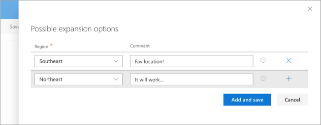
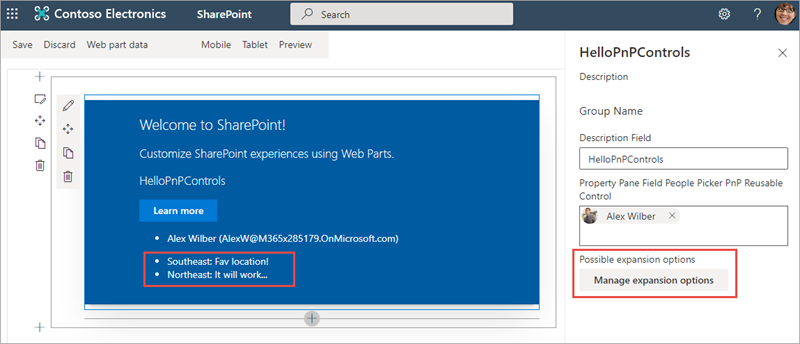

In this exercise, you'll learn how to use existing third-party controls from the popular [PnP SPFx Reusable Property Pane Controls](https://sharepoint.github.io/sp-dev-fx-property-controls) project.

## Create a new SharePoint Framework solution and web part

Create a new SPFx project that contains a single web part using no JavaScript framework for SharePoint Online with the Yeoman generator using the same steps from the first exercise. Allow the generator to scaffold the project and install all the necessary packages.

## Install the PnP SPFx reusable property pane controls

Open a command prompt and change to the folder for the root of the project. Execute the following command to install the controls:

```console
npm install @pnp/spfx-property-controls --save --save-exact
```

## Add the People Picker control to the web part

Open the project folder in **Visual Studio Code**.

Locate the web part class in the **src\webparts\\\*\\\*WebPart.ts** file.

> The actual path will depend on the name you gave the web part when running the Yeoman generator.

Within the web part class, add the following `import` statements to the top of the file after the existing `import` statements:

```typescript
import {
  IPropertyFieldGroupOrPerson,
  PropertyFieldPeoplePicker,
  PrincipalType
} from '@pnp/spfx-property-controls/lib/PropertyFieldPeoplePicker';
```

Locate the interface for the web part. It will be located immediately after the `import` statements and be named something similar to `IHelloWorldWebPartProps`, depending on the name of the web part.

Add the following property to the interface to store the people selected by the new control you're about to add to the property pane:

```typescript
people: IPropertyFieldGroupOrPerson[];
```

### Display the selected people

Locate the web part's `render()` method. Within this method, there's an HTML anchor `<a>` element. Add the following immediately after the `<a>` element:

```html
<div class="selectedPeople"></div>
```

Add the following code at the end of the `render()` method. If any people have been selected, this will display their full names and email addresses in the `<div>` element you just added to the rendering:

```typescript
if (this.properties.people && this.properties.people.length > 0) {
  let peopleList: string = '';
  this.properties.people.forEach((person) => {
    peopleList = peopleList + `<li>${ person.fullName } (${ person.email })</li>`;
  });

  this.domElement.getElementsByClassName('selectedPeople')[0].innerHTML = `<ul>${ peopleList }</ul>`;
}
```

### Add the property pane field control to the property pane

Locate the web part's `getPropertyPaneConfiguration()` method.

Within the `groupFields` array, add the following people picker field control. This will bind the field control to the `people` property previously added to the web part's properties:

```typescript
PropertyFieldPeoplePicker('people', {
  label: 'Property Pane Field People Picker PnP Reusable Control',
  initialData: this.properties.people,
  allowDuplicate: false,
  principalType: [PrincipalType.Users, PrincipalType.SharePoint, PrincipalType.Security],
  onPropertyChange: this.onPropertyPaneFieldChanged,
  context: this.context as any,
  properties: this.properties,
  onGetErrorMessage: null,
  deferredValidationTime: 0,
  key: 'peopleFieldId'
})
```

## Configure the hosted workbench

Locate and open the file **config/serve.json**

In the **serve.json** file, locate the `initialPage` setting. It's currently configured with a placeholder URL.

```json
"initialPage": "https://enter-your-SharePoint-site/_layouts/workbench.aspx",
```

Update the `initialPage` setting to open the hosted workbench:

```json
"initialPage": "https://contoso.sharepoint.com/sites/mySite/_layouts/workbench.aspx",
```

> [!NOTE]
> Ensure you enter the proper URL of a SharePoint Online site collection you have access to.

## Test the web part

The benefit of using the people picker control is that it contains the logic necessary to call the SharePoint APIs that list users and groups within the current site.

Start the project by executing **gulp serve** from the command line in the root of the project.

If you see this warning in the hosted workbench, switch back to the command prompt, wait for the **reload** subtask to finish executing, and then refresh the hosted workbench. 


Add the web part to the page using the same process from the previous exercises.

Once the web part has been added to the page, open the property pane with the edit web part icon using the same process from the previous exercises. Use the input control to find and select a user from the current site as shown in the following figure:


## Add the Collection Data control to the web part

Locate the web part class in the **src\webparts\\\*\\\*WebPart.ts** file.

> The actual path will depends on the name you gave the web part when running the Yeoman generator.

Within the web part class, add the following `import` statements to the top of the file after the existing `import` statements:

```typescript
import {
  PropertyFieldCollectionData,
  CustomCollectionFieldType
} from '@pnp/spfx-property-controls/lib/PropertyFieldCollectionData';
```

Locate the interface for the web part. It will be located immediately after the `import` statements and be named something similar to `IHelloWorldWebPartProps`, depending on the name of the web part.

Add the following property to the interface to store the collection of data entered in the new control you're about to add to the property pane:

```typescript
expansionOptions: any[];
```

### Display the `expansionOptions` property data

Locate the web part's `render()` method and add the following immediately after the `<div class="selectedPeople"></div>` element that you added previously:

```html
<div class="expansionOptions"></div>
```

Add the following code at the end of the `render()` method. If any regions have been added, this will display their names and associated comments in the `<div>` element you just added to the rendering:

```typescript
if (this.properties.expansionOptions && this.properties.expansionOptions.length > 0) {
  let expansionOptions: string  = '';
  this.properties.expansionOptions.forEach((option) => {
    expansionOptions = expansionOptions + `<li>${ option['Region'] }: ${ option['Comment'] } </li>`;
  });
  if (expansionOptions.length > 0) {
    this.domElement.getElementsByClassName('expansionOptions')[0].innerHTML = `<ul>${ expansionOptions }</ul>`;
  }
}
```

### Add the property pane field control to the property pane

Locate the web part's `getPropertyPaneConfiguration()` method.

Within the `groupFields` array, add the following field collection control. This will bind the field control to the `expansionOptions` property previously added to the web part's properties:

```typescript
PropertyFieldCollectionData('expansionOptions', {
  key: 'collectionData',
  label: 'Possible expansion options',
  panelHeader: 'Possible expansion options',
  manageBtnLabel: 'Manage expansion options',
  value: this.properties.expansionOptions,
  fields: [
    {
      id: 'Region',
      title: 'Region',
      required: true,
      type: CustomCollectionFieldType.dropdown,
      options: [
        { key: 'Northeast', text: 'Northeast' },
        { key: 'Northwest', text: 'Northwest' },
        { key: 'Southeast', text: 'Southeast' },
        { key: 'Southwest', text: 'Southwest' },
        { key: 'North', text: 'North' },
        { key: 'South', text: 'South' }
      ]
    },
    {
      id: 'Comment',
      title: 'Comment',
      type: CustomCollectionFieldType.string
    }
  ]
})
```

## Test the web part

If you stopped the local web server after adding the people picker control, start the project by executing **gulp serve** from the command line in the root of the project and add the web part to the page using the same process from the previous exercises. Otherwise, refresh the workbench.

Open the property pane with the edit web part icon using the same process from the previous exercises. Select the **Manage expansion options** button.

Enter a few values in the provided fields, then select **Save**.



Notice the values entered are displayed within the web part:



## Summary

In this exercise, you learned how to use existing third-party controls from the popular [PnP SPFx reusable property pane controls](https://sharepoint.github.io/sp-dev-fx-property-controls) project.
