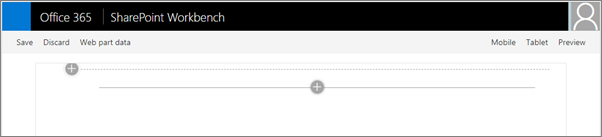
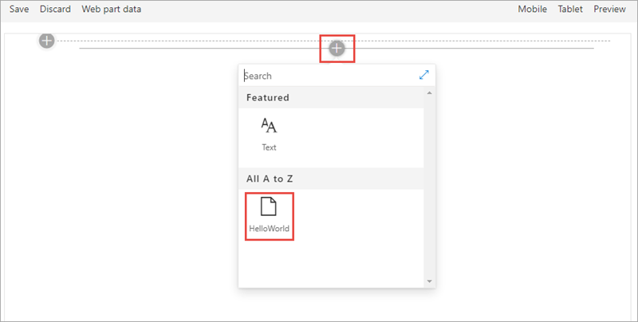
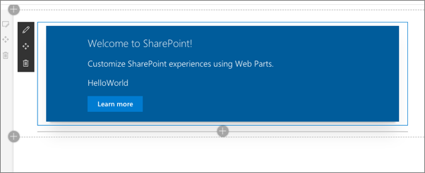
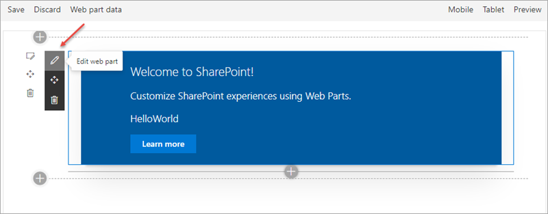
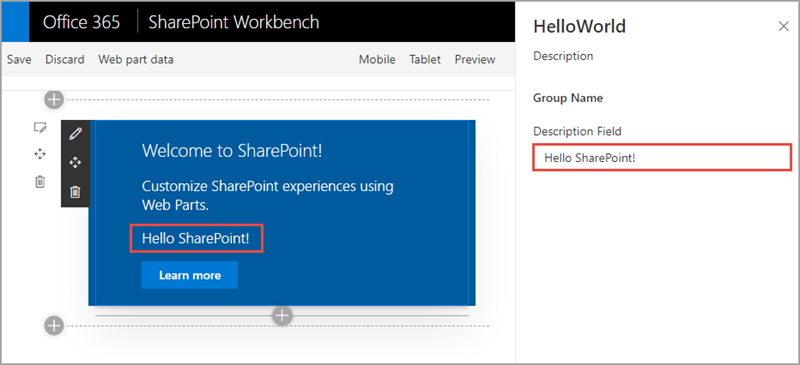
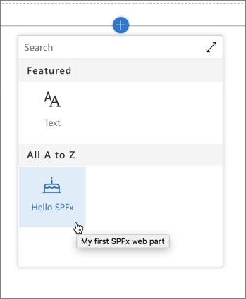

In this exercise, you'll create a SharePoint Framework client-side web part.

> [!IMPORTANT]
> The instructions below assume you're using v1.14.0 of the SharePoint Framework Yeoman generator. For more information on the use of the SharePoint Framework Yeoman generator, see [Yeoman generator for the SharePoint Framework](https://aka.ms/spfx-yeoman-info).

Open a command prompt and change to the folder where you want to create the project.

Run the SharePoint Yeoman generator by executing the following command:

```console
yo @microsoft/sharepoint
```

Use the following to complete the prompt that is displayed:

- **What is your solution name?**: HelloWorld
- **Which type of client-side component to create?**: WebPart
- **What is your Web part name?**: HelloWorld
- **Which framework would you like to use?**: No framework

After the generator scaffolds the folders required for the project, the generator will install all the dependency packages using npm.

When npm completes downloading all dependencies, ensure the developer certificate is installed by executing the following command:

```console
gulp trust-dev-cert
```

Run the project by executing the following command:

```console
gulp serve --nobrowser
```

The SharePoint Framework's gulp **serve** task with the **nobrowser** switch will build the project and start a local web server.

Wait for the **reload** subtask to finish executing. At this point, the web part will be ready for testing.



Open a browser and navigate to any SharePoint site in your tenant. If prompted, sign in using your Work or School credentials. Append the following to the end of the site's URL: **/_layouts/workbench.aspx**. This is the SharePoint-hosted workbench.



Select the web part icon button to open the list of available web parts, scroll down to the **Advanced** section, and select the **HelloWorld** web part:



Edit the web part's properties by selecting the pencil (edit) icon in the toolbar to the left of the web part:



In the property pane that opens, change the value of the **Description Field**. Notice how the web part updates as you make changes to the text:



## Update the web part code

Open the project folder in **Visual Studio Code**.

If the local web server isn't running, start it by running **gulp serve --nobrowser** on the command line from the root folder of the project, and add the **HelloWorld** web part to the SharePoint Workbench.

Next, update the code in the `render()` method to add a button that responds to an event.

Locate and open the file **src/webparts/helloWorld/HelloWorldWebPart.ts**.

Within this file, locate the `render()` method. Locate the following lines:

```html
<h4>Learn more about SPFx development:</h4>
<ul class="${styles.links}">
  <li><a href="https://aka.ms/spfx" target="_blank">SharePoint Framework Overview</a></li>
  <li><a href="https://aka.ms/spfx-yeoman-graph" target="_blank">Use Microsoft Graph in your solution</a></li>
  <li><a href="https://aka.ms/spfx-yeoman-teams" target="_blank">Build for Microsoft Teams using SharePoint Framework</a></li>
  <li><a href="https://aka.ms/spfx-yeoman-viva" target="_blank">Build for Microsoft Viva Connections using SharePoint Framework</a></li>
  <li><a href="https://aka.ms/spfx-yeoman-store" target="_blank">Publish SharePoint Framework applications to the marketplace</a></li>
  <li><a href="https://aka.ms/spfx-yeoman-api" target="_blank">SharePoint Framework API reference</a></li>
  <li><a href="https://aka.ms/m365pnp" target="_blank">Microsoft 365 Developer Community</a></li>
</ul>
```

Replace them with the following:

```html
<button type="button">Show welcome message</button>
```

Next, add the following code to the end of the `render()` method. This will wire up some code to the **click** event on the button and display an alert on the page.

```typescript
this.domElement.getElementsByTagName("button")[0]
  .addEventListener('click', (event: any) => {
    event.preventDefault();
    alert('Welcome to the SharePoint Framework!');
  });
```

Save your changes. Wait a few seconds for the gulp **serve** task to rebuild your project, and then refresh the SharePoint Workbench so that you can test them.

Select the **Show welcome message** button.

Notice the button triggers a JavaScript alert displaying the message you added in the above code.

Close the browser and stop the local web server by pressing <kbd>CTRL</kbd>+<kbd>C</kbd> in the command prompt.

## Update the web part's properties

Now change the properties of the web part to give it a new name, description, and icon.

The web part's metadata is found in its manifest file.

Locate and open the file **src/webparts/helloWorld/HelloWorldWebPart.manifest.json**.

In the section **preconfiguredEntries**, locate the following lines:

```json
"preconfiguredEntries": [{
  ...
  "title": { "default": "HelloWorld" },
  "description": { "default": "HelloWorld description" },
  "officeFabricIconFontName": "Page",
  ...
}]
```

Change the web part's title and description to something different.

The web part's icon is the name of one of the icons listed in the Office UI Fabric, located here: [https://developer.microsoft.com/fabric#/styles/icons](https://developer.microsoft.com/fabric#/styles/icons). Pick one and update the `officeFabricIconFontName` property:

```json
"preconfiguredEntries": [{
  ...
  "title": { "default": "Hello SPFx" },
  "description": { "default": "My first SPFx web part" },
  "officeFabricIconFontName": "BirthdayCake",
  ...
}]
```

Start the local web server using the provided gulp **serve** task with the **nobrowser** switch:

```console
gulp serve --nobrowser
```

Wait for the **reload** subtask to finish executing, then open or refresh the SharePoint Workbench. This time, when you hover the mouse over the web part in the toolbox, you'll see the changes you applied to your web part:



Close the browser and stop the local web server by pressing <kbd>CTRL</kbd>+<kbd>C</kbd> in the command prompt.

## Summary

In this exercise, you created a SharePoint Framework client-side web part.
