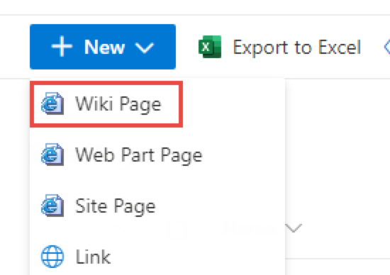
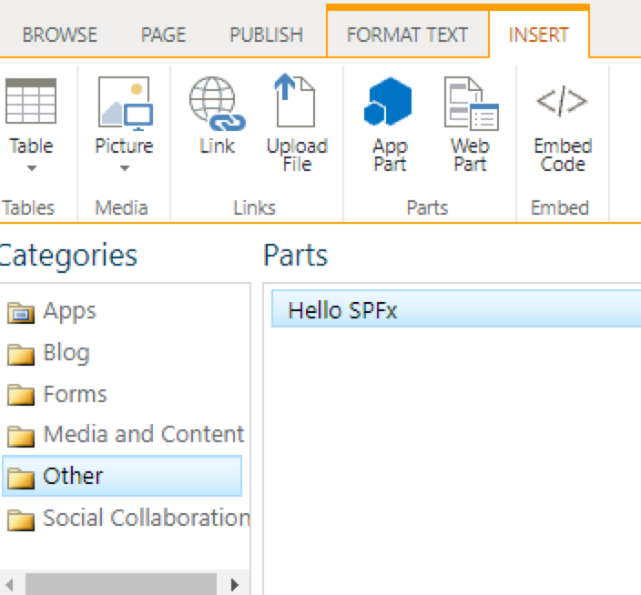
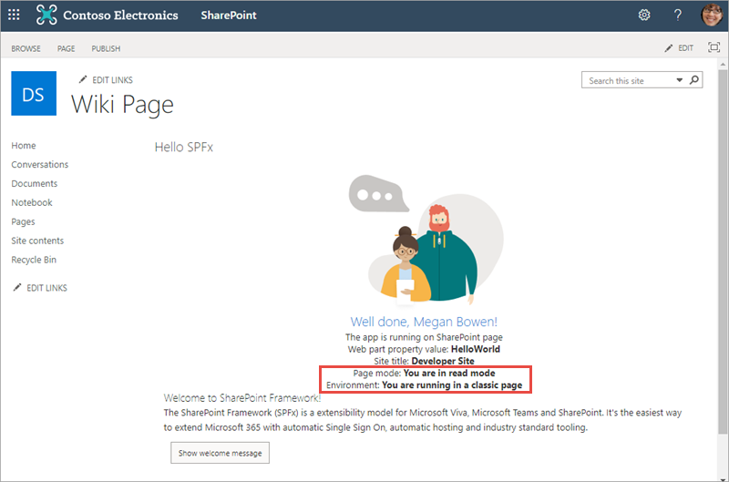
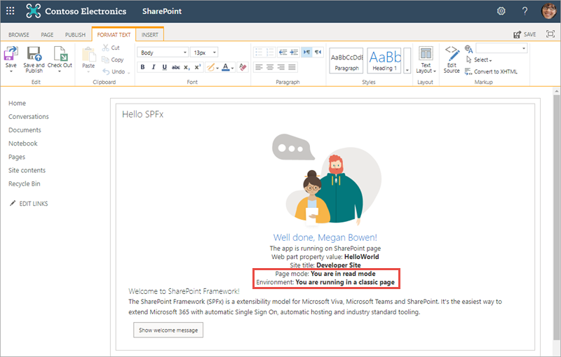
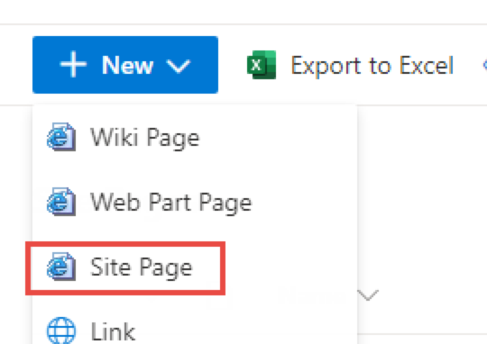
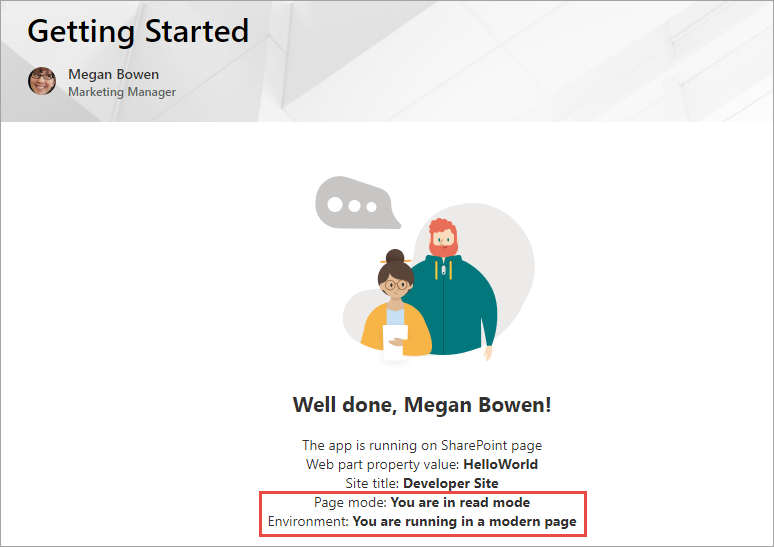
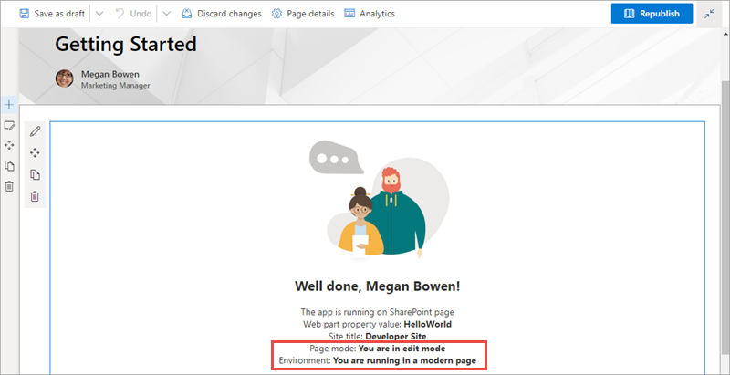

In this unit, you'll learn how to test custom web parts using the hosted workbench.

## Local vs. SharePoint-hosted workbench

Microsoft provides developers page to test SharePoint Framework projects. The **workbench** is a special SharePoint page that contains a single canvas to which developers can add their web parts.

### Local workbench

The local workbench is included with the SharePoint Framework version 1.12.1 and earlier. It runs on https://localhost that has no SharePoint context. It's simply an HTML page that loads the SharePoint Framework in the browser.

The local workbench is not included with current versions of the SharePoint Framework, thus it is not covered in the modules in this learning path.

### SharePoint-hosted workbench

The SharePoint-hosted workbench is located at **https://{your-sharepoint-site}/_layouts/workbench.aspx**. Because this workbench is hosted by a real SharePoint site, it has SharePoint context. This means that your web part can access data in SharePoint lists and libraries in the same site as the hosted workbench.

Even though the gulp **serve** task will monitor your project and rebuild it when changes are made, it won't automatically refresh the browser containing the hosted workbench. To see the changes, you'll need to manually refresh the browser where the workbench is loaded.

## Debugging

The gulp **serve** task used to start the local web server monitors your SharePoint Framework project's codebase while you're testing web parts in the workbench. When a file is changed and saved, the gulp task will rebuild the project.

While hosted in a real SharePoint site, the SharePoint-hosted workbench is still intended to be a local development test environment that allows you to test your code changes immediately.

The hosted workbench requires you to start the local web server that will serve the workbench the SharePoint component's manifest and JavaScript bundle. To do this, execute the following command at the command line from the root of your project:

```console
gulp serve
```

This command will run the **build** and **bundle** tasks, start the local web server, launch the default browser, and load the workbench page at the URL configured in **serve.json**. If you don't want it to launch the browser automatically, include the **--nobrowser** switch:

```console
gulp serve --nobrowser
```

### Mapping files makes debugging easier

SharePoint Framework projects are authored with TypeScript and the build process transpiles the TypeScript into JavaScript. It then bundles the built files into a single file. Because of this transpiling and bundling process, it can be hard to debug the JavaScript that's generated in the build process and map it back to the TypeScript you wrote.

Source code-mapping files make it possible to debug the original TypeScript code from the running JavaScript code. Mapping files map each line in the generated JavaScript code back to the TypeScript code it was generated from. When you set a breakpoint in JavaScript, a tool such browser development tools or editors like Visual Studio Code, will show you the TypeScript when your breakpoint is hit, even though it's the JavaScript that's running.

### Test web parts on classic pages

SharePoint Framework web parts can run on both classic and modern pages. To test a web part on a classic page, you first put the page into edit mode and add the web part using the **Insert** tab in the ribbon, the same way you add server-side web parts.

Select the web part from the gallery to add it to the page.







To edit the web part's properties, you must select the web part and then select **Edit web part** from the web part's context menu while the page is in edit mode. This means that while a classic page can be in edit mode, the web part can be in either presentation or edit mode.



### Test web parts on modern pages

There are small differences between a classic and modern pages when testing web parts.

Similar to the classic experience, create a new page or edit an existing one. Modern pages have a horizontal line with a **+** image that you use to open the web part toolbox.






To open the web part's property pane, select the **pencil** edit icon to the left of the web part when you hover the mouse of the web part.

Unlike the classic experience, the web part's mode always matches the mode of the page. If the page is in edit mode, so is the web part.



## Summary

In this unit, you learned how to test custom web parts using the hosted workbench.
