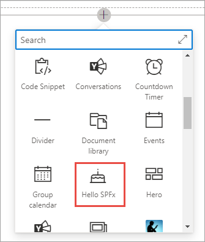
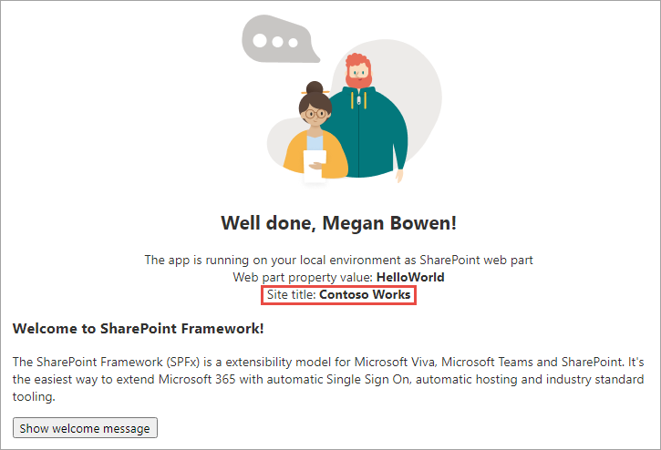

In this exercise, you'll test your web part in the hosted workbench, and you'll explore the different modes of the built-in gulp serve task.

Open **Visual Studio Code** and then open the SharePoint Framework web part project you created in the previous exercise.

## The different modes of the gulp serve task

The SharePoint Framework's gulp **serve** task with the **nobrowser** switch will build the project and start a local web server. After running the gulp **serve** task, you need to manually navigate to the hosted workbench to test your web part. This is how you've used the gulp **serve** task so far.

But what if you want the browser to open the hosted workbench for you automatically? In that case, you can use a configuration setting to tell the gulp **serve** task what to do.

Locate and open the file **config/serve.json**

In the **serve.json** file, locate the `initialPage` setting. It's currently configured with a placeholder URL.

```json
"initialPage": "https://enter-your-SharePoint-site/_layouts/workbench.aspx",
```

Replace **https://enter-your-SharePoint-site** with the URL of a SharePoint Online site in your tenant. This will form a valid URL that will open the hosted workbench. The following is an example that would work in the **contoso** tenant:

```json
"initialPage": "https://contoso.sharepoint.com/sites/mySite/_layouts/workbench.aspx",
```

Start the local web server using the provided gulp **serve** task without the **nobrowser** switch. This will build the project, start a local web server, and load the hosted workbench at the URL configured in **serve.json**.

```console
gulp serve
```

Wait for the **reload** subtask to finish executing. At this point, the web part will be ready for testing.


## Testing with the SharePoint Online Hosted Workbench

Select the web part icon button to open the list of available web parts.



Add the web part to the page.

Locate the web part file **src/webparts/helloWorld/HelloWorldWebPart.ts**.

Now locate the `render()` method and add the following line to the top of it, right after the method declaration:

```ts
const siteTitle : string = this.context.pageContext.web.title;
```

Add the following line just after the line that displays the web part property value:

```html
<div>Site title: <strong>${escape(siteTitle)}</strong></div>
```

Wait a few seconds for the project to rebuild, and then refresh the hosted workbench. Notice that the title of the site is being displayed:


Now, open a new browser tab and navigate to a different site. Append the following to the end of the site's URL: **/_layouts/workbench.aspx**.

Add the web part to the page.

Notice that the title of the second site is being displayed:



This is a simple demonstration of how the hosted workbench exposes the context of the current SharePoint site.

Close the browser tabs containing the hosted workbench and stop the local web server by pressing <kbd>CTRL</kbd>+<kbd>C</kbd> in the command prompt.

## Summary

In this exercise, you tested your web part in the hosted workbench, and you explored the different modes of the built-in gulp serve task.
