In this unit, you'll learn about some of the features included in the SharePoint Framework API.

## SharePoint Framework Utilities

The SharePoint Framework includes many utility APIs and libraries that make developing SharePoint Framework components easier. These utilities are available from the Framework API and from external libraries.

## Status renderers

The first utility we'll cover is the status renderers. These indicators are ideal for use when you have an error to display or when your component is doing a long-running asynchronous operation.

The status renderers are available from the web part's `context` property so there's nothing to import or add to your project to use them. When used, the status renderer will take up the entire web part user experience. There are two types of renderers available to developers:

- **loading indicators**: used when initializing or loading content in your web part
- **error indicator**: used to display error messages

### Loading indicator

Loading indicators are used when you need to initialize your web part and you want to provide some feedback to the user that something is happening. For example, a loading indicator can be shown when a web part is first added to the page, but needs to fetch information from Microsoft Graph, a remote API, when it first loads.

Instead of the user seeing a blank box on the page with no feedback that something is happening, you can show a loading indicator with an animated image and the message "Loading data.." to user.

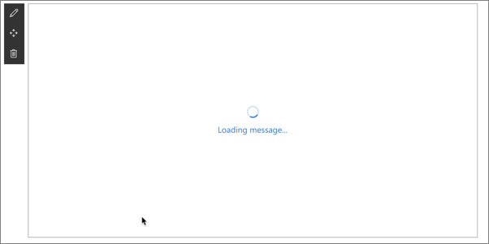

The two methods you'll use to control the indicator are `displayLoadingIndicator()` and `clearLoadingIndicator()`. Both methods are available from the `context` property on the web part.

To show the loading indicator, call the following method:

```typescript
this.context.statusRenderer.displayLoadingIndicator(this.domElement, "Loading message...");
```

To hide the indicator, call the following method:

```typescript
this.context.statusRenderer.clearLoadingIndicator(this.domElement);
```

The first parameter of both methods is the DOM element where the indicator should be placed. In this case, the indicator is taking up the entire area reserved for rendering the web part on the page.

### Error indicator

Error indicators are used when you need to display errors to your users. They work the same way as loading indicators and are available from the `context` property on the web part.

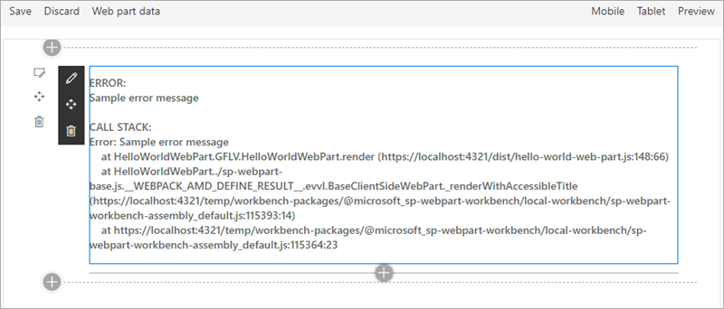

To show the error indicator, call the following method and pass in the error to display:

```typescript
this.context.statusRenderer.renderError(this.domElement, error);
```

To hide the indicator, call the following method:

```typescript
this.context.statusRenderer.clearError(this.domElement);
```

Like the loading indicator, the first parameter of both methods is the DOM element where the indicator should be placed.

## Lodash utility library

Lodash is a great JavaScript utility library that you can use to do operations on various objects such as arrays, numbers, and strings.

SharePoint Framework includes a repackage version of the Lodash utility library that contains a subset of the most common and essential functions from larger Lodash to improve performance.

To use functions from the library, make sure you only import those functions that you'll use in the current file. This will ensure you load only the required code and not the entire Lodash subset library on the page:

```typescript
import { escape } from '@microsoft/sp-lodash-subset';

export default class HelloWorldWebPart extends BaseClientSideWebPart<IHelloWorldWebPartProps> {

  public render(): void {
    this.domElement.innerHTML = `
      <p class="${ styles.description}">${escape(this.properties.description)}</p>
    `;
  }
}
```

## Page display modes

The SharePoint Framework API offers developers a way to determine the current display mode of a page. You can use this information to display a different experience for your users if the page is in read mode or edit mode.

To do this, use the `displayMode` property on the current component and compare it to one of the options on the enumeration `DisplayMode` available from the **\@microsoft/sp-core-library** package:

```typescript
import { DisplayMode } from '@microsoft/sp-core-library';

const pageMode: string = (this.displayMode === DisplayMode.Edit)
  ? 'You are in edit mode'
  : 'You are in read mode';
```

> [!IMPORTANT]
> In a classic server-side SharePoint page, the web page and the web part can be in different modes. For example, the web page can be in edit mode while the web part isn't in edit mode. In the modern client-side SharePoint page, both the page and/or its contents are in the same mode.

Here you can see the difference between the different page modes when the previous code runs on a web part. In this example, the web part has been added to a classic page. Notice how the page's and web part's  display mode don't always match up. This is because a web part can be in read or edit mode when the page is also in edit mode.

The page isn't in edit mode:

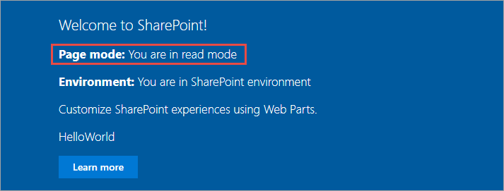

The page is in edit mode but the web part isn't:

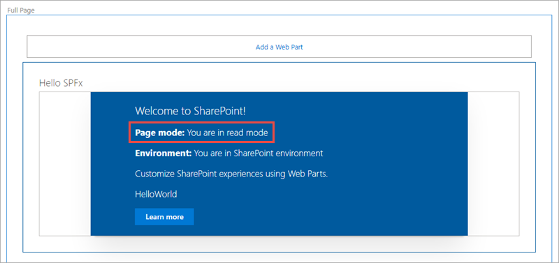

Both the page and web part are in edit mode:

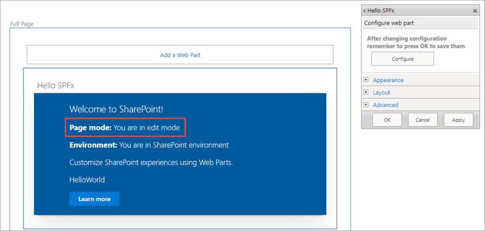

While on a modern page, the display mode of the web part follows the same mode as the page.

The page isn't in edit mode:

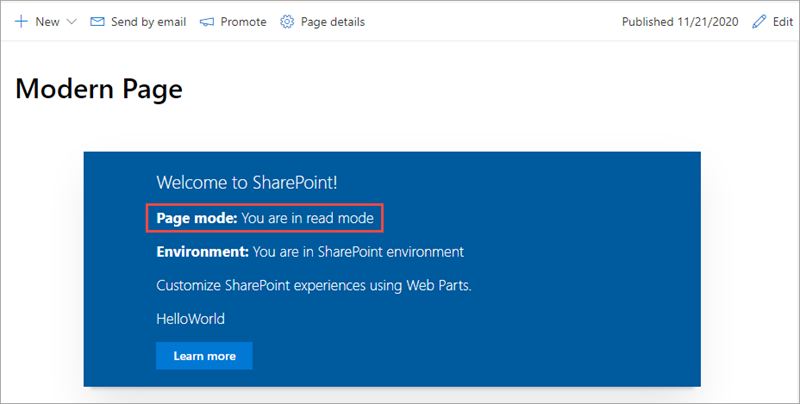

The page is in edit mode:

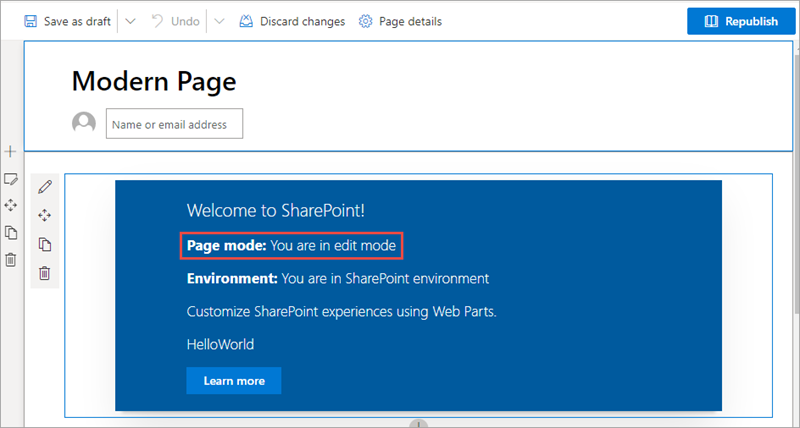

## Page context

The SharePoint Framework API includes a reference to the context of the current page where the component is running. Use the `context` object, available from the component's base class, to access the page context:

```typescript
const siteTitle: string = this.context.pageContext.web.title;
```

Custom components can access the following properties on the page context:

- web title
- web absolute URL
- web server-relative URL
- current user login name

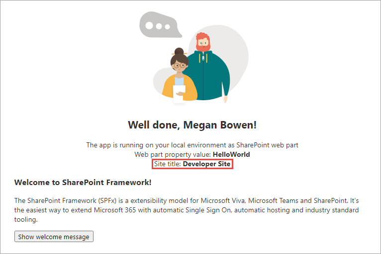

## Environment type

The SharePoint Framework API provides a mechanism you can use to detect the current environment. For example, to check if your web part is running in a classic or a modern page. To determine the current environment, import the `Environment` object and the `EnvironmentType` enumeration from the **@microsoft/sp-core-library** package:

```typescript
import {
  Environment,
  EnvironmentType
} from '@microsoft/sp-core-library';

const environmentType : string = (Environment.type === EnvironmentType.ClassicSharePoint)
  ? 'You are running in a classic page'
  : 'You are running in a modern page';  
```

The `EnvironmentType` enumeration has the following options:

- **Local**: (deprecated after SPFx v1.12.1) indicates the component is running in the local workbench
- **ClassicSharePoint**: indicates the component is running on a classic page
- **SharePoint**: indicates the component is running on a modern page (*includes the SharePoint-hosted workbench*)
- **Test**: indicates the component is running in a test harness

The following figures show a web part running in a classic page and in a modern page:

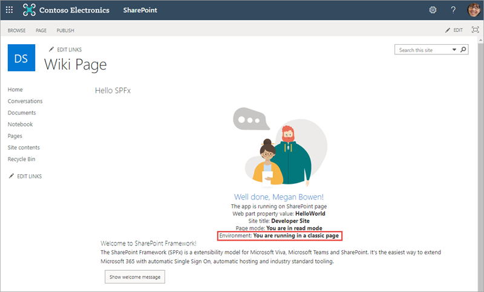

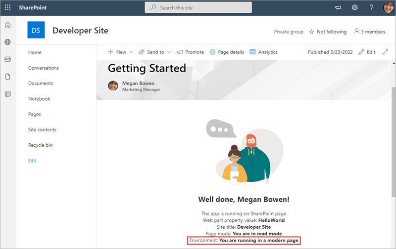

## Logging

Logging is a convenient and easy way to keep track of events happening in the web part. The SharePoint Framework has a built-in logging mechanism.

The `Log` class contains four static methods for logging:

- **info**: log information
- **warn**: log warnings
- **error**: log errors
- **verbose**: log everything

In the SharePoint Framework, all logging is written to the developer dashboard.

All static methods have the same signature, except the error method - they take three arguments:

- **source**: the source of the logging information (*max 20 characters*), such as the method or the class name
- **message**: the actual message to log (*max 100 characters*)
- **scope**: an optional service scope

The error method takes an `Error` object instead of the message string, otherwise they're the same.

To use the SharePoint Framework logging infrastructure, import the `Log` object from the **@microsoft/sp-core-library** package. Each of the methods will write a different type of logging message to the developer dashboard, as you can see here:

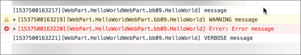

## Loading scripts and CSS files with the SPComponentLoader

When your component needs to programmatically load an external JavaScript or CSS file, you can use the `SPComponentLoader` object. This object can be found in the **@microsoft/sp-loader** package.

`SPComponentLoader` contains two methods: `loadScript()` and `loadCss()`. Both methods accept a string parameter of the URL of the file to load and return a JavaScript promise once the file has been loaded.

The `loadScript()` method accepts a second parameter that you can use to specify the object that the script should be assigned to when its exported.

```typescript
import { SPComponentLoader } from "@microsoft/sp-loader";

export default class HelloWorldWebPart extends BaseClientSideWebPart<IHelloWorldWebPartProps> {
  public render(): void {
    if (!this.renderedOnce) {
      this.domElement.innerHTML = `<div class="${styles.button}"></div>`;

      SPComponentLoader.loadScript('https://.../jquery.min.js', jQuery))
        .then({$:any}: void => {
          this.jQuery = $;
          SPComponentLoader.loadCss('https://.../jqueryui.css');
        });
    }
  }
}
```

Notice how the `SPComponentLoader` is wrapped in the `if (!this.renderedOnce)` clause. The `render` function of client-side web parts is called initially whenever a web part is added to the page, but also every time a web part property is changed in the property pane. Because we only want to load the scripts with the `SPComponentLoader` one time, we use the `renderedOnce` property to verify that the web part is rendering initially and then load the required modules.

When loading jQuery using the `SPComponentLoader`, we load it as a global script associated with the `jQuery` variable.

Notice that after loading the jQuery library and before loading a CSS file for the jQuery UI project, we store the reference to jQuery in the `this.jQuery` variable.

## Summary

In this unit, you learned about some of the features included in the SharePoint Framework API.
