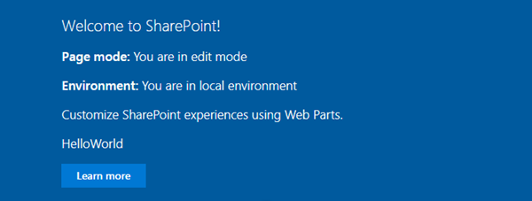

In this exercise, you'll explore a few different APIs available to you in the SharePoint Framework that are useful in many scenarios.

Open the web part project from the first exercise.

## Checking the current page mode and environment

Locate the web part file **src/webparts/helloWorld/HelloWorldWebPart.ts**.

At the top of the file, locate the following line:

```typescript
import { Version } from '@microsoft/sp-core-library';
```

Update this line to the following:

```typescript
import {
  Version,
  DisplayMode,
  Environment,
  EnvironmentType
} from '@microsoft/sp-core-library';
```

Now locate the `render()` method and add the following two lines to the top of it, right after the line that declares the `siteTitle` constant:

```typescript
const pageMode : string = (this.displayMode === DisplayMode.Edit)
  ? 'You are in edit mode'
  : 'You are in read mode';
const environmentType : string = (Environment.type === EnvironmentType.ClassicSharePoint)
  ? 'You are running in a classic page'
  : 'You are running in a modern page';
```

These two lines determine the current mode of the page and environment in which the web part is running. These can prove to be useful when determining how to render the user interface for the web part.

Display the value of these two members by adding the following lines to the HTML for the web part. Add the lines just after the line that displays the site title:

```html
<p class="${ styles.subTitle }"><strong>Page mode:</strong> ${ pageMode }</p>
<p class="${ styles.subTitle }"><strong>Environment:</strong> ${ environmentType }</p>
```

Test the web part to see the effect of the changes. Start the local web server using the provided gulp **serve** task:

```console
gulp serve
```

When the browser loads the hosted workbench, add the web part to the page. Notice the value of the page mode and environment:



## Leverage the SharePoint Framework Logging API

The SharePoint Framework also provides a way to log messages to the developer dashboard with more information than the traditional `console.log()`.

Locate the web part file **src/webparts/helloWorld/HelloWorldWebPart.ts**.

At the top of the web part file, locate the following lines:

```typescript
import {
  Version,
  DisplayMode,
  Environment,
  EnvironmentType
} from '@microsoft/sp-core-library';
```

Add an additional reference to `Log` the existing list so it looks like this:

```typescript
import {
  Version,
  DisplayMode,
  Environment,
  EnvironmentType,
  Log
} from '@microsoft/sp-core-library';
```

Add the following lines to the end of the `render()` method, immediately before it closes. These will add different messages to the developer dashboard:

```typescript
Log.info('HelloWorld', 'message', this.context.serviceScope);
Log.warn('HelloWorld', 'WARNING message', this.context.serviceScope);
Log.error('HelloWorld', new Error('Error message'), this.context.serviceScope);
Log.verbose('HelloWorld', 'VERBOSE message', this.context.serviceScope);
```

Wait a few seconds for the project to rebuild, and then refresh the hosted workbench.

Open the developer dashboard by by pressing <kbd>CTRL</kbd>+<kbd>F12</kbd>

There will be many messages logged to the developer dashboard, so set the Source filter to the name of your web part, **HelloWorld**.

Notice in the following image that each message is prefixed with the unique name of the web part.


## Addressing delayed loading web parts

Your web part may have a number of calculations to do or have a delay in fetching data before it renders the first time. Thankfully the SharePoint Framework provides an API you can use to address this.

Locate the web part file **src/webparts/helloWorld/HelloWorldWebPart.ts**.

Locate the following line in the `render()` method:

```typescript
this.domElement.innerHTML = `
```

Add the following lines just before the `this.domElement.innerHTML` line:

```typescript
this.context.statusRenderer.displayLoadingIndicator(this.domElement, "message");
setTimeout(() => {
  this.context.statusRenderer.clearLoadingIndicator(this.domElement);
```

Add the following line just after the code that attaches the event handler to the button:

```typescript
}, 5000);
```

The code you just added displays the string **message** in a loading indicator for 5 seconds before clearing it out and writing HTML to the page.

The resulting code should look similar to this:

```typescript
public render(): void {
  const siteTitle: string = this.context.pageContext.web.title;
  const pageMode: string = (this.displayMode === DisplayMode.Edit)
    ? 'You are in edit mode'
    : 'You are in read mode';
  const environmentType : string = (Environment.type === EnvironmentType.ClassicSharePoint)
    ? 'You are running in a classic page'
    : 'You are running in a modern page';

  this.context.statusRenderer.displayLoadingIndicator(this.domElement, "message");
  setTimeout(() => {
    this.context.statusRenderer.clearLoadingIndicator(this.domElement);

    this.domElement.innerHTML = `
      <div class="${ styles.helloWorld }">
        <div class="${ styles.container }">
          <div class="${ styles.row }">
            <div class="${ styles.column }">
              <span class="${ styles.title }">Welcome to SharePoint!</span>
              <p class="${styles.subTitle}"><strong>Site title:</strong> ${siteTitle}</p>
              <p class="${ styles.subTitle }"><strong>Page mode:</strong> ${ pageMode }</p>
              <p class="${ styles.subTitle }"><strong>Environment:</strong> ${ environmentType }</p>
              <p class="${ styles.description }">${escape(this.properties.description)}</p>
              <a href="#" class="${ styles.button }">
                <span class="${ styles.label }">Learn more</span>
              </a>
            </div>
          </div>
        </div>
      </div>`;

    this.domElement.getElementsByClassName(`${styles.button}`)[0]
      .addEventListener('click', (event: any) => {
        event.preventDefault();
        alert('Welcome to the SharePoint Framework!');
      });
  }, 5000);

  Log.info('HelloWorld', 'message', this.context.serviceScope);
  Log.warn('HelloWorld', 'WARNING message', this.context.serviceScope);
  Log.error('HelloWorld', new Error('Error message'), this.context.serviceScope);
  Log.verbose('HelloWorld', 'VERBOSE message', this.context.serviceScope);
}
```

Wait a few seconds for the project to rebuild, and then refresh the hosted workbench.

When the web part initially loads, it displays the loading message:


After five (5) seconds, notice the web part is rendered as it was before because the timeout concludes.

Close the browser and stop the local web server by pressing <kbd>CTRL</kbd>+<kbd>C</kbd> in the command prompt.

## Summary

In this exercise, you explored a few different APIs available to you in the SharePoint Framework that are useful in many scenarios.
