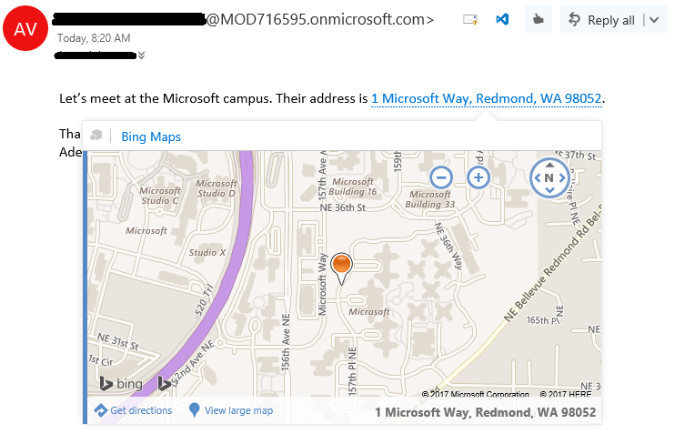
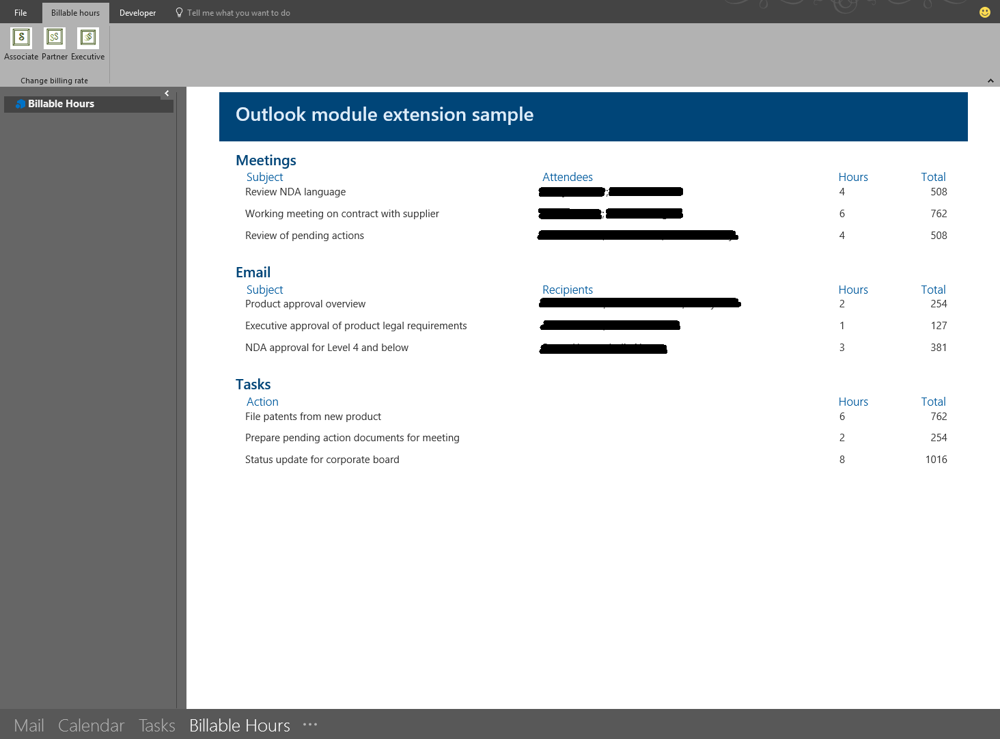

The Outlook JavaScript APIs give your add-ins access to the user's mailbox, messages, and appointments in Outlook. An Outlook add-in can get the content and properties of a message or appointment. An add-in can also manage the content, formatting, and structure of a message or appointment that is being composed.

## Object model

To understand the Outlook APIs, you must see how the main components of a mailbox relate to each other.

- The **Mailbox** object enables you to handle authentication, manage a selected item, and view user profile details.
- The **Item** object represents the selected message or appointment that the user is reading or composing.

Using the Outlook APIs, you can manage many properties of an email or appointment. Many of the APIs are organized around the mode the user is in. The following table maps item types and modes.

|Item type|Modes|
|---|---|
|Message|Read,<br>Compose|
|Appointment (or meeting)|Attendee (read),<br>Organizer (compose)|

## Key features

In addition to task pane add-ins, you can create contextual and module add-ins. In this section, you'll learn about a few key features of Outlook APIs.

- Authentication options
- Contextual add-ins
- Module add-ins

### Authentication

Your Outlook add-in can access information from anywhere on the Internet, whether from the server that hosts the add-in, from your internal network, or from somewhere else in the cloud. If that information is protected, your add-in needs a way to authenticate your user. Outlook add-ins provide a number of different methods to authenticate, depending on your specific scenario.

#### Exchange user identity token

Exchange user identity tokens provide a way for your add-in to establish the identity of the user. By verifying the user's identity, you can do a one-time authentication into your back-end system, then accept the user identity token as an authorization for future requests. Consider using user identity tokens if your add-in:

- Is used primarily by Exchange on-premises users
- Needs access to a non-Microsoft service that you control

Your add-in can call `getUserIdentityTokenAsync` to get Exchange user identity tokens.

#### Access tokens obtained via OAuth2 flows

Add-ins can also access third-party services that support OAuth2 for authorization. Consider using OAuth2 tokens if your add-in:

- Needs access to a third-party service outside of your control

Using this method, your add-in prompts the user to sign in to the service either by using the `displayDialogAsync` method to initialize the OAuth2 flow, or by using the office-js-helpers library to implement the OAuth2 Implicit flow.

#### Callback tokens

Callback tokens provide access to the user's mailbox from your server back-end, either using Exchange Web Services (EWS), or the Outlook REST API. Consider using callback tokens if your add-in:

- Needs access to the user's mailbox from your server back-end

Add-ins obtain callback tokens using one of the `getCallbackTokenAsync` methods. The level of access is controlled by the permissions specified in the add-in manifest.

### Contextual add-ins

Contextual add-ins are Outlook add-ins that activate based on text in a message or appointment. You may have seen the default contextual add-ins in Outlook, such as Bing Maps or Suggested Meetings. By using contextual add-ins, a user can initiate tasks related to a message without leaving the message itself, which results in an easier and richer user experience.

The following table lists a few example tasks based on a user's selection.

|User chooses...|Contextual add-in action|
|---|---|
|Address|Open a map of the location.|
|String|Open a meeting suggestion add-in.|
|Phone number|Add number to your contacts.|

> [!NOTE]
> Contextual add-ins are not currently available in Outlook on Android and iOS at this time.

The following image shows a contextual add-in being displayed in Outlook.



*A contextual add-in displayed in Outlook*

A contextual add-in's manifest must include an `ExtensionPoint` element with an `xsi:type` attribute set to `DetectedEntity`. Within the `ExtensionPoint` element, the add-in specifies the entities or regular expression that can activate it. If an entity is specified, the entity can be any of the properties in the `Entities` object.

As such, the add-in manifest must contain a rule of type `ItemHasKnownEntity` or `ItemHasRegularExpressionMatch`. The following example shows how to specify that an add-in should activate on messages when it detects a phone number.

```xml
<ExtensionPoint xsi:type="DetectedEntity">
  <Label resid="contextLabel" />
  <SourceLocation resid="detectedEntityURL" />
  <Rule xsi:type="RuleCollection" Mode="And">
    <Rule xsi:type="ItemIs" ItemType="Message" />
    <Rule xsi:type="ItemHasKnownEntity" EntityType="PhoneNumber" Highlight="all" />
  </Rule>
</ExtensionPoint>
```

After a contextual add-in is associated with an account, it will automatically start when the user clicks a highlighted entity or regular expression.

A user launches a contextual add-in through text, either a known entity or a developer's regular expression. Typically, a user identifies a contextual add-in because the entity is highlighted.

### Module add-ins

Module add-ins appear in the Outlook navigation bar, right alongside mail, tasks, and calendars. You can use all of the features of the Outlook JavaScript API in your add-in, and create command buttons in the Outlook ribbon so the user can interact with the add-in content.

> [!NOTE]
> Module add-ins are only supported in Outlook 2016 or later on Windows.

The following image shows an example of a module extension add-in.



*A Module add-in example in Outlook on Windows*

To make a module add-in, include the module extension point in your add-in's manifest file. The following example shows a snippet of a manifest file adjusted to define a module extension.

```xml
...
<!-- Add Outlook module extension point. -->
<VersionOverrides xmlns="http://schemas.microsoft.com/office/mailappversionoverrides"
                  xsi:type="VersionOverridesV1_0">
  <VersionOverrides xmlns="http://schemas.microsoft.com/office/mailappversionoverrides/1.1"
                    xsi:type="VersionOverridesV1_1">

    <!-- Begin override of existing elements. -->
    <Description resid="residVersionOverrideDesc" />

    <Requirements>
      <bt:Sets DefaultMinVersion="1.3">
        <bt:Set Name="Mailbox" />
      </bt:Sets>
    </Requirements>
    <!-- End override of existing elements. -->

    <Hosts>
      <Host xsi:type="MailHost">
        <DesktopFormFactor>
          <!-- Set the URL of the file that contains the
                JavaScript function that controls the extension. -->
          <FunctionFile resid="residFunctionFileUrl" />

          <!-- Module extension point for a ModuleApp -->
          <ExtensionPoint xsi:type="Module">
            <SourceLocation resid="residExtensionPointUrl" />
            <Label resid="residExtensionPointLabel" />

            <CommandSurface>
              <CustomTab id="idTab">
                <Group id="idGroup">
                  <Label resid="residGroupLabel" />

                  <Control xsi:type="Button" id="group.changeToAssociate">
                    <Label resid="residChangeToAssociateLabel" />
                    <Supertip>
                      <Title resid="residChangeToAssociateLabel" />
                      <Description resid="residChangeToAssociateDesc" />
                    </Supertip>
                    <Icon>
                      <bt:Image size="16" resid="residAssociateIcon16" />
                      <bt:Image size="32" resid="residAssociateIcon32" />
                      <bt:Image size="80" resid="residAssociateIcon80" />
                    </Icon>
                    <Action xsi:type="ExecuteFunction">
                      <FunctionName>changeToAssociateRate</FunctionName>
                    </Action>
                  </Control>
                </Group>
                <Label resid="residCustomTabLabel" />
              </CustomTab>
            </CommandSurface>
          </ExtensionPoint>
        </DesktopFormFactor>
      </Host>
    </Hosts>

    <Resources>
      ...
    </Resources>
  </VersionOverrides>
</VersionOverrides>
```

## Get started developing Outlook add-ins

To start developing a Word add-in, use:

- The Yeoman generator for Office Add-ins
- Visual Studio

You can use a template as your base then add your functionality.
