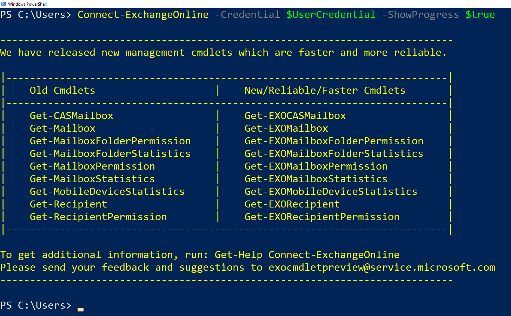
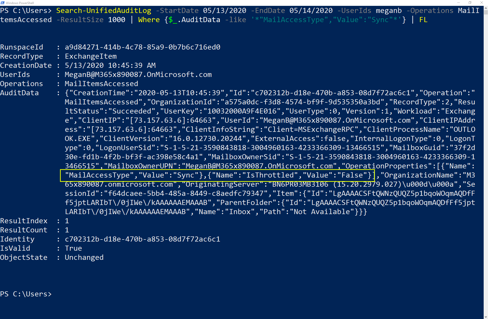
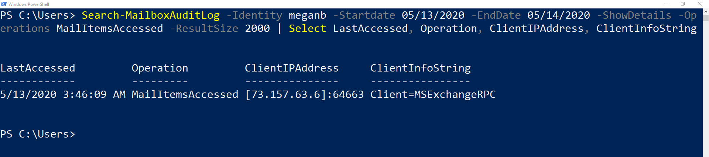
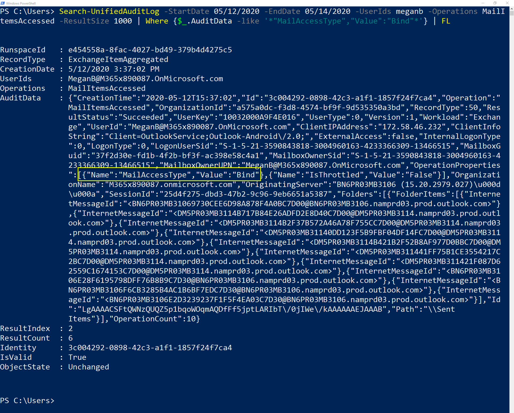

Using *MailItemsAccessed* audit records for forensic purposes is typically performed after a data breach has been identified and the attacker evicted. To begin your investigation, identify the mailboxes that may have been compromised and determine the time frame when the attacker had access. Then, you can use the *Search-UnifiedAuditLog* or *Search-MailboxAuditLog* cmdlets in Exchange Online PowerShell to search audit records that correspond to the data breach. 

Once you connect to the Exchange Online PowerShell, you can follow these steps for using *MailItemsAccessed* audit records to investigate a compromised email account. 
1.	Identify throttled mailboxes
2.	Check for sync activities
3.	Check sync activity context
4.	Check for bind activities

## Connect to Exchange Online PowerShell
Connecting to Exchange Online PowerShell V2 is required to use PowerShell to search the audit log. You can use the *Search-UnifiedAuditLog* or *Search-MailboxAuditLog* cmdlets to search audit records. The instructions below assume the following tasks have already been completed.
- You have been granted the permissions required to connect to the Exchange Online PowerShell V2.
- Windows PowerShell has been configured to run scripts.
- Windows Remote Management (WinRM) has been enabled.
- WinRM has been configured to allow Basic authentication.
- Exchange Online PowerShell V2 is installed on the computer.

Here are the steps to connect to the Exchange Online PowerShell V2. Open Windows PowerShell and follow the instructions based on your authentication method:
### Accounts without multi-factor authentication
1.	Run the following command:

    `$UserCredential = Get-Credential`
2.	Type the **username** and **password** when the Windows PowerShell credential request dialog box appears.
3.	Run the following command after providing your credentials:

    `Connect-ExchangeOnline -Credential $UserCredential -ShowProgress $true`

The image below shows a successful connection to Exchange Online PowerShell V2.

  
 
### Accounts with multi-factor authentication enabled
1.	Replace <UPN> with your account in user principal name format (meganb@contoso.com) and run the following command:

    `Connect-ExchangeOnline -UserPrincipalName <UPN> -ShowProgress $true`

## Identify throttled mailboxes
Check if the mailbox was throttled during the time it may have been compromised. If it has been throttled, some mailbox auditing records have likely not been logged. In the case where any audit records have "IsThrottled" as "True," you should assume that for a 24-hour period after that record was generated, access to the mailbox was not audited and all mail data has been compromised. No results means the mailbox was not throttled during the period you are investigating. To search for *MailItemsAccessed* records where the mailbox was throttled, run the following PowerShell command substituting the values for EndDate, StartDate, and UserIds with what is appropriate for time period and user accounts you are investigating. 

`Search-UnifiedAuditLog -StartDate 05/13/2020 -EndDate 05/14/2020 -UserIds meganb -Operations MailItemsAccessed -ResultSize 1000 | Where {$_.AuditData -like '*"IsThrottled","Value":"True"*'} | FL`

Here are the values used in the example:

|   |   |
|---|---|
|  StartDate | 05/13/2020  |
|  EndDate |  05/14/2020 |
| UserIds  | meganb  |

## Check for sync activities
If an attacker uses an email client to download messages in a mailbox, they can disconnect the computer from the Internet and view the messages offline. This means mailbox auditing would not be able to audit these activities. You should assume all synced email messages were compromised if the request came from the attacker’s PC or Mac. To search for *MailItemsAccessed* records where the mail items were accessed via a sync operation, run the following command substituting the values for *EndDate, StartDate*, and *UserIds* values with what is appropriate for your situation. 

`Search-UnifiedAuditLog -StartDate 05/13/2020 -EndDate 05/14/2020 -UserIds meganb -Operations MailItemsAccessed -ResultSize 1000 | Where {$_.AuditData -like '*"MailAccessType","Value":"Sync"*'} | FL`

Here are the values used in the example:

|   |   |
|---|---|
|  StartDate | 05/13/2020  |
|  EndDate |  05/14/2020 |
| UserIds  | meganb  |

Here are the results of running the *Search-UnifiedAuditLog* command. Megan Bowen’s mailbox (meganb) had one sync activity during the dates specified. The next step is to determine if this sync activity came from Megan Bowen (meganb) or the attacker. 

  
 
## Check sync activity context
Check sync activities to determine if sync activity occurred in the same context as the one used by the attacker accessing the mailbox. Context is differentiated by the IP address of the client computer used to access the mailbox and the mail protocol. Use the properties listed below to investigate. These properties are located in the *AuditData* or *OperationProperties* data. If any of the syncs occur in the same context as the attacker activity, assume everything synced has been compromised.

|  Property |  Description |
|---|---|
| ClientInfoString  |  Describes protocol, client (includes version) |
|  ClientIPAddress | IP address of the client machine  |
|  SessionId | Session ID helps to differentiate attacker actions vs. day-to-day user activities on the same account (in the case of a compromised account)  |
|  UserId |  UPN of the user reading the message |

The following PowerShell command helps determine the context for the sync activity. Substitute the values for EndDate, StartDate, and Identity with what is appropriate for your situation. 

`Search-MailboxAuditLog -Identity meganb -StartDate 05/13/2020 -EndDate 05/14/2020 -ShowDetails -Operations MailltemsAccessed -ResultSize 2000 | Select LastAccessed, Operation, ClientIPAddress, ClientInfoString`

Here are the values used in the example:

|   |   |
|---|---|
|  StartDate | 05/13/2020  |
|  EndDate |  05/14/2020 |
| Identity | meganb  |

Here is the result of running the PowerShell command shown above. The *ClientIPAddress* and *ClientInfoString* details help to determine if the sync activity came from a legitimate source.

  
 
## Check for bind activities
After performing the sync activity analysis, you can be confident all other access to email messages, whether by a legitimate user or the attacker, will be captured in the *MailItemsAccessed* audit records with a *MailAccessType* property with a value of "Bind". To search for *MailItemsAccessed* records where the mail items were accessed by a Bind operation, run the following command:

`Search-MailboxAuditLog -StartDate 05/13/2020 -EndDate 05/14/2020 -Identity meganb -Operations MailItemsAccessed -ResultSize 10000 -ShowDetails | Where {$_.OperationProperties -like "*MailAccessType:Bind*"} | FL`

Here is the result of running the PowerShell command shown above: 
 
  

Email messages that were accessed are identified by their *InternetMessageId* value. You can also check to see if any audit records have the same context as those already associated with other attacker activity. 

You can use the audit data for bind operations in two different ways:
- Access or collect all email messages the attacker accessed by using the *InternetMessageId* to find them and determine if any of those messages contains sensitive information.
- Use the *InternetMessageId* to search audit records related to a set of potentially sensitive email messages. This is useful if you are concerned only about a small number of messages.

## Learn more
- [Responding to a Compromised Email Account](https://docs.microsoft.com/microsoft-365/security/office-365-security/responding-to-a-compromised-email-account?view=o365-worldwide?azure-portal=true)
- [Use Advanced Audit to investigate compromised accounts](https://docs.microsoft.com/microsoft-365/compliance/mailitemsaccessed-forensics-investigations?azure-portal=true)
- [Exchange Online PowerShell V2](https://docs.microsoft.com/powershell/exchange/exchange-online/exchange-online-powershell-v2/exchange-online-powershell-v2?azure-portal=true)
- [Search-UnifiedAuditLog PowerShell cmdlet reference](https://docs.microsoft.com/powershell/module/exchange/policy-and-compliance-audit/Search-UnifiedAuditLog?azure-portal=true)
- [Search-MailboxAuditLog PowerShell cmdlet reference](https://docs.microsoft.com/powershell/module/exchange/policy-and-compliance-audit/search-mailboxauditlog?azure-portal=true)
