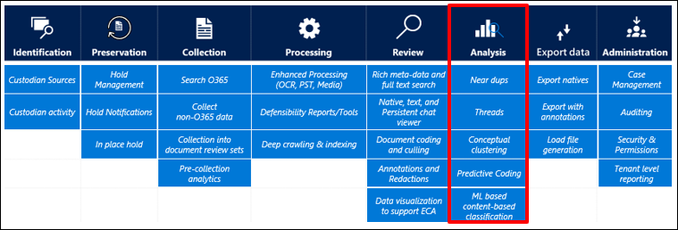
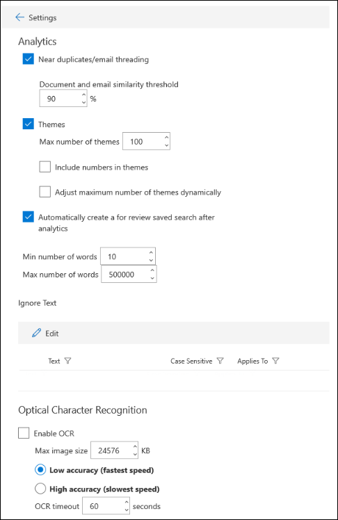
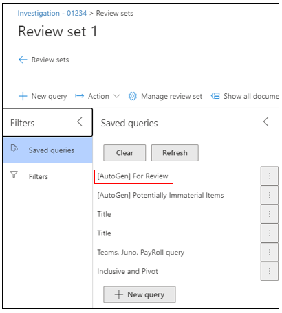
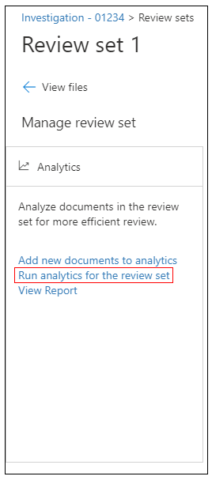

This section discusses the *Analysis* phase of the EDRM model.

When an evidence collection is large, it often includes multiple copies of the same or similar email messages or documents. Analysis tools in Advanced eDiscovery support the Analysis phase of the EDRM model by enabling you to cull data from the review set that isn't relevant to the investigation.

Advanced eDiscovery is integrated with capabilities such as:

- Near duplicates and email threading
- Themes
- Autogenerated review set query
- Ignore text
- Optical character recognition

By reducing the volume of relevant data, these capabilities help you save legal review costs by enabling you to organize content to make the review process easier and more efficient.

To configure how data in your review set is further culled, open the case in Advanced eDiscovery and navigate to the **Settings** tab. Click **Select** under **Search & analytics**.

To configure search and analytics settings for a case:

1. On the **Advanced eDiscovery** page, select the case.
1. On the **Settings** tab, under **Search & analytics**, click **Select**.

    

### Near duplicates and email threading

Near duplicate detection groups textually similar documents together to help you make your review process more efficient. When near duplicate detection is run, the system parses every document with text. Then, it compares every document against each other to determine whether their similarity is greater than the set threshold. If it is, the documents are grouped together. Once all documents have been compared and grouped, a document from each group is marked as the "pivot"; in reviewing your documents, you can review a pivot first and review the other documents in the same near duplicate set, focusing on the difference between the pivot and the document that is in review.

In most cases, the last email in a thread will include the contents of all the preceding emails such that reviewing the last email will give a complete context of the conversation that happened in the thread. Email threading identifies such emails so that reviewers can review a fraction of collected email without losing any context.

Email threading parses each email in a thread, deconstructs it into individual messages, then analyzes those messages for unique content. In the end, emails are divided into four categories:

- **Inclusive**: the last message in the email has unique content, and the email has all of the attachments that were included in other emails of which the content is wholly contained in this email.
- **Inclusive minus**: the last message in the email has unique content, but the email does not contain some of the attachments that were included in other emails of which the content is wholly contained in this email.
- **Inclusive copy**: an exact copy of an inclusive/inclusive minus email
- **None**: The content of this email is wholly contained in at least one email that is marked as inclusive/inclusive minus.

This section lets you configure the following parameters:

- **Near duplicates/email threading**. When turned on, duplicate detection, near duplicate detection, and email threading are included as part of the workflow when you run analytics on the data in a review set.
- **Document and email similarity threshold**. If the similarity level for two documents is above the threshold, both documents are put in the same near duplicate set.
- **Minimum/maximum number of words**. These settings specify that near duplicates and email threading analysis are performed only on documents that have at least the minimum number of words and at most the maximum number of words.

### Themes

The Themes functionality analyzes documents with text in a review set to parse out common themes that appear across all the documents in the review set. Advanced eDiscovery assigns those themes to the documents in which they appear. It also labels each theme with the words used in the documents that are representative of the theme. Because a document can contain various types of subject matter, Advanced eDiscovery often assigns multiple themes to documents. The theme that appears most prominently in a document is designated as its dominant theme.

This section lets you set the following parameters:

- **Themes**. When turned on, themes clustering is performed as part of the workflow when you run analytics on the data in a review set.
- **Maximum number of themes**. Specifies the maximum number of themes that can be generated when you run analytics on the data in a review set.
- **Include numbers in themes**. When turned on, numbers (that identify a theme) are included when generating themes.
- **Adjust maximum number of themes dynamically**. In certain situations, there may not be enough documents in a review set to produce the desired number of themes. When this setting is enabled, Advanced eDiscovery adjusts the maximum number of themes dynamically rather than attempting to enforce the maximum number of themes.

### Review set query

If you select the **Automatically create a For Review saved search after analytics** checkbox, Advanced eDiscovery autogenerates review set query named **For Review**.

  

This query filters out duplicate items from the review set which enables you review the unique items in the review set.

> [!NOTE]
> This query is created only when you run analytics for a review set in the case.

 

### Ignore text

Sometimes certain text will diminish the quality of analytics, such as lengthy disclaimers that get added to email messages regardless of the content of the email. If you know of text that should be ignored, you can exclude it from analytics by specifying the text string and the analytics functionality (Near-duplicates, Email threading, Themes, and Relevance) that the text should be excluded for.

### Optical character recognition (OCR)

When optical character recognition is enabled in a case, the OCR functionality automatically extracts text from images and includes the image text with the data that is added to a review set. You can view the extracted  text in the Text viewer of the selected image file in the review set. This lets you conduct further review and analysis on text in images. OCR is supported for loose files, email attachments, and embedded images. For a list of image file formats that are supported for OCR, see [Supported file types in Advanced eDiscovery](/microsoft-365/compliance/supported-filetypes-ediscovery20?azure-portal=true).

> [!NOTE]
> You have to enable OCR functionality for each case that you create in Advanced eDiscovery.
