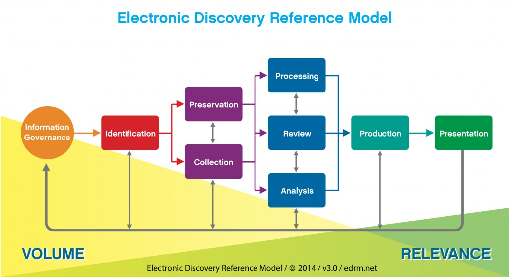
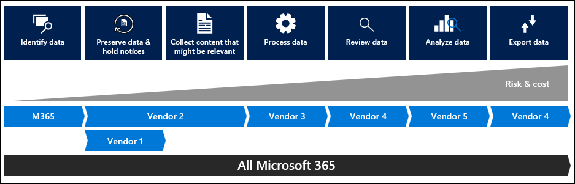
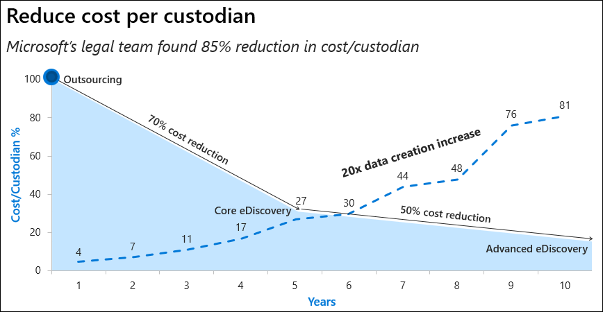
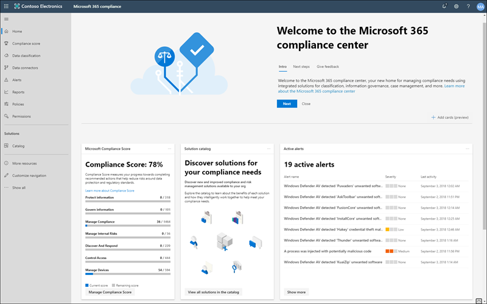

## A brief history of eDiscovery

eDiscovery, or electronic discovery, is the process used by organizations to find, preserve, analyze, and package electronic content for an audit, litigation, or investigation. This section briefly describes how eDiscovery evolved.

The Sarbanes–Oxley Act of 2002 (SOX) set new and expanded requirements for all U.S. public company boards, management, and public accounting firms for certifying the accuracy of their financial information. It also holds privately held companies responsible for retaining information to meet business, legal, and regulatory requirements. In addition to SOX, there were a variety of International and industry laws that had been introduced by this time. Furthermore, the U.S. Congress recognized the increased use of electronic technology and the need to establish security and privacy standards. This recognition led to the implementation of standards and regulations to ensure organizations were held accountable and to protect individuals' personal information. The increase in electronic technology also resulted in corporations having to protect their intellectual property, trade secrets, business plans, and employees' personal information from being compromised by internal and external sources without the authority to access that data.

Given all these new requirements, organizations needed to implement policies and procedures to manage electronic data, often referred to as electronically stored information (ESI). As a result, a new industry evolved to accommodate compliance needs across the enterprise, including journaling, archiving, backup, discovery, and encryption. Using these technologies, the traditional method of performing eDiscovery typically involved going out and collecting vast amounts of data from various distributed sources and storing them in a central location (usually off-site) in order to then have them indexed and searched to start the process of identifying the relevant data. In many cases, this would take place at a third-party vendor. This approach took a lot of time, added high costs at each stage, and caused interruptions to the end users whose data was being collected causing lost productivity.

Microsoft 365 has a built-in eDiscovery solution meant to address these challenges. A critical feature is the capability to preserve data by placing it on hold. Whereas previously the data needed to be collected in order to make sure that it was properly preserved, the ability to apply holds to the data where it lives ensures that it will be preserved and remain accessible to the administrators and compliance officers, thereby reducing the disruption to the end users and reducing storage costs. Placing items on hold enables organizations to immutably preserve mailbox items and documents for discovery and other compliance needs by keeping those items within the infrastructures of Exchange and SharePoint. Data is preserved in a way that is tamper-proof and discoverable. Preservation using holds in Exchange and SharePoint helps meet compliance needs by giving organizations the ability to search electronic information in its present state, and hidden copies of those items that have been deleted or modified.  

## The Electronic Discovery Reference Model

In today's digital workplace, the sheer volume of electronically stored information, in addition to increased regulation and litigation, are driving increased growth in eDiscovery and investigations more broadly. In 2018, IDC estimated that organizations spent over $10B supporting customers' eDiscovery needs. According to another survey, 63 percent of organizations expect to conduct even more investigations.

Many organizations maintain an exorbitant amount of data in the form of email messages and electronic documents, social data, instant messages, and webpages. By 2025, IDC says worldwide data will grow 61 percent to 175 zettabytes, with as much of the data stored in the cloud as in data centers. With legal review costs up to $150 per gigabyte, there is strong incentive to filter the massive volume of data that is analyzed so the results sent for review are the most relevant to an investigation. The process of gathering and analyzing electronic information so that a large volume of data is filtered down to what is most relevant is commonly referred to as EDRM, or the [Electronic Discovery Reference Model](https://www.edrm.net/resources/frameworks-and-standards/edrm-model/?azure-portal=true?).

Since 2005, [EDRM](http://www.edrm.net/?azure-portal=true) has delivered standards, tools, guides, and test datasets to improve eDiscovery, privacy, and security best practices throughout the world. A relatively recent addition to the EDRM model was Information Governance, which is about getting your electronic house in order to mitigate risk and expenses should it become necessary to use eDiscovery.

The EDRM diagram below represents a conceptual view of the eDiscovery process, not a linear one. Organizations may engage in some of the steps outlined in the diagram or elect to carry out the steps in a different order than shown here.

It's also worth noting that the same step may be repeated numerous times or you may cycle back to earlier steps in order to refine your approach as a better understanding of the data emerges or as the nature of the matter changes.

## Advanced eDiscovery in Microsoft 365

The Advanced eDiscovery solution in Microsoft 365 builds on the original, core [eDiscovery](/microsoft-365/compliance/ediscovery?azure-portal=true) solution in Microsoft 365 by providing expanded capabilities that enable you to do more while the data remains in-place in your tenant.

 

By providing expanded capabilities so that you can do more things in-place to further reduce and cull your data, Advanced eDiscovery in Microsoft 365 provides a workflow aligned to the EDRM framework that is more efficient and cost effective. In addition to the efficiency and cost savings, the reduction of risk cannot be understated here – the in-place culling and reduction of data helps to keep sensitive and private data within the tenant without having to share additional copies to outside vendors unless absolutely necessary.

At a high level, here's how Advanced eDiscovery supports the EDRM processes and workflow:

1. **Identification**. Adding persons of interest as custodians to an Advanced eDiscovery case. Custodians are the individuals who are under investigation.
1. **Preservation**. Placing a legal hold on custodial and non-custodial data with the ability to send legal hold notifications to custodians and track their acknowledgments.
1. **Collection**. Searching for and collecting live data from the custodial data sources (and non-custodial data sources, if applicable) that may be relevant to a case.
1. **Processing**. Copying the data identified in the collection phase to an Azure Storage location (called a review set) which provides a static view of the data for review and analysis.
1. **Review**. Viewing specific documents and running additional queries to reduce the data to what is most relevant to the case, including the ability to annotate and tag specific documents.
1. **Analysis**. Using integrated analytics and machine learning to further cull data from the review set that you determine is not relevant to the case makes the review process easier, more efficient, and less expensive.
1. **Production**. Exporting documents from a review set for legal review.
1. **Presentation**. Displaying content before audiences (for example, depositions, hearings, trials, etc.).

At Microsoft, we have seen the average volume of user-generated data grow from 4 GB per custodian 10 years ago to a current average of 81 GB – 20x growth that is represented illustrated in the chart below by the black line.

Even with this tremendous growth in data, the graph shows our cost savings we have seen with the adoption of Office 365 and in-place preservation and eDiscovery. You can see the transition from the "traditional" eDiscovery approach where we outsourced all of the processing and searching of data by sending it to our third-party eDiscovery partner represented by the left-most bar (100 percent), the use of Core eDiscovery to cull in-place that saved us approximately 70 percent of our costs, and then the adoption of the Advanced eDiscovery analytics that helped to reduce our costs by an additional 50 percent for an overall average savings of nearly 85 percent.

For a quick look at Advanced eDiscovery in Microsoft 365, watch:
>
> [!VIDEO https://www.microsoft.com/videoplayer/embed/RE4Asf4]

> [!NOTE]
> This feature is a capability included with:
>
> - Microsoft 365 E5
> - Microsoft 365 E5 Compliance
> - Microsoft 365 E5 eDiscovery and Audit
>
> Please review [Microsoft 365 licensing guidance for security & compliance](/office365/servicedescriptions/microsoft-365-service-descriptions/microsoft-365-tenantlevel-services-licensing-guidance/microsoft-365-security-compliance-licensing-guidance?azure-portal=true) to identify required licenses for your organization.

## Microsoft 365 Compliance Center

If you've ever worked with the core eDiscovery solution in the Microsoft 365 Defender portal, you may be aware that you could further manage a case using Advanced eDiscovery by clicking **Switch to Advanced eDiscovery**. This opened the case in Advanced eDiscovery (classic) which is being retired. Its functionality has been replaced by a new version of Advanced eDiscovery in the Microsoft 365 compliance center.

Version 2.0 of the Advanced eDiscovery solution in Microsoft provides all of the capabilities of the original solution, but now includes a custodian-based approach of identifying content in other Microsoft 365 services, collecting that content, and then adding it to a review set where reviewers can take advantage of fast search queries, tagging, and analytics features to help cull relevant documents. It includes improved processing and native viewers for both Microsoft and non-Microsoft file types, and provides a custodian holds management feature that lets you apply holds to content in different services, notify users of the holds, and track custodian responses, all within an Advanced eDiscovery case.

To access Advanced eDiscovery v2.0:

1. Go to the [Microsoft 365 compliance center](https://compliance.microsoft.com/?azure-portal=true).
1. In the left navigation pane of the Microsoft 365 compliance center, click **Show all**, and then click **eDiscovery > Advanced**.
