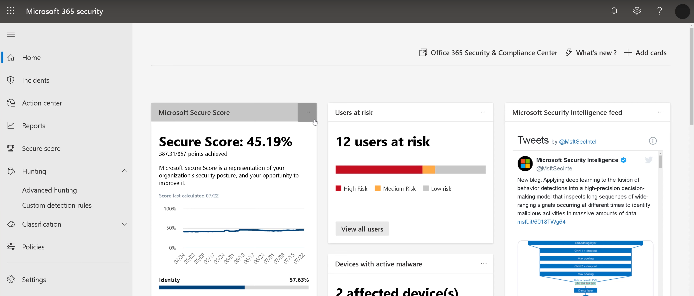

With multiple products in the Microsoft security stack, it can be difficult to get a thorough overview of your security stance and current threats in one place. The Microsoft 365 Defender portal provides such a centralized tool to summarize and amalgamate security data from many sources.

In Contoso, for example, as well as using Microsoft Defender for Cloud Apps, you have security information generated by Azure Threat Protection, Microsoft Defender for Endpoint, Microsoft Defender for Identity, and Azure Active Directory. You want to find a way to query all this information from a single tool.

Here, you'll learn how the Microsoft 365 Defender portal provides one place to view, investigate, and drill down into security events throughout your company.

## What is the Microsoft 365 Defender portal?

Microsoft provides a range of security products to protect cloud and on-premises systems. While these services are sufficient to defend your network against complex and rapidly evolving modern threats, it can be difficult to keep track of these products' behavior and performance when it's necessary to view that data in multiple locations.

For example, a threatening malware executable might have multiple potential routes into your organization:

- In emails delivered to Exchange Online.
- In uploads to Azure Storage accounts.
- Attached to messages in a mobile social media app.

These incursions might be detected and mitigated by Microsoft Defender for Cloud Apps, Microsoft Defender for Cloud on Windows or mobile operating systems, or Azure Advanced Threat Protection. To observe and investigate these events, it's necessary to log into several different portals and it's difficult to integrate that information into a single report.

The Microsoft 365 Defender portal integrates with many different Microsoft Security products and provides a single location where events can be investigated and diagnosed. In the Microsoft 365 Defender portal, you can view and analyze security events from across your organization's identities, data, devices, apps, and infrastructure.

You can access the Microsoft 365 Defender portal at <https://security.microsoft.com>

> [!NOTE]
> Before June 2021, The Microsoft 365 Defender portal was known as the Microsoft 365 Defender portal.

## Prerequisites

You must have a valid license to access the Defender for Cloud. If you have any of these licenses, you can access the Microsoft 365 Defender portal at no extra cost:

- Microsoft 365 E5 or A5
- Microsoft 365 E5 Security or A5 Security
- Windows 10 Enterprise E5 or A5
- Enterprise Mobility + Security (EMS) E5 or A5
- Office 365 E5 or A5
- Microsoft Defender for Endpoint
- Microsoft Defender for Identity
- Microsoft Defender for Cloud Apps
- Defender for Office 365 (Plan 2)

Trail licenses for Office 365 don't include access to the Defender for Cloud.

To check your licenses, go to the Microsoft 365 admin center and then select **Billing > Licenses**.

You'll also need administrative permission to access Microsoft 365 Defender information, including the data displayed in the Defender for Cloud. Accounts assign to the following Azure Active Directory roles have access:

- Global administrator
- Security administrator
- Security Operator
- Global Reader
- Security Reader

## Build dashboards in Microsoft 365 Defender portal

The Home page in the Microsoft 365 Defender portal is designed to provide an at-a-glance overview of the security health of your organization. It is composed of cards that display targeted information. The cards you see when you sign in depend on your role.

The cards you can use fall into four categories:

- **Identities.** These cards display information about how the identities in your organization are behaving and highlight suspicious or risky actions.
- **Data.** These cards help you to identify unauthorized data disclosure.
- **Devices.** These cards display information on alerts, activities, and risks that apply to mobile devices in your organization.
- **Apps.** These cards help you to identify how cloud apps are used and potential threats that they may represent.

You can customize the cards that the home page displays. You can use cards to build a dashboard of information that's targeted precisely to your role and helps you to focus on the most relevant events.



Other pages in the Microsoft 365 Defender portal include:

- **Incidents.** On this page, you can see how attacks started, where they were detected, and what steps have been taken to mitigate them. Each incident listed may include data from multiple Microsoft 365 Defender components and other Microsoft security stack products, integrated into a single story.
- **Alerts.** On this page, you can see, filter, and search alerts from Defender for Cloud Apps, Azure Active Directory, Defender for Endpoint, Defender for Identity and other sources.
- **Secure Score.** On this page, you can see an overall score that summarizes the strength of your security posture. The score depends on the features, policies, tools, and capabilities that you have enabled. The page also provides suggestions for security hardening.
- **Classification.** On this page, you can configure a classification scheme for documents, emails, web sites, and other objects. Using these categories, you can apply protection policies to different types of information.

## Advanced hunting

One page in the Microsoft 365 Defender portal is labeled **Advanced hunting**. You can use this tool to write and execute queries against the last 30 days of raw security data from throughout your organization. You can also use these queries to define custom detection rules, which automatically identify and mitigate threats.

The advanced hunting tool uses the Kusto query language to define queries. Here's an example of a Kusto query:

```kusto
// Finds PowerShell execution events that could involve a download
union DeviceProcessEvents, DeviceNetworkEvents
| where Timestamp > ago(7d)
// Pivoting on PowerShell processes
| where FileName in~ ("powershell.exe", "powershell_ise.exe")
// Suspicious commands
| where ProcessCommandLine has_any("WebClient",
 "DownloadFile",
 "DownloadData",
 "DownloadString",
 "WebRequest",
 "Shellcode",
 "http",
 "https")
| project Timestamp, DeviceName, InitiatingProcessFileName, 
InitiatingProcessCommandLine, FileName, ProcessCommandLine, 
RemoteIP, RemoteUrl, RemotePort, RemoteIPType
| top 100 by Timestamp
```

In Kusto, comments are prefaced by two forward slashes. Use comments to explain your query code to other administrators to help them understand the purpose and methodology of the query.

The first line of the query defines the tables against which the query runs: `DeviceProcessEvents` and `DeviceNetworkEvents`.

The first `where` clause specifies that the query should return only events that happened in the last seven days.

The second `where` clause specifies that the query should return only events generated by PowerShell.

The third `where` clause specifies what operations are considered suspicious by defining a set of keywords to check for in the PowerShell command line.

The `project` clause defines the data columns that the query will return.

The `top` clause limits the results to the most recent 100 events.
