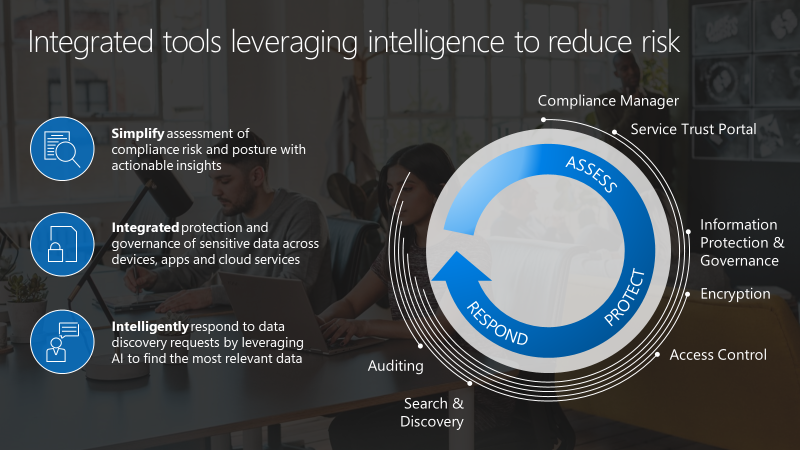

As the proliferation of data increases, and our reliance on storing and accessing that data from computer systems grows, so has the need for data management. Over the years, governmental and other agencies have become interested in how we use and share data. This is particularly relevant when dealing with personal data, such as financial and health data. 

To help protect individuals, governments and the agencies they appoint have introduced regulations about data storage and use. These regulations introduce requirements around data handling and retention, such as:
- Granting people the right to access, and possibly correct, data stored about them.
- Defining a data retention period. 
- Granting governments and their appointed regulatory bodies the rights to access stored records for investigative purposes. 
- Defining exactly how stored data can and cannot be used. In other words, defining the purpose for the collated data. 
- Defining privacy controls so that private data can remain private.

Organizations must comply with a number of governmental regulations regarding data privacy and access. This can be extremely complex to implement and manage. Some of these regulations include:
- HIPAA. The Health Insurance Portability and Accountability Act (HIPAA) imposes strict privacy regulations for customers who process electronic protected health information.
- Data processing agreements. A data processing agreement describes how the data processor handles and safeguards customer data. For example, the data processor for Office 365 is Microsoft, and the regulations are covered worldwide. 
- FISMA. United States federal agencies can procure information systems and services only from organizations that meet the Federal Information Security Modernization Act (FISMA) regulations.
- ISO/IEC 27001:2013. This standard from ISO and the International Electrotechnical Commission (IEC) is widely used, and is the best-known standard for an information security management system. Office 365 meets this security benchmark with physical, logical, process, and management controls. Since 2015, even ISO 27018 privacy controls for the most recent Office 365 audit are included. 
- EU Model Clauses. The European Union EU Data Protection Directive is a key instrument for the EU privacy and human rights law. The EU Model Clauses legitimize the transfer of personal data outside the EU, and they comprise the preferred method for the data transfer of personal data outside the EU. 
- Safe Harbor Framework. The US and EU Safe Harbor Framework also addresses the transfer of personal data outside the EU. Office 365 follows the principles and processes stipulated by this framework.
- The Family Educational Rights and Privacy Act (FERPA). United States educational organizations are required to follow FERPA regulations regarding the use or disclosure of student education records. This also includes student information sent in email or email attachments.
- SSAE 16. Independent organizations can audit Office 365 and provide SSAE 16 SOC 1 Type I and Type II, and SOC 2 Type II reports on how the service implements controls.
- The Personal Information Protection and Electronic Documents Act (PIPEDA). PIPEDA is a Canadian law pertaining to how private sector organizations collect, use, and disclose personal information in regard to commercial business. 
- The Gramm–Leach–Bliley Act (GLBA). This act protects customers’ nonpublic personal information, and financial institutions are required to follow these regulations to protect their clients’ information.

Microsoft 365 supports your organization’s compliance needs with built in tools and capabilities to help you protection information, manage data governance, and respond to regulatory requests. 

It can be helpful to think about managing compliance in terms of three phases: 
- **Assess**:  Simplify assessment of compliance risk and posture with actionable insights
- **Protect**:  Integrated protection and governance of sensitive data across devices, apps and cloud services
- **Respond**:  Intelligently respond to data discovery requests by leveraging AI to find the most relevant data

The graphic below visualizes how in each of these phases, the built-in information protection and data governance capabilities in Microsoft 365 help you achieve your compliance requirements: 

- Tools like Service Trust Portal and Compliance Manager help you assess your risk. 
- The built-in information protection and access control features in Microsoft 365 help you implement protection and data governance. 
- Capabilities like Advanced eDiscovery and Auditing give you the tools to find information to respond to regulatory requests or investigations.

In the following units, we’ll look at some of the tools Microsoft 365 provides to assess your compliance risk, protect and govern information, and respond to regulatory requests or manage investigations.