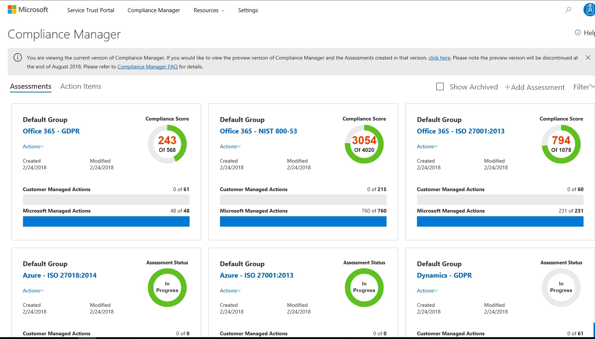

(Intro sentence)

## Service Trust Portal
There are a number of tools you can use to manage compliance in Microsoft 365. The first of these is the Service Trust Portal (STP). This portal provides a variety of content, tools, and other resources about Microsoft security, privacy, and compliance practices. It also includes independent third-party audit reports of Microsoft's online services, and information about how our online services can help your organization maintain and track compliance with standards, laws, and regulations such as:
- International Organization for Standardization (ISO).
- Service Organization Controls (SOC).
- National Institute of Standards and Technology (NIST)
- Federal Risk and Authorization Management Program (FedRAMP)
- General Data Protection Regulation (GDPR 
- Office 365 Auditing

The Service Trust Portal includes the following compliance tools:
- **Compliance Manager** – your dashboard to standards, regulations, and assessments.
- **Trust documents**. Audit reports, data protection info about how Microsoft operates Azure, Dynamics 365, and Office 365, Azure Security and Compliance Blueprint.
- **Regional Compliance**. Regionally specific compliance information, often in the form of legal opinions that describe Microsoft cloud services in different countries, like Australia, Poland, or the UK.
- **Privacy**. Info about the capabilities in Microsoft services that you can use to address specific GDPR requirements, as well as GDPR documentation

Compliance Manager is a dashboard view of standards, regulations, and assessments that helps you stay compliant with both internal requirements and well-known security standards. This feature works across Microsoft cloud services to help organizations meet complex compliance obligations, including: 
- GDPR
- ISO 27001
- ISO 27018
- NIST 800-53
- HIPAA

You can access the Service Trust Portal by going to http://aka.ms/STP

Video: Service Trust Portal video (6.23 minutes) 
[!VIDEO https://www.youtube.com/embed/qtzdqCPdMNg]

## Compliance Manager
The Compliance Manager is a workflow-based risk assessment tool you use to stay compliant with both internal requirements and well-known security standards. This feature works across Microsoft cloud services to help organizations meet complex compliance obligations, including: 
- GDPR
- ISO 27001
- ISO 27018
- NIST 800-53
- HIPAA

Compliance Manager performs the following key activities:
- **Real-time risk assessment**. In the Compliance Manager dashboard you can view a summary of your compliance posture against the data protection regulatory requirements that are relevant to your organization, in the context of using Microsoft cloud services. The dashboard provides you with your compliance score, which helps you make appropriate compliance decisions.
- **Actionable insights**. These insights help you understand the responsibility that you and Microsoft share in meeting compliance standards. For components that Microsoft manages, you can see the control implementation and testing details, test date, and results. For components that you manage, you can see recommendations for appropriate actions and guidance on how to implement them.
- **Simplified compliance**. Compliance Manager can help you simplify processes to achieve compliance. It provides control management tools that you can use to assign tasks to your teams. You can also generate reports instead of collecting information from multiple teams. This tool also enables you to perform proactive assessments when needed. 

Video: New Compliance manager demo: 
![VIDEO https://www.youtube.com/embed/r1vs8NdSXKQ]