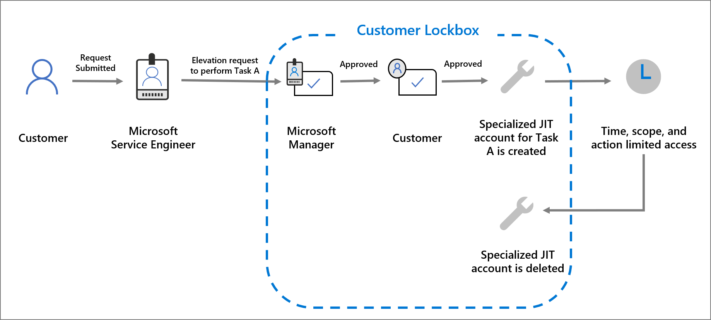

>[!VIDEO https://www.microsoft.com/videoplayer/embed/RE4xda3]

Customer Lockbox ensures that Microsoft cannot access an organization’s data in the cloud to perform a service operation without the customer’s explicit approval. Service Team engineers at Microsoft often help troubleshoot and fix technical issues reported by customers. Our engineers are sometimes able to resolve issues through the extensive telemetry and debugging tools Microsoft has in place for its services. However, some issues may require a Service Team engineer to access customer content to determine the root cause and fix the issue. Customer Lockbox requires the Service Team engineer to request access from the customer and provides customers with the option to approve or deny these access requests. This puts access control directly in the hands of the customer.

The following diagram illustrates the Customer Lockbox workflow when a customer experiences an issue in Microsoft 365 that requires a Service Team engineer to access customer content.

1. When a customer troubleshoots an issue but is unable to fix it, the customer can open a support request with Microsoft Support.

2. A Service Team engineer reviews the support request and determines if the request requires access to the customer’s tenant to resolve the issue.

3. If access to the customer tenant is necessary, the Service Team engineer logs into the Customer Lockbox request tool and makes a data access request. The request includes the customer's tenant name, service request number, and the estimated time the engineer needs access to the data.

4. If a Microsoft Support manager approves the request, Customer Lockbox sends the customer’s designated approver an email notification about the pending access request from Microsoft. Customer accounts with the global administrator role or the Customer Lockbox access approver admin role in the Microsoft 365 admin center can approve Customer Lockbox requests. The default duration for a customer to respond to a Customer Lockbox request is 12 hours. If the customer does not respond to a request within this period, the request expires without granting access to the Service Team engineer.

5. If the customer approver decides to grant access, they sign into the Microsoft 365 admin center and approve the request. This step triggers the creation of an audit record, which is made available to the customer in the audit log if the customer has enabled audit logging. All actions performed by a Service Team engineer are logged in the audit log.

6. After receiving approval from the customer approver, the Service Team engineer is granted access. The engineer can then log into the customer’s tenant in Microsoft 365 Services and resolve the customer's issue. When the period approved for access expires, access is automatically revoked. Currently, the maximum period allowed for access permissions granted through Customer Lockbox is 4 hours. The engineer can request a shorter period.

## Learn more ##
- [Customer Lockbox FAQ](https://docs.microsoft.com/microsoft-365/compliance/customer-lockbox-requests?view=o365-worldwide#frequently-asked-questions&azure-portal=true)
