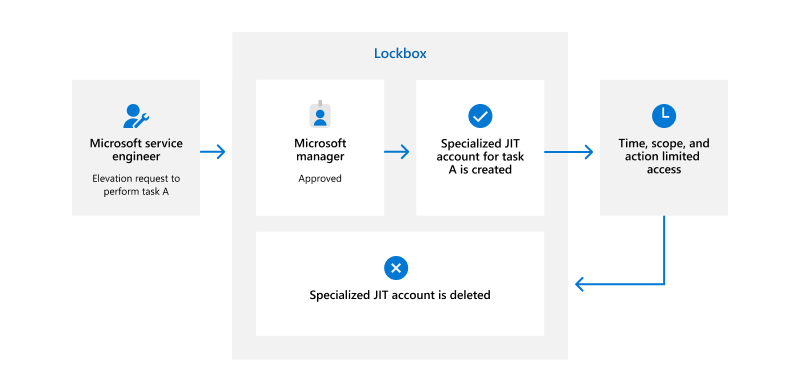

## Zero Standing Access (ZSA)

Microsoft approaches privileged access using the principle of ZSA. ZSA means that by default, Microsoft personnel do not have persistent privileged access to production environments. When access is provided through Just-In-Time (JIT) access, it is the bare minimum, with just enough access for the specific task at hand. ZSA takes the possibility of account compromise seriously and ensures that a compromised account cannot be used to run privileged commands in the production environment or access customer content.

ZSA is made possible by the architecture of Microsoft 365 products and services. Automated service code handles routine operations in Microsoft 365. This enables our engineers to support the service without standing administrative privileges or access to customer content. Nevertheless, sometimes our engineers require elevated privileges to provide timely support to customers or resolve issues in Microsoft 365 production environments. When service team engineers require privileged access, Microsoft 365 uses a JIT access model to provide limited, time-bound access.

## Just-In-Time (JIT) and Just-Enough-Access (JEA)

Microsoft 365 uses a JIT access model to provide service team engineers with temporary privileged access to production environments when such access is required to support Microsoft 365. The JIT access model replaces traditional, persistent administrative access with a process for engineers to request temporary elevation into privileged roles when required.

JIT in Microsoft 365 is enabled by Lockbox. Lockbox is a tool that enforces the JIT workflow and provides granular privilege management. Lockbox restricts elevated access to the minimum privileges, resources, and time needed to complete the assigned task. We call this implementation of least privilege Just-Enough-Access (JEA). Lockbox implements JEA for all JIT access requests by forcing engineers to specify the scope of access in their requests and provide a justification for why access is required.

IDM eligibilities and Lockbox roles work together to ensure JIT requests are limited to JEA. Engineers are only able to request access to assets within the scope of their service team account's eligibilities. For example, an engineer supporting a service or feature in Microsoft 365 would be eligible to request access to assets related to that feature. In addition, engineers can only request access to perform actions allowed by their approved Lockbox roles. Not all engineers require access to the same types of administrative functions, and Lockbox roles limit engineers to only the types of JIT requests that are necessary for their job responsibilities.  Lockbox automatically rejects JIT requests that are out of scope for the engineer's eligibilities and Lockbox roles, as well as requests that exceed allowed thresholds.

The JIT workflow leverages Lockbox to initiate JIT requests, facilitate review by Lockbox approvers, grant or deny access based on approver decisions, and audit JIT requests. The following diagram illustrates the Lockbox workflow when an engineer requests JIT access.

1. A service team engineer with a business need for privileged access to production resources requests access through Lockbox. The request specifies the privileged role, resources, and time required to complete the task. It also includes a business justification for why the task is necessary. Engineers can only request elevation into privileged roles allowed by their security groups memberships, and can only specify resources in-scope for their service team account eligibilities.

2. Lockbox sends the JIT request to a designated access approver, who reviews the request and makes the decision to grant or deny access. Engineers cannot approve their own JIT requests. If the access approver denies the request or allows the request to expire without any action, access is not granted.

3. If the access approver approves the request, the engineer who requested access receives a temporary account and one-time machine-generated complex password. This temporary account allows access to the resources specified in the request.

4. The engineer uses this temporary privileged account to connect to the production environment using multifactor authentication (MFA) through a Secure Access Workstation (SAW). Use of the temporary account is automatically monitored and logged to ensure accountability and detect anomalous behavior. After the duration specified in the request expires, the temporary account is disabled, and access is automatically revoked.

The JIT access model limits the impact of a compromised service team account by ensuring service team accounts do not have standing privileged access to production environments. Moreover, the temporary privileged access granted through Lockbox is limited in scope and expires after the specified duration. This means that compromise would not grant an attacker unlimited or persistent access to production resources. Use of a SAW to connect to the production environment further limits the potential impact of a compromised account.
