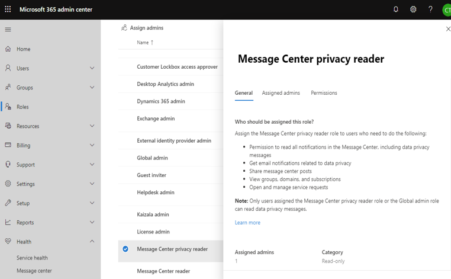

The following diagram illustrates customer notification process after a confirmed security incident occurs.

   

## Microsoft Responsibility ##

If at any point in the investigation of a security or privacy incident the Microsoft 365 Security Response team discovers that customer data has been the subject of accidental or unlawful destruction, loss, or alteration, unauthorized disclosure, or unauthorized access, then the event is declared a security incident and the customer incident notification process is initiated. Microsoft identifies and notifies any affected tenants within 72 hours in accordance with the guidelines of many regulatory frameworks, including GDPR.

The notification timeline commitment begins when the official security incident declaration occurs. Upon declaring a security incident, the notification process occurs as expeditiously as possible, without undue delay.

Customer notification for security incidents occurs via appropriate channels based on the nature and scope of the incident. These channels may include one or more of the following:

- Notification in the [Message Center of the M365 Admin center](https://docs.microsoft.com/microsoft-365/admin/manage/message-center?view=o365-worldwide&azure-portal=true)
- Email to the customer’s tenant administrator
- Email to the customer’s designated [Global Privacy Contact](https://docs.microsoft.com/azure/active-directory/fundamentals/active-directory-properties-area?azure-portal=true) (if the tenant Admin has defined it in the Azure Active Directory Admin center)
- Direct outreach by phone call to the customer’s tenant administrator by a specially trained Support team member

Microsoft’s customer notification commitments are detailed in two sections of the [Microsoft Online Services Data Protection Addendum](https://www.microsoft.com/licensing/product-licensing/products?azure-portal=true):

### Security Incident Notification ###

*Notification(s) of Security Incidents will be delivered to one or more of Customer’s administrators by any means Microsoft selects, including via email. It is Customer’s sole responsibility to ensure Customer’s administrators maintain accurate contact information on each applicable Online Services portal. Customer is solely responsible for complying with its obligations under incident notification laws applicable to Customer and fulfilling any third-party notification obligations related to any Security Incident.*

*Microsoft shall make reasonable efforts to assist Customer in fulfilling Customer’s obligation under GDPR Article 33 or other applicable law or regulation to notify the relevant supervisory authority and data subjects about such Security Incident.*

*Microsoft’s notification of or response to a Security Incident under this section is not an acknowledgment by Microsoft of any fault or liability with respect to the Security Incident.*

*Customer must notify Microsoft promptly about any possible misuse of its accounts or authentication credentials or any security incident related to an Online Service.*

### Appendix A – Security Measures ###

#### Incident Response Process ####

*For each security breach that is a Security Incident, notification by Microsoft (as described in the “Security Incident Notification” section above) will be made without undue delay and, in any event, within 72 hours.*

## Customer Responsibility ##

To ensure notifications are received promptly by the correct customer contacts, the customer must maintain accurate contact information in their tenant profiles.

- Customers should ensure their contact information is up to date in the [Microsoft 365 Admin center](https://docs.microsoft.com/microsoft-365/admin/admin-overview/about-the-admin-center?view=o365-worldwide&azure-portal=true).
- Customer administrators should [configure the options](https://docs.microsoft.com/microsoft-365/admin/manage/message-center?view=o365-worldwide&azure-portal=true) for how Data Privacy messages are displayed in the Message Center to ensure relevant customer administrators are made aware of incident notifications.

   ]

- If necessary, Global Admins can configure additional roles with access to Message Center content to avoid granting unnecessary administrative rights to non-administrators who require access to incident notifications.

Customers share responsibility with Microsoft for reporting security incidents. In the context of Microsoft Commercial services (as opposed to Consumer services), Microsoft is the Data Processor, while the customer is the Data Controller. If a security incident where Microsoft serves as the Data Processor, Microsoft will notify affected customers, who are then responsible for notifying their Data Protection Authorities, regulatory bodies, and affected users as required by any relevant regulations or laws. In addition, if a customer becomes aware of a security incident involving its own user accounts or any Microsoft Online Service, the customer must notify Microsoft promptly as described in the [Microsoft Online Services Data Protection Addendum](https://www.microsoft.com/licensing/product-licensing/products?azure-portal=true).

## Learn more ##

- [Security Incident Management in Microsoft 365 White Paper](https://aka.ms/Office365SIM?azure-portal=true)
- [Microsoft Online Services Data Protection Addendum](https://www.microsoft.com/licensing/product-licensing/products?azure-portal=true)
- [Microsoft Secure Score](https://docs.microsoft.com/microsoft-365/security/mtp/microsoft-secure-score?view=o365-worldwide&azure-portal=true)
