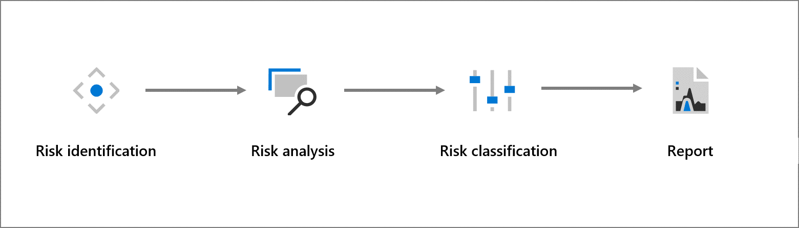

Managing risk within our datacenters is a continuous process, with formal assessments occurring throughout the lifecycle of a facility. To identify and mitigate the impact of physical and environmental threats to Microsoft datacenters, a Threat, Vulnerability, and Risk Assessment (TVRA) is conducted annually for all datacenters hosting customer data. In addition to following Microsoft Enterprise Risk Management’s Framework, Microsoft leverages requirements defined in the Technology Risk Management Guidelines initially published in June 2013 by the Monetary Authority of Singapore. TVRAs reflect Microsoft’s best professional judgement based on accepted risk assessment methods and the information currently available to the company.

The TVRA process follows these steps:

- **Risk Identification:** TVRAs consider a wide range of threat scenarios emerging from natural and man-made (including accidental) hazards, depending on datacenter location, design, scope of services, and other factors. The TVRA considers threat scenarios at multiple geographic levels: country, metropolitan area, and site-specific. In addition to leveraging data from trusted and independent third-party risk organizations, the TVRA threat scenarios also incorporate feedback from Microsoft subject-matter experts (SMEs) regarding the top threats to Microsoft datacenters. For locations that have multiple datacenters, TVRA ratings are aggregated to ensure a holistic view of the physical and environmental threats, vulnerabilities, and risks for the locations being assessed.

Types of threat scenarios assessed for datacenter TVRAs include:

- **External threats** – incidents resulting from external intentional or accidental human activities (for example, political instability, civil disorder).
- **Internal threats** – incidents resulting from internal intentional or accidental human activities (for example, internal theft, sabotage).
- **Natural hazards** – a natural process or phenomenon that could negatively impact datacenters (for example, floods, earthquakes, severe storms).
- **Environmental threats** – environmental conditions that could negatively impact datacenters (for example, water stress, hazardous materials exposure, climate change).

- **Risk Analysis:** Threats are evaluated based on an assessment of their inherent risk. Inherent risk is calculated as a function of impact of a threat and likelihood of the threat occurrence in the absence of management action and controls. These assessments are informed by both internal SME feedback and third-party data sources.

- **Risk Classification:** Residual risk is determined as a measure of remaining risk levels after consideration of control effectiveness. Control effectiveness is evaluated as a measure of current management actions and controls designed to prevent or detect threats, and assesses the likelihood that the controls, as designed and implemented, will have their desired effect. These assessments are informed by an aggregation of internal SME  feedback on control effectiveness for the datacenter locations addressed in the TVRA.

- **Report:** Once the assessment is documented and approved by management stakeholders, the TVRA is published annually.

Microsoft is committed to continuously updating its risk assessments and methodologies to incorporate improvements and account for changing conditions. As a result, our analysis and conclusions are subject to change.

## Learn more

- [Monetary Authority of Singapore (MAS)’s Technology Risk Management Guidelines](https://www.mas.gov.sg/~/media/MAS/Regulations%20and%20Financial%20Stability/Regulatory%20and%20Supervisory%20Framework/Risk%20Management/TRM%20Guidelines%20%2021%20June%202013.pdf?azure-portal=true)
