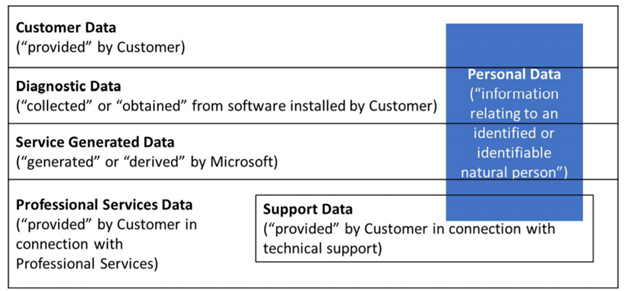

When customers sign up for Microsoft Online Services, it is important that customers understand the terms of use that apply to them. Because privacy and regulatory requirements differ by industry and geographical boundaries, it is important that customers make their own determinations as to whether the service meets their particular use needs.

The terms of use that Microsoft has with its customers are:

- Online Services Terms (OST): standard contractual commitments to commercial customers that use Online Services, where Microsoft acts as data processor
- Online Services Data Protection Addendum (DPA): respective obligations around processing and using data types that exist in our service

The DPA and OST were originally in one document until January 2020, when we split them apart to make it easier for our customers to find data privacy terms. Microsoft works with regulators and commercial customers to obtain feedback on data protection laws, and we adjust for varying regulations as they change.  

## Privacy notice, consent, and data taxonomy

Notice and consent are fundamental principles of privacy laws around the world. Microsoft maintains a Customer Data Governance Board (CDGB) which manages the Customer Data Taxonomy (Taxonomy) and the Customer Data Use Framework (Framework) - a set of company-wide rules for notice, consent, and user controls. The Taxonomy defines categories of data types and uses. The Framework specifies the notice, consent, and post-collection user controls required for the use of each data type. Microsoft also uses privacy reviews, including a legitimate interest analysis to support this process. Additional requirements may apply to specific situations (for example, parental consent may be necessary to collect data from a child.)

## Data handling and use

Data Handling Standards provide guidance about how to manage each data classification type within specific activities or scenarios, including a set of collective requirements to meet the obligations outlined in the OST/DPA and various audit standards and regulations. These standards are commonly used when new features are being built or when running a service, and can be specific to that service, such as Microsoft 365.

To comply with broadly applicable privacy laws, we strictly limit our use of all personal data within the four categories of data processed. To protect the confidentiality of customer business data, we further strictly limit the use of all customer data and all professional services data. We do not access the contents of customer data to determine what is personal or not. Instead, we assume that all customer data and all professional services data contain personal data.  Below is a visual representation of the data types defined in the DPA. The blue box helps to illustrate that all personal data is processed as a part of one of the other data types (all of which also include non-personal data). Support data is a subset of professional services data.

The personal data within diagnostic data and service-generated data is mostly in the form of unique machine-generated numbers that are linkable to users.

## International data transfers

Customer data and personal data that Microsoft processes on a customer's behalf may be transferred to, and stored and processed in, the United States or any other country in which Microsoft or its subprocessors operate. If a customer wants a deeper understanding by service, it is beneficial to review the Data Protection Addendum.

Microsoft complies with international data protection laws regarding transfers of customer data across borders. For example, the EU Model Clauses regulate the transfer of EU customer personal data to countries outside the European Economic Area (EEA). Microsoft EU Standard Contractual Clauses provide specific contractual guarantees around transfers of personal data for covered services that Europe's privacy regulators have determined to meet EU standards for international transfers of data. The EU Model Clauses also provide a valid mechanism for the transfer of personal data from Switzerland and the United Kingdom.

## Learn more

- [Online Services Terms (OST) & Data Protection Addendum (DPA)](https://www.microsoft.com/licensing/product-licensing/products?azure-portal=true)
- [How Microsoft categorizes data for online services](https://www.microsoft.com/trust-center/privacy/customer-data-definitions?azure-portal=true)
- [EU Model Clauses](/microsoft-365/compliance/offering-eu-model-clauses?azure-portal=true)
- [EU-U.S. Privacy Shield](/microsoft-365/compliance/offering-eu-us-privacy-shield?azure-portal=true)
