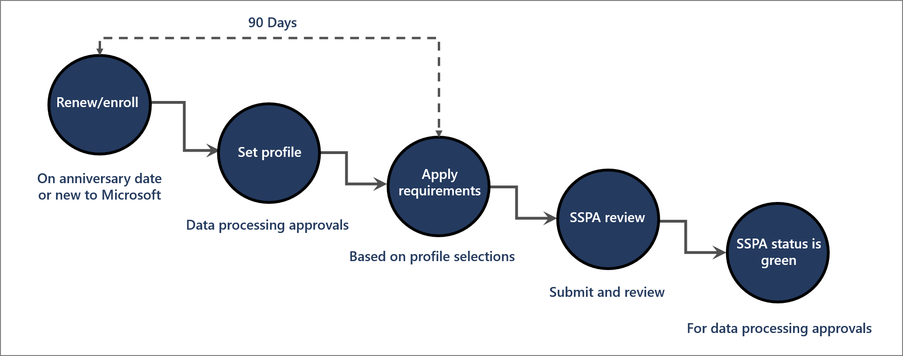

When Microsoft 365 initiates a support contract with a subprocessor, specific workflows and processes ensure subprocessors meet requirements before beginning contracted work. New subprocessors must complete a series of verifications to validate that their information systems meet the requirements applicable to the types of data they will process as part of contracted work. Alternatively, contracted work assigned to existing subprocessors who have already met requirements allows Microsoft to limit the number of subprocessors who process customer or personal data.

## Adding a new subprocessor

Adding a new subprocessor requires a series of rigorous verifications to ensure the subprocessor meets Microsoft standards before they can begin contracted work. These verification steps include but are not limited to:

- A business verification check: A review by the business to determine why the use of this supplier is needed over suppliers who are already approved. Once business approval has been granted, the additional verifications below must be performed.
- Anti-corruption checks: Check against global relationship management systems and news for suppliers who may be engaged in corruption activities.
- Corruption risk score: This is a score that is assigned based on the anti-corruption check. The score indicates the risk level of the supplier being involved in corruption activities.
- A do-not-engage check: Internal Microsoft check against suppliers who have been deemed inappropriate for use.
- Trade sanctions screening: A review of watch sites, government records, and media searches to determine if trade sanctions apply to the supplier.

In addition, business unit approval is required as a final check after all scores and checks have been returned and accounted for.

Subprocessor enrollment begins with an email request to a prospective subprocessor with instructions to create a profile in the Microsoft Supplier Compliance Portal (MSCP). Subprocessors use the portal to choose the data processing activities they wish to be approved for. These data processing activities include:

- Processing of personal data and/or Microsoft confidential data
- Processing data on the supplier's network
- Data processing role (controller, processor, co-controller, etc.)
- Payment card processing
- Provision of Software as a Service (SaaS)
- Use of subcontractors

Once a subprocessor has completed their profile, subprocessors must demonstrate compliance with all applicable Data Protection Requirements (DPR), along with any other required SSPA verifications based on their profile. Data processing activities considered high-risk require self-attestation of DPR compliance as well as an audit from an independent and certified authority. Once a subprocessor has passed all applicable checks, their SSPA status is subject to final review. Reviewers verify all relevant checks and decide which types of data processing should be approved. After the profile has been approved, subprocessors receive the requisite data processing approvals.

## Adding an existing subprocessor

Subprocessors that have already been approved by Microsoft to process certain data types can be engaged more easily to complete similar contracts. If a subprocessor has already been approved to process the relevant data classifications, new purchase orders can specify existing subprocessor resources. Our systems verify that the existing subprocessor has met relevant requirements for the data classifications required by the new purchase order. If the existing subprocessor has not yet been approved for the relevant data classification, an updated DPR is sent to the subprocessor for attestation and may result in additional verification requirements.

## Microsoft Data Protection Requirements (DPR)

All enrolled subprocessors must complete a self-attestation of compliance with the DPR annually. Subprocessor data processing profiles determine whether the full set of DPR requirements or an applicable subset of requirements apply. Subprocessors who process data must provide an independent verification of compliance, each of which details related security and privacy controls. The subprocessor must demonstrate compliance with all in-scope sections before they can be approved to begin contracted work.

- Section A: Management
- Section B: Notice
- Section C: Choice and Consent
- Section D: Collection
- Section E: Retention
- Section F: Data Subject Rights
- Section G: Disclosure to third Parties
- Section H: Quality
- Section I: Monitoring and Enforcement
- Section J: Security

## Additional certification requirements

In addition to compliance with the DPR, Microsoft requires subprocessors to maintain the following certifications:

- **ISO/IEC 27001 Certification** for all subprocessors, including the ISO/IEC 27002 Code of Best Practices.
- **ISO/IEC 27018 Certification** for subprocessors storing customer data in a cloud service.
- **EU-US Privacy Shield and Swiss-U.S. Privacy Shield Certifications** for subprocessors processing personal data from the European Union or Switzerland in the United States of America (to the extent allowed based on program requirements).
- **Payment Card Industry (PCI) Certification** for subprocessors who process or store credit card data. These subprocessors must be audited annually as a Level 1 Supplier by a Qualified Security Assessor certified in the current version of PCI.
- **ISO/IEC 27701 Requirements** for all subprocessors.

## Learn more

- [Supplier Privacy & Assurance Standards](https://www.microsoft.com/procurement/sspa?activetab=pivot:primaryr3&azure-portal=true)
