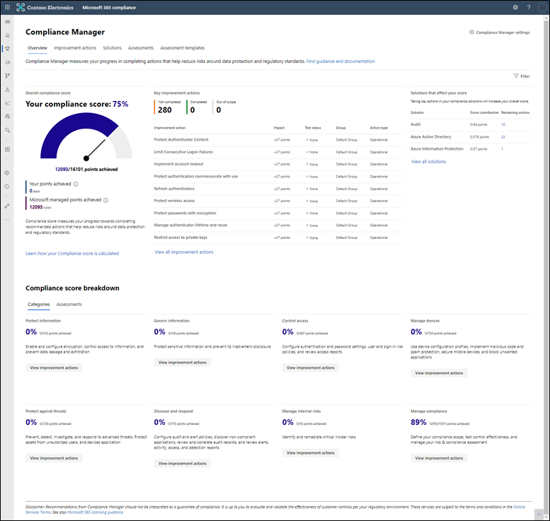
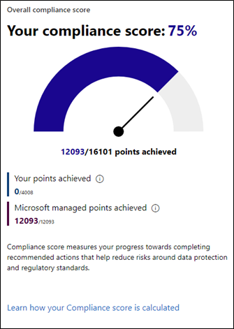
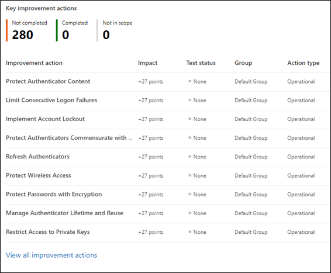
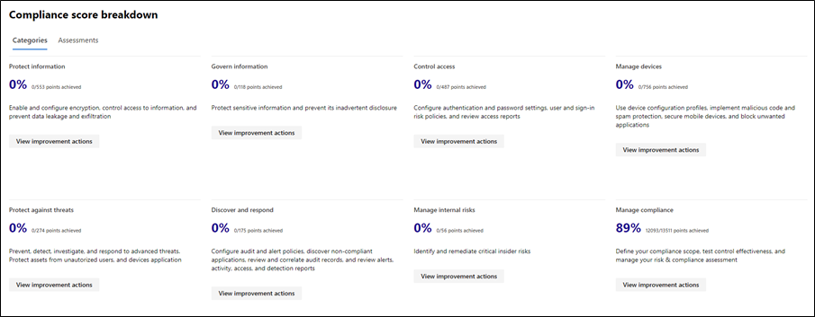
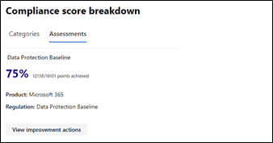
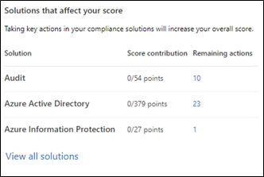
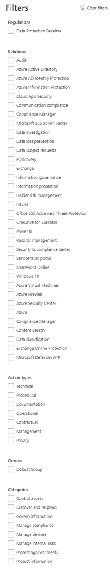

The Compliance Manager dashboard provides you with an at-a-glance view of your current compliance posture. It shows your compliance score, helps you see what needs attention, and guides you to actions to improve compliance. The Compliance Manager dashboard (shown below) consists of the following sections:

- Overall compliance score
- Key Improvement actions
- Compliance score breakdown
- Solutions that affect your score

## Overall compliance score

Your compliance score measures your progress towards completing recommended actions that help reduce risks around data protection and regulatory standards. Your initial score is based on the Data Protection Baseline, which includes controls common to many industry regulations and standards. While the Data Protection Baseline is a good starting point for assessing your compliance posture, compliance score becomes more valuable once you add assessments relevant to the specific requirements of your organization.   You can also use filters to view the portion of your compliance score based on criteria that includes one or more solutions, assessments, and regulations. More on that later.

The image below is an example of the Overall compliance score section of the Compliance Manager dashboard. Notice that even though the number under Your points achieved is 0, the Compliance Score is 75%. This demonstrates the value of the shared responsibility model. Since Microsoft has already implemented all the actions it is responsible for, a substantial portion of what is recommended to achieve compliance is already complete even though you have yet to take any action.

  

## Key improvement actions

The **Key improvement actions** section shows the activities that, if implemented, will most positively impact your compliance score. The example below shows each improvement action has an impact of 27 points. That means each action is of the type mandatory preventative. The **View all improvement actions** link leads to the **Compliance Manager Improvement actions** page containing a complete list of your improvement actions. The summary at the top shows that there is a total of 280 improvement actions to complete.

  

## Compliance score breakdown

The **Compliance score breakdown** section is divided into **Categories** and **Assessments.** Both are designed to provide you with information about your compliance posture based on a subset of your compliance program.
The **Categories** view shows the portion of your overall compliance score applicable to these eight categories:

- Protect information
- Govern information
- Control access
- Manage devices
- Protect against threats
- Discover and respond
- Manage internal risks
- Manage compliance

The image below shows the compliance score results for **Categories** with only Microsoft-managed actions implemented. Your deployment may look similar when you get started. Notice only the **Manage compliance** category has any score associated with it – 89%. This is because it is the only category that includes improvement actions Microsoft implements on your behalf. All the other categories are composed entirely of actions you manage. The values of 0% in each of the other categories indicates none of your actions have been completed.

The **Assessments** shows the portion of your overall compliance score applicable to the assessments you have chosen to track for your organization. The image below shows the default **Assessments** view of the **Compliance score breakdown.** Notice only Data Protection Baseline assessment is displayed. This is because no additional assessments have been added. The 75% shown in the image is the compliance score specifically related to the Data Protection Baseline assessment.

  

## Solutions that affect your score

This section shows a partial list of solutions containing improvement actions that can positively impact your score, and the number of remaining improvement actions in each solution. Select **View all solutions** to visit the Compliance Manager solutions page and see a complete list of solutions and remaining actions.

  

## Dashboard filter

Select **Filter** in the upper-right corner of the page to see Compliance Manager Overview filtered by the criteria you specify. You can select one or more filters based on regulations, solutions, action types, groups, and categories. You can, for example, filter the dashboard to show only the score, actions, solutions, categories, and assessments relevant to the NIST 800-53 regulation and the Records Management solution.

The only regulation or standard appearing in the example image below is **Data Protection Baseline.** This is because no additional assessments have been added to Compliance Manager other than what is configured by default.

  
