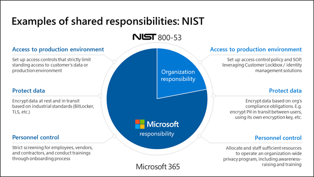

Because the responsibility is shared, transitioning your IT infrastructure from on-premises to a cloud-based service like Microsoft 365 significantly reduces your burden of complying with regulations. Take the United States National Institute of Standards and Technology's NIST 800-53 regulation as an example. It is one of the largest and most stringent security and data protection control frameworks used by the United States government and large organizations. If your organization were adhering to this standard and using Microsoft 365, Microsoft would be responsible for managing more than 75% of the 500-plus controls. You would only need to focus on implementing and maintaining the controls not managed by Microsoft. Contrast that situation with one where your organization was running 100% on-premises. In that case, your organization would need to implement and maintain all the NIST 800-53 controls on your own. The time and cost savings managing your IT portfolio under the shared responsibility model can be substantial.

The image below depicts the sharing of responsibilities for managing NIST 800-53 compliance in Microsoft 365.

  
