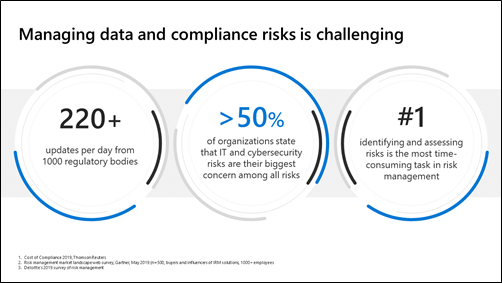

According to an annual report about the cost of compliance, there were more than 220 regulation updates per day from over 1,000 regulatory bodies all over the world. As noted earlier, a significant amount of the compliance-related activity we are seeing is in data protection regulations and initiatives focused on privacy. For example, enforcement on the California Consumer Privacy Act (CCPA), Brazil's Lei Geral de Proteção de Dados (LGPD), and Thailand's Personal Data Protection Act (PDPA) began in 2020.

Organizations face all kinds of risks, including financial, legal, people, IT, and cybersecurity risks. According to research, more than half of the organizations surveyed view IT and cybersecurity risks as their biggest concern. This aligns with the trend of tightening data protection regulations and increasing consumer awareness of the value of keeping their personal information private.

When it comes to managing risks, research indicates risk identification and assessment is the most time-consuming task. Many organizations are still tracking their data protection controls manually and relying on point-in-time assessments, like annual audits, to identify and assess risks.

  
