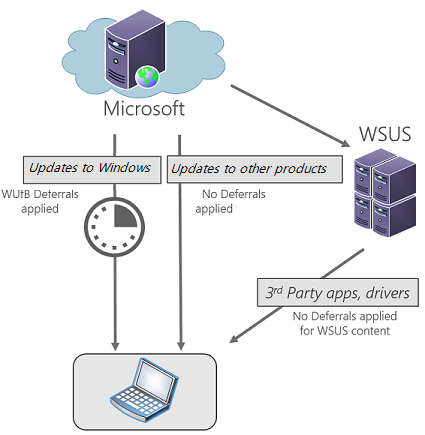

Windows Update for Business is a new service introduced with Windows 10. With Windows Update for Business, you can use Group Policy or mobile device management to configure Windows Update to control the distribution and deployment of Windows updates.

Windows Update for Business provides three types of updates in Windows:

- Feature Updates. These updates include security and quality revisions, and feature additions and changes. They're released approximately every 4 to 8 months.
- Quality Updates. These operating system updates typically are released the second Tuesday of each month (though they can be released at any time). These include security, critical, and driver updates. Updates to other Microsoft products (such as those for Microsoft Office or Microsoft Visual Studio) are also treated as Quality Updates.
- Non-deferrable updates. Antimalware and antispyware Definition Updates from Windows Update are mandatory and cannot be deferred.

Windows Update for Business is not a product so much as a way of providing control over updates in a business setting. As such, you can optionally integrate the Windows Update for Business approach in many scenarios using a variety of existing management technologies, including Windows Server Update Services (WSUS). The following three examples describe different scenarios for configuring Windows Update for Business.

## Scenario #1. Defer Windows Update updates with other update content hosted on WSUS

In this scenario, the following objectives apply:

- Device is configured to defer Windows Quality Updates with Windows Update for Business.
- Device is managed by WSUS.
- Device is not configured to enable Microsoft Update.
- Office and other software apps are on WSUS.
- Third-party drivers are on WSUS.

## Scenario #2. Exclude drivers from Windows Quality Updates using Windows Update for Business

In this scenario, the following objectives apply:

- Device is configured to defer Windows Quality Updates and to exclude drivers from Windows Update Quality Updates.
- Device is configured to be managed by WSUS.
- Windows Update drivers are available on WSUS.

## Device configured to receive Microsoft updates

In this scenario, the following objectives apply:

- Device is configured to defer Quality Updates using Windows Update for Business.
- Device is managed by WSUS.
- Device is configured to receive updates for other Microsoft products at the same time as updates to Windows.
- Microsoft Update, third-party, and locally published update content is available on the WSUS server.

These are the three primary scenarios for using Windows Update for Business.

## Learn more

- [Configure Windows Update for Business](/windows/deployment/update/waas-manage-updates-wufb?azure-portal=true)
- [Deploy Windows Updates](/windows/deployment/update/?azure-portal=true)
- [Implement feature updates](/windows/deployment/update/?azure-portal=true)
- [Monitor Windows 10 updates](/windows/deployment/update/update-compliance-monitor?azure-portal=true)
