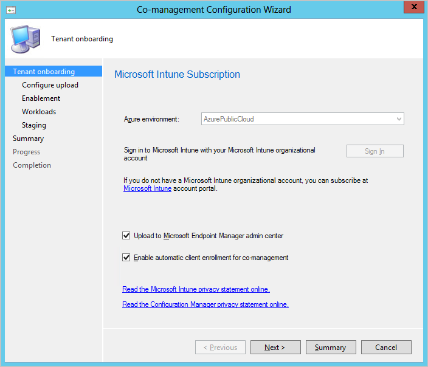

You need to ensure every device you manage is reachable, no matter where it is or when it connects. You also need to provide each user with everything they need to stay productive, while protecting devices, apps, and data. Device actions help you confirm your policies are in sync and all apps are functioning correctly.

## Perform device actions

You can choose the following device actions:
   - **Sync Machine Policy** - Configuration Manager will request the client download policy for the device.
   - **Sync User Policy** - Configuration Manager will request the client download policy for the currently logged on user.
   - **App Evaluation Cycle** - Configuration Manager will request the client to re-evaluate the requirement rules for all applicable app deployments.

When you run a device action from Microsoft Endpoint Manager admin center, the notification request is forwarded to the Configuration Manager site, and from the site to the client device. 

Use the following steps to run a device action:

1. In a browser, navigate [Microsoft Endpoint Manager admin center](https://go.microsoft.com/fwlink/?linkid=2109431).
2. Click **Devices** > **All devices** to see the uploaded devices.  
   You'll see **ConfigMgr** in the **Managed by** column for devices that have been uploaded from Configuration Manager. 

   

3. Select a device to view its **Overview** page.
4. Choose the **Sync User Policy** > **Yes** to run the action. 
   Configuration Manager will request the client to download the policy for the current logged on user.

   

   After selecting to run a device action, you'll see a status message in the **Device actions status** table. Once the device action is finished syncing, the status message will show as **Complete**. If an error occurs, you'll see a message in the **Error** column. If a device action completes with out error, you'll have confirmed that the device action is running correctly.
