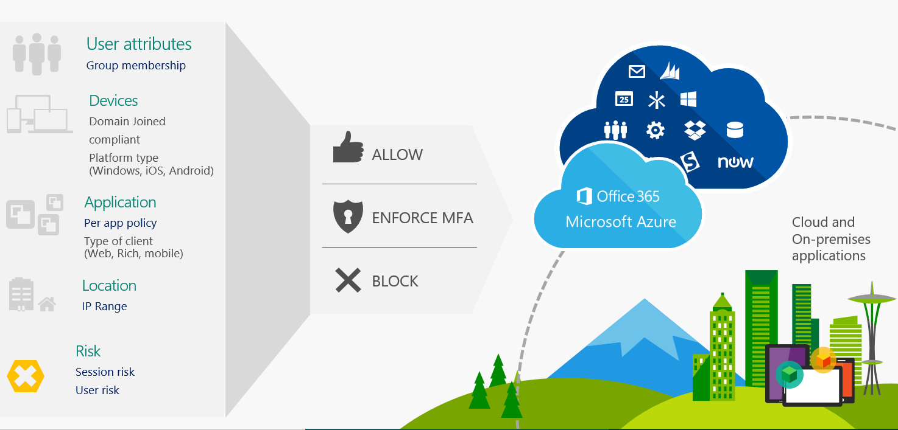

Conditional access provides granular access control to keep your corporate data secure, while giving users an experience that allows them to do their best work from any device, and from any location. Conditional access helps protect sensitive data by evaluating users, devices, apps, location, and risk before access is granted to corporate data. This helps manage access to sensitive data and helps ensure that only approved users and devices can access critical company resources. 

Conditional Access is a solution that spans Microsoft 365 services including Intune, Office 365, and Windows 10. 

