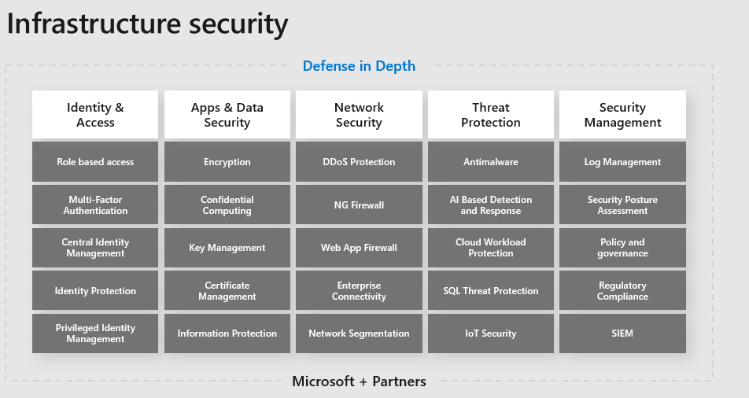

Corporate infrastructure spans across devices, networks, identities, management tools, apps, and more. Organizations need to evaluate their infrastructure and implement holistic security controls that span their various business needs.

