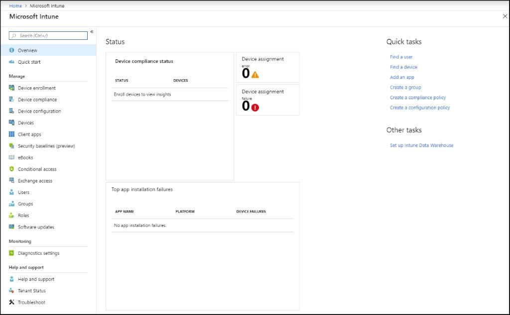

Intune is a cloud service that helps you manage computers, laptops, tablets, and other mobile devices. This includes iOS, Android, and Mac OS X devices. It uses Azure Active Directory (Azure AD) as a directory store for identity, and it can integrate with local management infrastructures such as Microsoft System Center Configuration Manager (SCCM). Intune is especially useful for devices that are beyond the management scope of Group Policy, such as mobile phones, devices that are not Active Directory Domain Services (AD DS) domain members, or Windows 10 devices that are joined to Azure AD. 

By using Intune, you can:
- Let your organization's employees use their personal devices to access organizational data (commonly known as "Bring Your Own Device (BYOD)").
- Manage organization-owned phones.
- Control access to Microsoft Office 365 from unmanaged devices, such as public kiosks and mobile devices.
- Help ensure that devices and apps that do connect to corporate data comply with security policies.

Intune is a component of Enterprise Mobility + Security (EMS). Intune integrates with Azure AD and device OS features to provide a device management solution. For example, when a user attempts to access Office 365 data through a line of business app (LOB app) on their phone, Office 365 checks with Azure AD to authenticate the user and verify whether that user can access the data from that app on that device. The results depend on: 
- Conditional access policies defined within Azure AD. 
- Whether Intune tells Azure AD that the device is compliant with device configuration and data protection policies.
- Whether the app on that device complies with app configuration and data protection policies. 

If the device and app are both compliant with all policies, Azure AD notifies Office 365 that the data can be accessed.