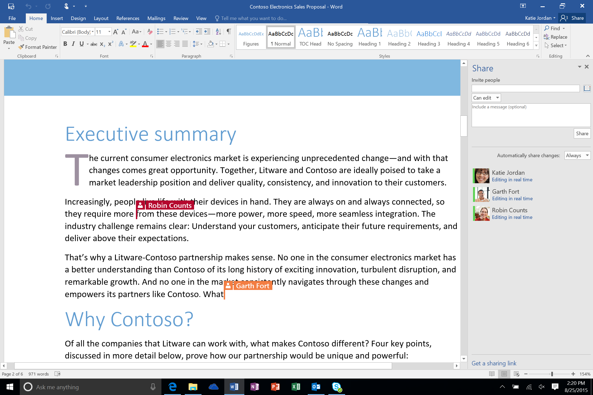

Users work in many ways, sometimes along departmental lines and other times with team members from other departments. Often, they also work with people from outside their own organization, such as suppliers and customers. Microsoft 365 enables users to easily and securely share their documents and data, work together with teammates anytime, get feedback insights from colleagues, and store content easily with version history to keep up-to-date with document progress. 

When users are working together on a document in real time, it’s called co-authoring. Microsoft 365 provides co-authoring capabilities across all the core Office apps. You can co-author on an Office document when it is stored in OneDrive for Business or SharePoint. Microsoft Teams brings author presence information into the co-authoring experience and adds a chat-based workspace for the people who are actively working in the doc. 

*An example of co-authoring in Word* 

**OneDrive for Business** and **SharePoint** in Microsoft 365 provide shared storage, document version controls, and permission settings to enable multiple users to seamlessly edit the same document.

**Microsoft Teams** provides the entire team, including outside consultants and independent contractors, with a single point of access to everything they need to move a project forward, including project specific applications like creative resources, development repositories, and survey and analytics tools. Teams is also fully integrated with Microsoft applications including Word, Excel, PowerPoint, Power BI, and Stream, so the team can collaborate and access information without leaving their shared Teams workspace. All files that are worked with in Teams are automatically stored in SharePoint, and team members can customize intranet sites with project details and announcements for the broader organization. Teams is the place to have informal chats, iterate quickly on a project, work with Teams files, and collaborate on shared deliverables.

**Microsoft Teams** is also customizable and configurable. You can enable, disable, and configure apps for Teams, including tabs, connectors, and bots provided by Teams (first-party apps, also known as default apps) or by a third-party (also known as external apps). Additional settings let you specify whether external apps are enabled by default and which users can sideload apps to Teams. You can control organization-wide user settings such as external access and guest access to let your users work with people outside your organization. Other configurable settings include email integration, file sharing and cloud file storage, organizational charts, device authentication for Surface Hubs, and scoped directory searches.
