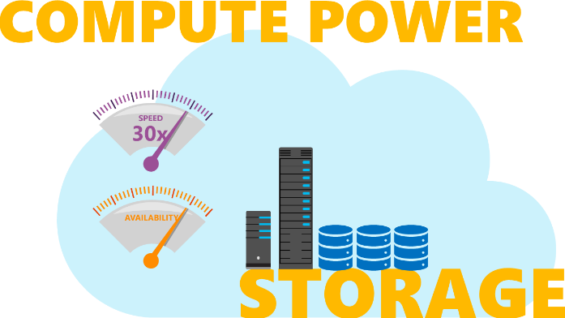
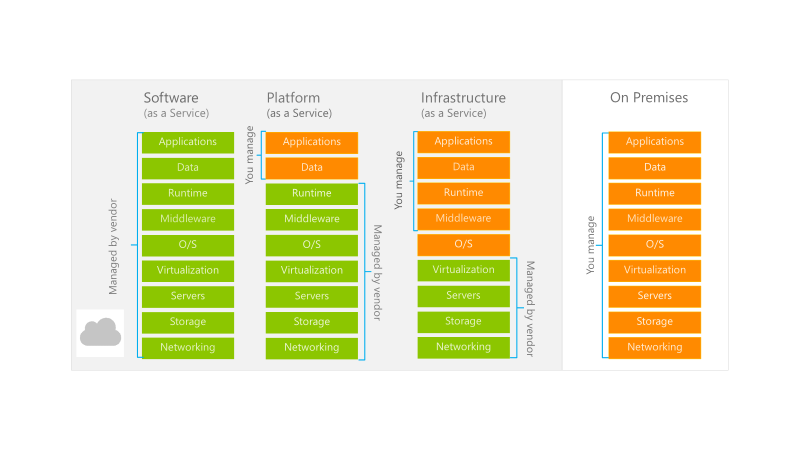

Cloud computing providers offer a wide range of services to meet the different needs of organizations, and different cloud providers offer different services. These services typically include:

-	Communication: Voice, email, chat, and video
-	Collaboration: Information sharing that is secure and flexible
-	Subscriptions: Services and pricing models customized to your need
-	Compute power: Delivered on demand
-	Storage: Secure, scalable, and easy

To get a basic understanding of some of the services that the cloud provides, let’s briefly look at two common services that all cloud providers offer – compute power and storage. 

## Compute power
You use compute power every day – when you send emails, browse websites, or check the weather on your mobile device. Hardware is there behind the scenes doing all the computer processing work needed to accomplish these tasks.

When you build solutions using cloud computing, you can choose how you want work to be done based on your resources and needs. For example, if you want to have more control and responsibility over maintenance, you could create a virtual machine, or VM. A VM looks like a physical computer running Windows or Linux. With the cloud, you can have a VM ready within minutes, not days or weeks. VMs are a great start, but let’s briefly discuss concepts you’ll want to learn more about: containers and serverless computing.

**Containers** are one of the hottest technology trends in the last few years, with the open source project, Docker, being one of the leading platforms for managing containers. Docker containers provide an efficient, lightweight approach to application deployment because they let you deploy different components of the application into different containers. Multiple containers can reside on a single system, and you can move containers between systems. This extreme portability makes it easier to deploy applications in multiple environments—either on-premises or in the cloud—often with no changes to the application.

**Serverless computing** lets you focus solely on how your application behaves and not worry about provisioning and maintaining servers. For example, you can build a serverless process that automatically sends an email confirmation after a customer makes an online purchase.

## Storage

When you take a picture, send an email, or look up the weather to see if you’ll need to pack a raincoat, you’re using data. Depending on the situation, you’re either reading data or writing it. 

Each of these tasks requires storage. Cloud storage is basically a virtual filing cabinet. Cloud providers typically offer services that can handle all types of files. For example, if you wanted to store text, you could use a file on disk, or you could take a more structured approach like using a relational database.

Cloud storage can offer several advantages over local, on-premise storage solutions. You can usually drag and drop items from your desktop to the cloud and access your files from anywhere that has an Internet connection. You can avoid emailing huge file attachments by sending a web link to the file stored in the cloud instead. Costs for cloud storage are typically very low, and cloud storage solutions usually have built-in disaster recovery in case something happens to the cloud storage systems, preserving your important files.

## Service models
Cloud providers generally offer three service models:

- Software as a service (SaaS)
- Platform as a service (PaaS)
- Infrastructure as a service (IaaS)

These models differ based on the components that are managed by the cloud vendor. The following figure breaks down how these different service offerings are managed in Microsoft Azure’s cloud service:
  

