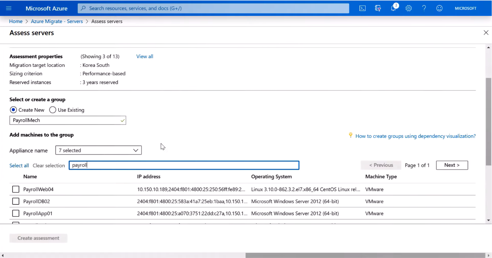

You'll need to let the process run for up to 24 hours to see complete performance metrics, but a basic assessment usually takes just a couple of minutes.

>

To start:

1. Click **Assess**. That brings you to the **Assess Servers** function.
1. Keep the **Discovery Source** as **Machines discovered from Azure Migrate**.
1. Give the assessment a name.
1. **Create a New Group** – these are the servers that are part of your multi-tier application, but you can group virtual machines based on your needs. Later, this group will be discoverable as you target machines to replicate and migrate.
1. Select your appliance name. If you have multiple appliances spread across host environments or network segments, you can multi-select the appliances and their corresponding data uploaded to Azure.
1. Search for the servers to add to your group.
1. Select the servers you want to assess and later migrate.

   

1. When finished, click **Create Assessment**.

After validation, you will automatically be taken back to Azure Migrate where you can see that an additional Group and Assessment have been added to your assessment tile.
