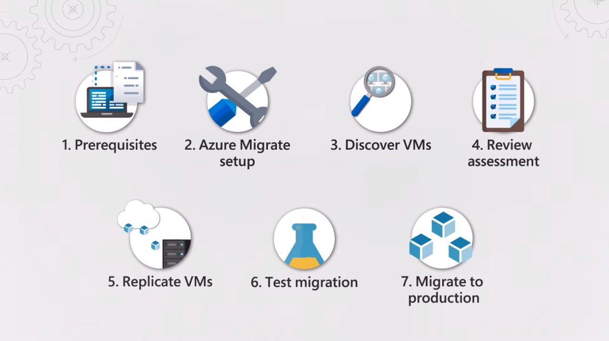

The Azure Migrate process uses Microsoft's tools for assessment and migration

1. Set up prerequisites and ensure both environments have the needed permissions.
2. Set up an Azure Migrate project, including the tools for assessment and migration.
3. Download a virtual machine appliance and deploy it in VMware environment to discover virtual machines and dependencies.
4. Review the assessment and dependencies from Azure Migrate while scoping the target migration.
5. Replicate virtual machines from VMware into Azure storage.
6. Test virtual machines using a test virtual network.
7. Migrate virtual machines into production using a production virtual network.

In the next module, we will cover the steps to meet prerequisite requirements and configure Azure Migrate to get it ready for virtual machine discovery and assessment.
