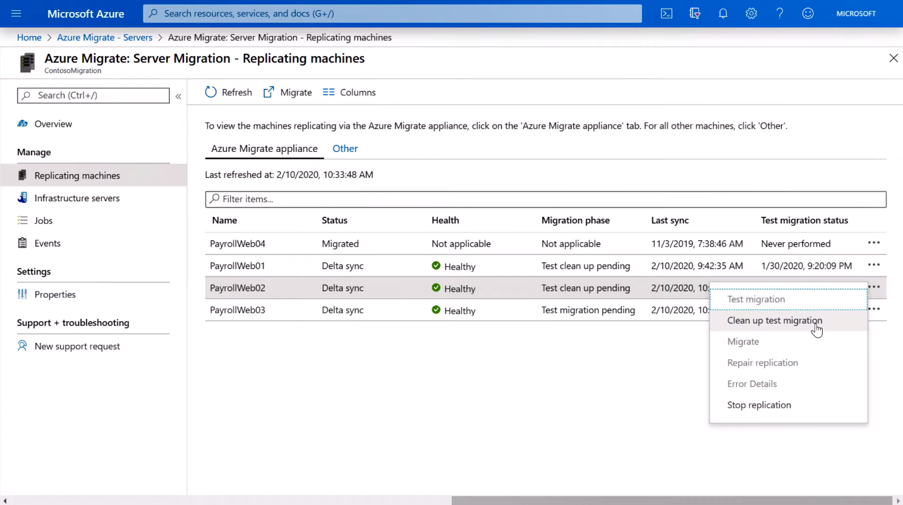
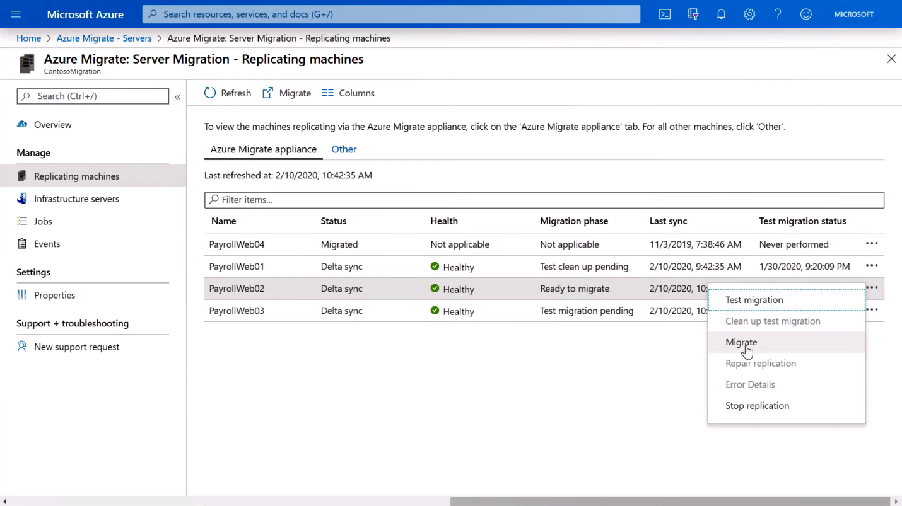

Once you’re ready for the production migration, return to the **Replicating Server**s view and click on the ellipses again. 
You’ll pick up where you left off from the previous step. 

1. Choose **Clean up Test Migration**. This operation deletes your test virtual machine and prepares the replicated virtual machine for production migration.

   

1. When the clean-up is finished, from the **Replicating machines** view, select **Migrate**. That process will prompt you to shut down the virtual machine to avoid any data loss and then perform a final replication. We recommend doing this during off peak business hours as the virtual machine will be down for a few minutes.

   

You can check the migration status as it validates the prerequisites, prepares for migration, creates the Azure VM, and then starts the Azure VM.

Once your resources are in Azure, you can take advantage of Cloud services such as Azure Security Center to secure your migrated workloads, securely back up your VMs and data with Azure Backup, and leverage Azure Monitor to collect, analyze, and act on telemetry data from your Azure and on-premises environments. 

Of course, if you need more help you can contact the Azure Migration Program to get direct assistance from Microsoft and certified partners at www.azure.com/amp 
