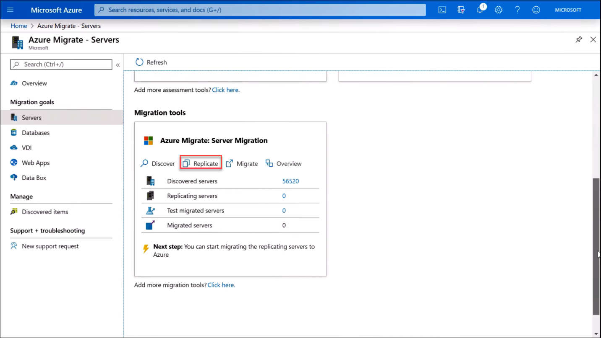
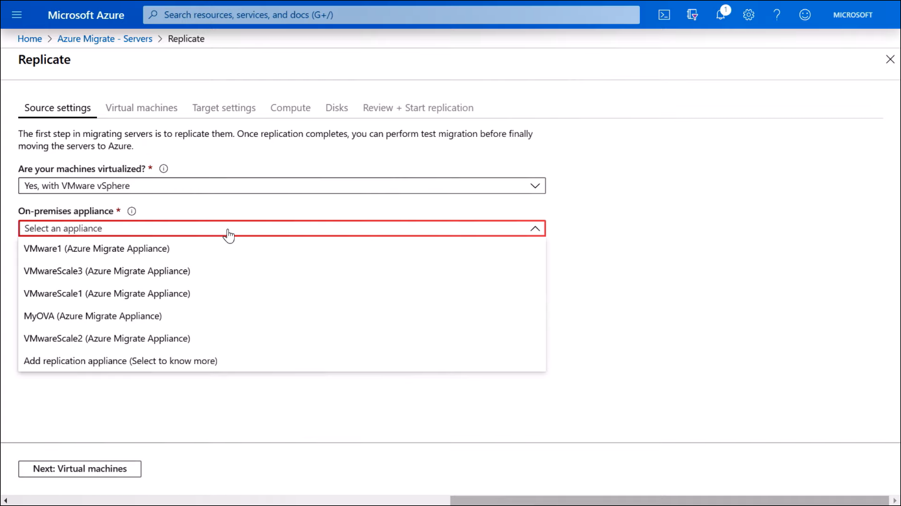
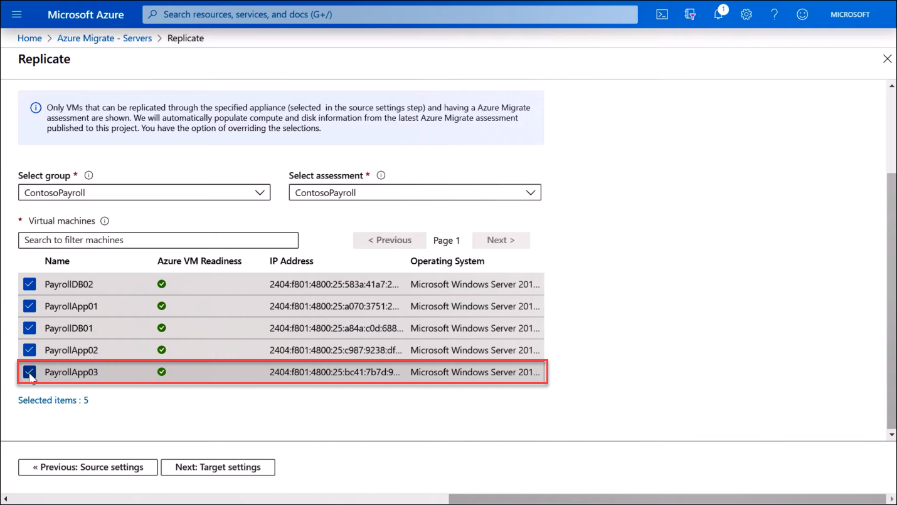
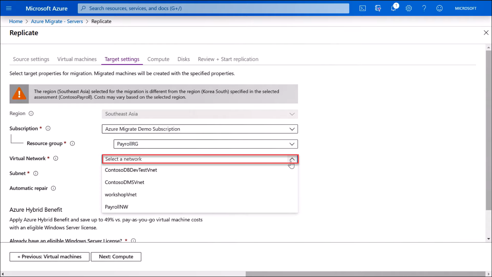
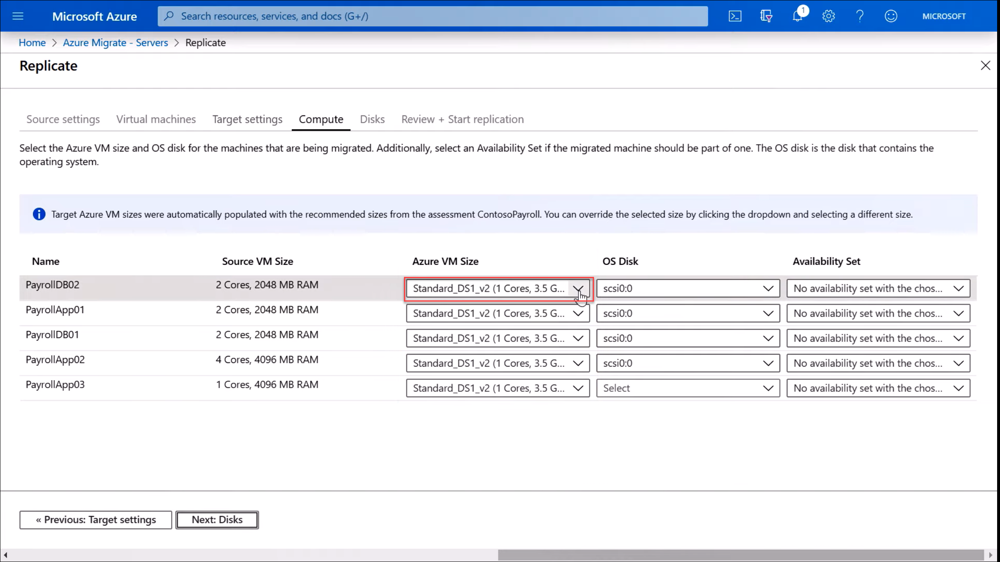
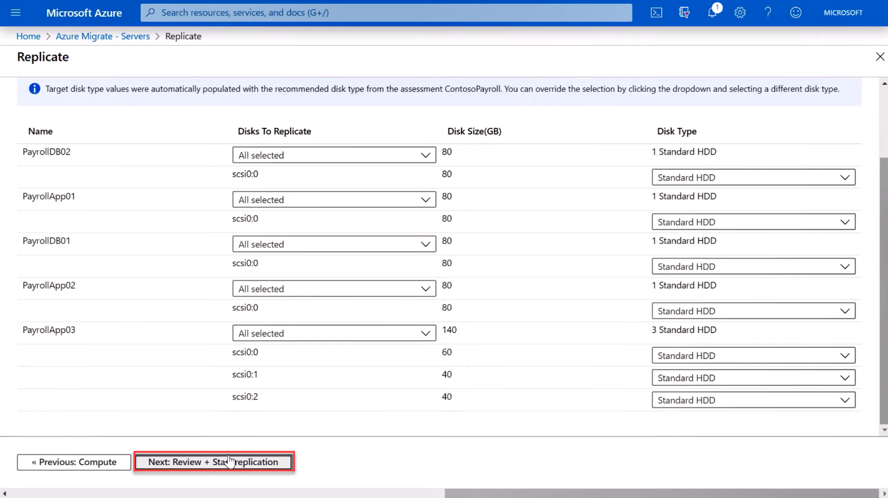

Up till now, we have been preparing for the migration. Now, we will be replicating the virtual machines into Azure storage and then testing and migrating them into production.

Complete the following steps to proceed with the replication process.

1. Start **Azure Migrate: Server Migration** by clicking **Replicate**.

   

1. In **Source settings**, select how your machines were virtualized along with your appliance.

   

1. In **Virtual Machines**,

    a. Choose **Yes, apply migration settings from an Azure Migrate assessment.**
    b. Choose your assessment group and assessment.  
    c. Select the servers that you want to migrate. You also have the option to search for larger assessments.

   

   You can replicate up to 100 VMs simultaneously. To replicate more than 100, we recommend creating multiple batches.

1. In **Target settings**, choose the **subscription**, **region,** and **resource group** where your VMs will reside after migration.

   

1. Then, choose your production Virtual Network and subnet so that the VMs can communicate once migration is complete. For pre-migration testing, use a test VNET.
1. If you have an eligible license, choose the **Hybrid** benefit. Then confirm.
1. In **Compute**, the target Azure VMs are automatically populated using the assessment recommendations from your selected assessment. You can also change the Azure VM size from the drop-down menu.

   

   > [!NOTE]
   > For the OS Disk, typically SCSI Controller 0, ID 0 is the standard, but you can select different controllers and IDs as necessary.

   Here you can also define availability sets already configured in the targeted resource group. Availability sets run two or more copies of virtual machines on separate virtual machine hosts in Azure to ensure 99.95% uptime.

8. In **Disks**, you can choose which disks to replicate from the VMs.

    

9. Finally, in **Review + Start replication**, click **Replicate** to begin replication. Times for replication will vary based on number and size of virtual machines along with connection speeds between your data center and Azure.
