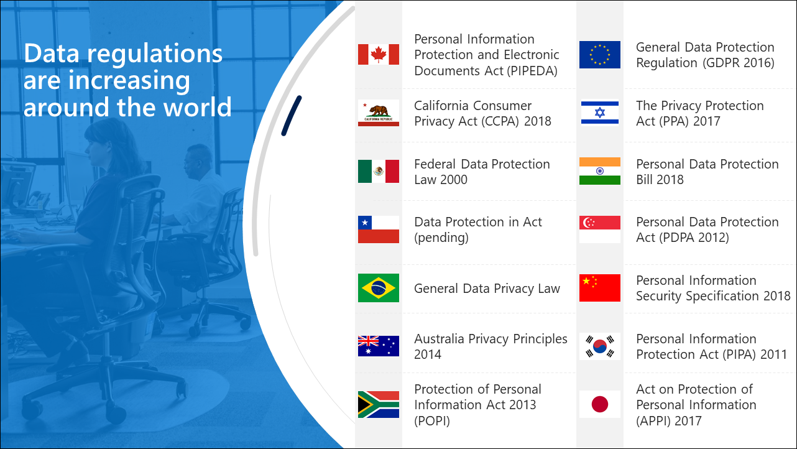

## Data is exploding

Data is exploding and it is being created, stored, and shared everywhere. IDC estimates that in 2025, the world will create and replicate 163 zettabytes of data, representing a tenfold increase from the amount of data created in 2016. Not only is the amount of data growing, but the types of data continue to evolve. In the past, organizations primarily dealt with documents and emails. Now they are also dealing with instant messages, text messages, video files, and images. Many organizations are struggling with how to manage this data overload and the variety of devices on which it is created.

   

> [!NOTE]
> 1 Zettabyte = 1,000,000 Petabytes

## Regulation is increasing

Not only is the amount of data increasing, the number of regulations organizations must comply with continues to grow. The maintenance and protection of personal data is one area where there has been a lot of focus. The cost of not complying with privacy regulations like the European General Data Protection Regulation (GDPR) could result in fines, withdrawal of licenses, and lower credibility with regulators and customers.

    

## Discovering and managing data is challenging

Many organizations are struggling with managing their data. Research tells us most organizations do not have the information to understand the risks they face. Protecting data has become more challenging as people work in new ways, including creating and sharing data across organizational, or regional boundaries. Customers now need to protect sensitive information on devices, Software as a Service (SaaS) applications, and cloud services, in addition to on-premises environments. Your risk profile is likely to increase without an information protection and governance strategy.
Here are few points to consider:

- 88% of organizations no longer have the confidence they can detect sensitive data loss or protect against it.
- More than 80% of corporate data is "dark", meaning it is not classified, protected, or governed.
- Protecting and governing sensitive data is the biggest concern in complying with regulations.

   

## Defining an information and protection strategy

Does your organization have a strategy to detect, manage and protect sensitive information across your digital estate? One of the first questions our customers ask when discussing information protection and governance goes something like this: "How can I implement a strategy for protecting and managing sensitive information?"

Here are some common questions we ask when talking with our customers about this topic:

- *Do you know where your business critical and sensitive data resides and what is being done with it?* Trying to understand where your information is can be a huge project in itself.
- *Do you have control of this data as it travels inside and outside your organization; for example, when it gets shared with customers or partners via email, SharePoint sites, or other online services, or is copied to a mobile device?* You want to protect information wherever it goes.
- *Are you using multiple solutions to classify, label, and protect sensitive data?* We find that many organizations use more than one solution to protect and govern their data, making it difficult to determine if there are any coverage gaps.

## Protect and govern data wherever it lives

Microsoft offers integrated information protection and governance solutions to help you protect and govern your data, throughout its lifecycle – wherever it lives, or wherever it travels.

It is not just about the data in Microsoft 365 services like Exchange Online, SharePoint Online and Microsoft Teams. You probably have data in other locations like on-premises SharePoint sites and local file shares. Sensitive data also resides in data visualization tools, like Power BI. Your organization might also use non-Microsoft clouds like Dropbox, Box, or software-as-a-service (SaaS) apps like Salesforce. And let's not forget about your corporate social networking presence. The image below lists some possible sensitive data storage locations.
 
   

## Unified approach to data discovery and classification

Microsoft is taking a unified approach to the discovery and classification of data in Microsoft 365 services, our productivity apps, the Power Platform, non-Microsoft cloud services and apps, and on-premises data. The benefits of this approach include:

- Consistent classification across devices, apps, and services.
- Strong integration into the applications and services.
- Deep content scanning with more than 90 built-in sensitive information types.
- Fully extensible scanning with support for custom sensitive information types and trainable classifiers.

## Balance security and productivity

You must strike a balance in the organization's interest in security with your workforce's desire for mobility and productivity.

These capabilities tip the security side of the scale:

- Enforce Conditional Access to sensitive data.
- Data loss prevention (DLP) actions to block sharing.
- File and email encryption based on sensitivity label.
- Prevent data leakage through DLP policies.
- Business data separation on devices.
- Secure email with encryption and permissions.

These capabilities tip the productivity side of the scale:

- Seamless built-in experiences across Office apps on all platforms.
- Flexible search, collaboration, and co-authoring on protected files in Office on the Web.
- Recommended labeling and visual markings like watermarks, lock icons, and policy tips.
- Built-in labeling in Office applications on iOS and Android.

 

## Information protection and governance lifecycle

Implementing an information and governance solution for your organization is a journey, and every organization will take a different approach. Whatever approach you use, it will involve people, processes, and technology.

### People

The information protection governance lifecycle involves many potential stakeholders. In your organization, there may not be people with the specific titles listed below. The important thing to remember is that each of these roles should be represented:

- **Chief Information Security Officer (CISO)**. Typically head of the governance committee. Determines policies and procedures.
- **Compliance Officer**. Understands and interprets regulations, which ones apply to the organization, and what kind of controls are needed.
- **Data Admin**. Writes sensitive information classification policies based on guidance provided by the governance committee.
- **Data Owner**. Business owner of the content or process.
- **Help Desk**. Trained on how to assist information workers when issues arise; for example, when access to a document is lost for an unknown reason.
- **Information Worker**. Creates documents, emails, or other content that may be affected by policies and procedures. They need to know what classification means, when it should be applied, what happens if it is auto-applied, etc. Information workers are referred to as users in this learning path.

### Process

From a process perspective, here are the major phases you should follow for a successful implementation.

- **Define the data classification taxonomy**. The data classification taxonomy ends up as sensitivity and retention labels that will be applied to your content. These labels may surface in productivity applications, SharePoint Online sites, Microsoft Teams workspaces and Exchange emails. They may be applied manually by users or automatically by Microsoft 365.
- **Define classification policy conditions**. Once you have built your taxonomy, you need to determine how you are going to find and classify the data in your environment and map it to the taxonomy.
- **Create, test, and deploy the labels and policy settings**. Once you determine the methods you will use to protect and govern your data, it is important to test everything thoroughly prior to deploying your configuration across the organization.
- **Ongoing usage, monitoring and remediation**. It is important to understand how data classification is being used and to ensure your policies are accurate and achieving the desired results.

### Technology

Lastly, you need a technology partner with the right solutions to meet your needs. In this course we will explore the unique capabilities Microsoft delivers to meet your data classification, information protection, and information governance requirements.

## Know your data, protect your data, prevent data loss, and govern your data

Microsoft's approach to information protection and governance is centered around four principles:

- *Know your data*. Understand your data landscape and identify important data across your hybrid environment.
- *Protect your data*. Apply flexible protection actions including encryption, access restrictions, and visual markings.
- *Prevent data loss*. Detect risky behavior and prevent accidental oversharing of sensitive information.
- *Govern your data*. Automatically retain, delete, and store data and records in a compliant manner.

Knowing your data, protecting your data, preventing data loss, and governing your data are outcomes powered and enriched by our intelligent platform, which delivers:

- A common approach to classification, no matter where data resides.
- A unified policy configuration and management experience for Information Technology (IT).
- An analytics dashboard to monitor and remediate issues.
- Application Programming Interfaces (APIs) that enable the partner ecosystem to extend information protection and governance capabilities to their own apps and services.

As the image below illustrates, information protection and governance is not something you do once and then you are finished. It is a continuous process where you start with the basics and refine your approach over time.

## Learn more

- [Learn about sensitivity labels](/microsoft-365/compliance/sensitivity-labels?azure-portal=true)
- [Overview of retention policies](/microsoft-365/compliance/retention-policies?azure-portal=true)
- [Overview of retention labels](/microsoft-365/compliance/labels?azure-portal=true)
- [Get started with trainable classifiers](/microsoft-365/compliance/classifier-getting-started-with?azure-portal=true)
- [Use sensitivity labels in Office apps](/microsoft-365/compliance/sensitivity-labels-office-apps?azure-portal=true)
