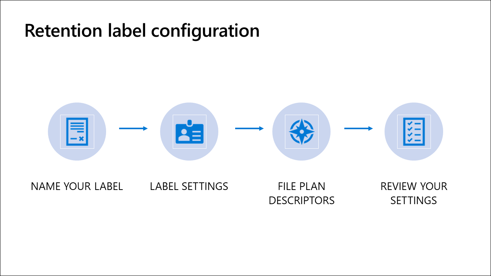

The information governance and records management solutions both use retention labels. You can create your own retention labels for records management or edit the labels created during the file plan import process. One additional step is added, and another is modified during the retention label configuration process in records management. The additional step provides the opportunity to add additional records-management specific metadata. The modified step enables the label to be used to declare records.

Navigate to **Microsoft 365 compliance center > Records management > File plan** to configure retention labels for records management.

The process of creating a retention label consists of these steps:

1. Name your label
1. Adding file plan descriptors
1. Configuring label setting
1. Reviewing settings and create the label

## Step 1: Name your label

This step consists of providing the following information:

- Name
- Description for admin
- Description for users

### Name

This is the name of the label users will see in the apps, if published (like Outlook, SharePoint, and OneDrive). It should help the user understand what it is used for, but not be any longer than it needs to be.

### Description for admins

This information is only visible to admins who will manage this label so enter something helpful.

### Description for users

This appears to users when they hover over the label in some apps. A default label showing the label's retention settings will be displayed if left blank.

## Step 2: File plan descriptors

The file plan descriptors step is unique to records management. File plan descriptors are metadata common to many file plans and facilitate the management of records. Most descriptors are pre-populated with common selections, and you can add your own. None of these fields are required, and you can add your own values in addition to the pre-populated choices. The table that follows provides more information about each descriptor.

| Name  | Description  | Example  | Pre-populated?  |
|---|---|---|---|
| Reference   ID  | Free form unique field that could be used to refer to your formal file plan  | 764X37-9087  | No  |
|  Business function/department |  Common department names are supplied, but you can add your own; example: select Accounting | Finance	  | Yes  |
| Category  | A list of categories is provided, but you can add you own  | Financial statements  |  Yes |
|  Subcategory |  The addition of subcategory lets you add a second level of categorization |  Income statements |  Yes |
|  Authority type | The primary justification for the label  | Regulatory  | Yes  |
| Provision/citation  | The name of the specific regulatory or legal provision the label applies to  | Sarbanes-Oxley Act of 2002  |  Yes |

## Step 3: Label settings

### Retention

Turn on retention if you want to apply retention settings to this label. Leaving retention off results in the label behaving like a text label. Turning on the label results in additional settings pertaining to whether the content should be deleted or retained. When the label is applied to the content, the content is retained and/or deleted based on the settings you configure. If retained for a period of time, additional options are presented to configure what is to be done after the retention period has expired. You can also configure what trigger starts the retention period clock ticking.

### When this label is applied to content...

**Retain the content**. Selecting this option means the content will stay where it is for the time specified. For example, email will stay in mailboxes and documents will stay in SharePoint or OneDrive. If users delete the content, a copy will be placed in a secure location. Next you need to decide what to do after the retention period ends. Here are the options:

- **Delete the content automatically**. Content will be deleted without requiring additional action by users or admins.
- **Trigger a disposition review**. A disposition review is where a reviewer evaluates the items that reach the end of their retention period to decide if they can be safely deleted (disposed). When items reach the end of the retention period, reviewers will receive an email notification and can go to the dispositions page to determine what happens to the item.
- **Nothing. Leave the content as is**. If you do not want to keep the content after the retention period expires, you must delete it yourself.

**Don't retain the content, just delete if it's older than**. Users will be free to permanently delete their email, documents, or other items at any time. But when content reaches the age specified, it will be deleted. For example, email messages will be deleted from users' mailboxes and documents will be deleted from SharePoint or OneDrive.

**Retain or delete the content based on**. You need to determine when you want the clock to start on the deletion or retention process. Here are your options:

- When it was created
- When it was last modified
- When it was labeled
- An event

If you choose **when it was created, last modified**, or **labeled**, content in email messages will be deleted based on when the message was sent or received, documents when created or last modified, or when the label was applied.

Basing the label on an event means content will be retained forever until you create the event on the event page. When there is a specific occurrence of the event type, you create the actual event to start the process. Event-driven retention is covered in the next unit.

### Label classification

This configuration option is unique to the records management solution. If selected, the label will be used to classify the content as a record. Users will not be able to edit or delete the content or change or remove the label. However, they will still be able to edit the content's metadata. Classifying content as a record makes it immutable.

## Step 4: Review your settings

The final step in the process is to review your settings, make any needed updates, and create the label.

## Learn more

- [Overview of retention labels](/microsoft-365/compliance/labels?azure-portal=true)
- [Retention policy precedence](/microsoft-365/compliance/labels?the-principles-of-retention-or-what-takes-precedence?azure-portal=true)
- [Overview of disposition reviews](/microsoft-365/compliance/disposition-reviews?azure-portal=true)
- [How a retention policy works with content in place](/microsoft-365/compliance/retention-policies#how-a-retention-policy-works-with-content-in-place?azure-portal=true)
