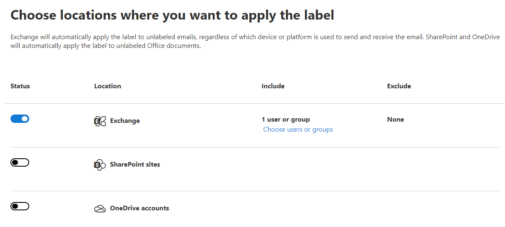

You can now create auto-labeling policies to automatically apply sensitivity labels to email messages or documents that contain sensitive information stored in Microsoft 365 services like OneDrive, SharePoint Online, and Exchange Online. Because this labeling is applied by services rather than by applications, you don't need to worry about what apps users have and what version. As a result, this capability is immediately available throughout your organization and suitable for labeling at scale. These policies can automatically label files at rest and emails in transit based on the rules you set. Once created, policies will run in simulation mode to assist you in fine-tuning your auto-classification policy. Only after you are satisfied the policies are working as designed should you publish the label.

The steps to create an auto labeling policy are listed below:

- Info to label
- Name
- Choose locations
- Policy rules
- Label
- Policy mode
- Finish

> [!NOTE]
> This feature is a capability included with:
>
> - Microsoft 365 E5
> - Microsoft 365 E5 Compliance
> - Microsoft 365 E5 Information Protection and Governance
>
> Please review Microsoft 365 licensing guidance for security & compliance to identify required licenses for your organization.

## Step 1: Info to label

Start with a policy template or create a custom policy to choose the sensitive information you want this label applied to. Select a category to see the policy templates you can use or create a custom policy to start from scratch. If you need to protect labeled content, you will be able to choose labels later.  

## Step 2: Name

The next step is to give your policy a name and description.

### Name

The name will be copied from the policy template, if selected in Step 1. It will be blank if the **Custom** option was selected.

### Description

Provide information to help identify the automatically applied label, locations, and conditions that identify the content to label.

## Step 3: Choose locations

Select which locations and users or groups (Exchange), sites (SharePoint), or accounts (OneDrive) the policy will apply to. Exchange will automatically apply the label to unlabeled emails, regardless of which device or platform is used to send and receive the email. SharePoint and OneDrive will automatically apply the label to unlabeled Office documents. The example below shows the configured policy will apply to one Exchange user or group and not SharePoint sites and OneDrive accounts. You can configure a maximum of 10 site collections in all auto-labeling policies at this time.

## Step 4: Policy rules

The **Define policy settings** page has two options. Keep the default of **Find content that contains** to define rules that identify content to label across all your selected locations. If you need different rules per location, select **Advanced settings**.

The rules use conditions that can include sensitive information types and sharing options:

- For **Content contains sensitive info types**, you can select both built-in and custom sensitive information types.
- For the **Content is shared** option, you can choose **only with people inside my organization** or **with people outside my organization**.

If your only location is Exchange, or if you select **Advanced settings**, there are additional conditions that you can select. They include:

- Sender IP address is
- Recipient domain is
- Recipient is
- Attachment's file extension is
- Attachment is password protected
- Document property is
- Any email attachment's content could not be scanned
- Any email attachment's content didn't complete scanning

## Step 5: Label

Choose a label to auto-apply. Users will see the selected sensitivity label applied to files that match the rules specified. 

## Step 6: Policy mode

Decide if you want to run the simulation now or wait until later.

### Run policy in simulation mode

Running the policy in simulation mode before activation helps ensure the label is being applied to the correct items. You can do this right away or wait until later. Selecting this option starts the simulation.

### Leave policy turned off

Selecting this option leaves the policy in an inactive state ready to run in simulation mode.

## Step 7: Finish

You will be given one last opportunity to review and edit your settings before submission. Unlike auto-labeling for Office apps, there's no separate publish option. Allow up to 24 hours for the auto-labeling policy to replicate throughout your organization.

### Simulation mode

The **Policy Simulator** assists you in validating and fine-tuning your auto-labeling policies. You can validate your policies prior to enforcement. Policies can be published in successively broader scopes, thereby mitigating the risk of unintended consequences. Select an individual policy to see the details of the configuration and its status. **Policy Simulator** is designed to:

- Help you understand the impact of the policy and tune it for accuracy and scalability.
- Provide insights on the estimated length of time required to deploy a policy at scale.
- Prevent deployment of ineffective or bad policies and help minimize incident management costs.

The image below shows an auto-label policy named **U.S. Patriot Act** that has been running in simulation mode for two days. You can click on the **Matched items** tab to see the results of your auto-labeling policy simulation, provided you have the appropriate permissions.  Selecting **Turn on policy** starts policy enforcement.

  

## Learn more

- [Apply a sensitivity label to content automatically](/microsoft-365/compliance/apply-sensitivity-label-automatically?azure-portal=true)
