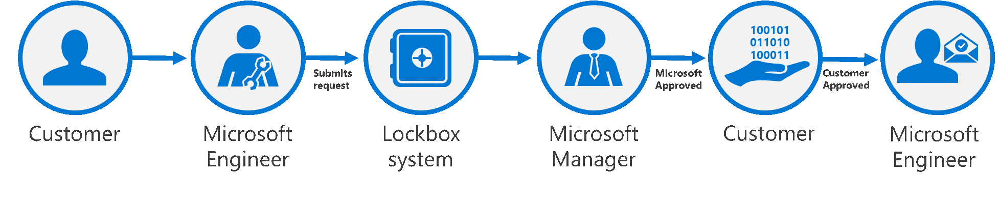
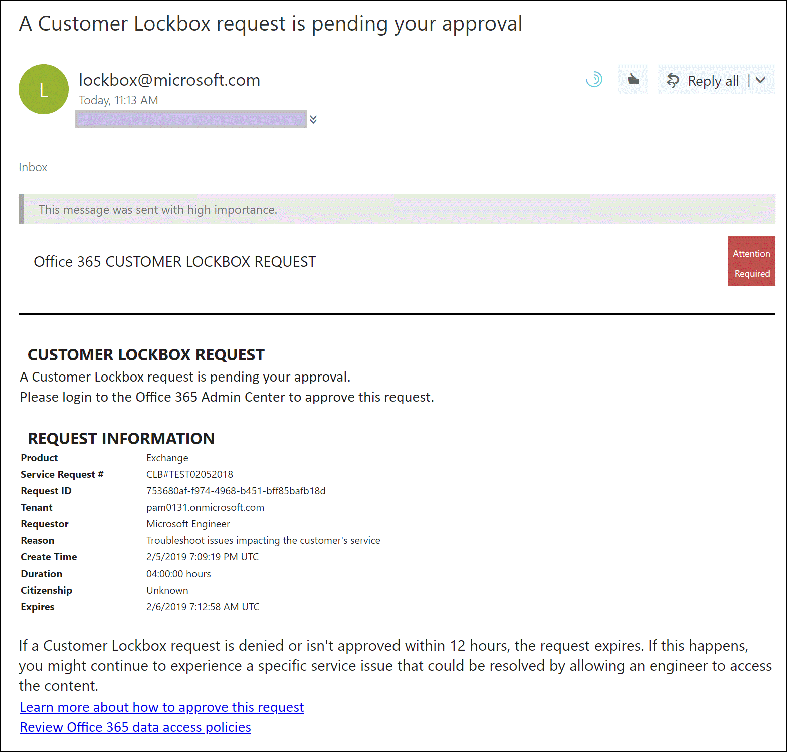

## Customer Lockbox overview

Customer Lockbox ensures that Microsoft cannot access an organization's data in the cloud to perform a service operation without your explicit approval.

Microsoft engineers often help troubleshoot and fix technical issues reported by customers. Issues are sometimes fixed through extensive telemetry and debugging tools Microsoft has in place for its services. However, some issues require a Microsoft engineer to access customer content to determine the root cause and fix the issue. Customer Lockbox requires the Microsoft engineer to request access from the customer and provides organizations the option to approve or deny these requests and provide direct-access control to the customer.

Customer Lockbox supports requests to access content in Exchange Online, SharePoint Online, and OneDrive for Business. Examples of customer content include:

- Email body or email attachments
- SharePoint site contents
- Information in the body of a SharePoint file
- Instant messages (IM) or voice conversations
- Customer-generated blob or structured storage data (for example, SQL Containers)
- Customer-owned security information (for example, certificates, encryption keys, and passwords)

If you would like to learn more about customer content in Microsoft 365, see the [Microsoft Trust Center](https://www.microsoft.com/trust-center/privacy?azure-portal=true).

Watch the video below to learn how Customer Lockbox in Microsoft 365 brings your organization into the approval workflow for requests to access your content.  
>
> [!VIDEO https://www.microsoft.com/videoplayer/embed/RE4xNp4]
>
> [!NOTE]
> This feature is a capability included with:
>
> - Microsoft 365 E5
> - Microsoft 365 E5 Compliance
> - Microsoft 365 E5 Insider Risk Management
>
> Please review [Microsoft 365 licensing guidance for security & compliance](/office365/servicedescriptions/microsoft-365-service-descriptions/microsoft-365-tenantlevel-services-licensing-guidance/microsoft-365-security-compliance-licensing-guidance?azure-portal=true) to identify required licenses for your organization.

## Customer Lockbox workflow

The following diagram illustrates the Customer Lockbox workflow after a customer experiences an issue in Office 365. In this example, you initiate a Customer Lockbox request upon experiencing an issue with an Exchange Online mailbox.

  

1. After you troubleshoot the issue but can't fix it, you open a support request with Microsoft Support.

1. A Microsoft engineer reviews the service request and determines a need to access the organization's tenant to repair the issue in Exchange Online.

1. The Microsoft engineer logs into the Customer Lockbox request tool and makes a data access request that includes the organization's tenant name, service request number, and the estimated time the engineer needs access to the data.

1. After a Microsoft Support manager approves the request, Customer Lockbox sends the designated approver at the organization an email notification about the pending access request from Microsoft. Anyone with a work or school account who has been granted the global administrator role or someone assigned the Customer Lockbox access approver admin role in Microsoft 365 admin center can approve Customer Lockbox requests.

    Customer Lockbox requests have a default duration of 12 hours. If you don't respond to a request within 12 hours, the request expires.

    

1. The approver signs into the Microsoft 365 admin center and approves the request. This step triggers the creation of an audit record available by searching the audit log. All actions performed by a Microsoft engineer are logged in the audit log. You can search for and review these audit records.  Before you can use the audit log to track requests for Customer Lockbox, there are some steps you need to take to set up audit logging. For more information, see Search the audit log in the [Microsoft 365 Defender portal](/office365/securitycompliance/search-the-audit-log-in-security-and-compliance#before-you-begin?azure-portal=true). 

1. After the approver from the organization approves the request, the Microsoft engineer receives the approval message, logs into the tenant in Exchange Online, and fixes the customer's issue.

    Currently, the maximum period for the access permissions granted to the Microsoft engineer is 4 hours. The Microsoft engineer can also request a shorter period.

## Learn more

 - [Customer Lockbox frequently asked questions](/microsoft-365/compliance/customer-lockbox-requests?frequently-asked-questions?azure-portal=true)
