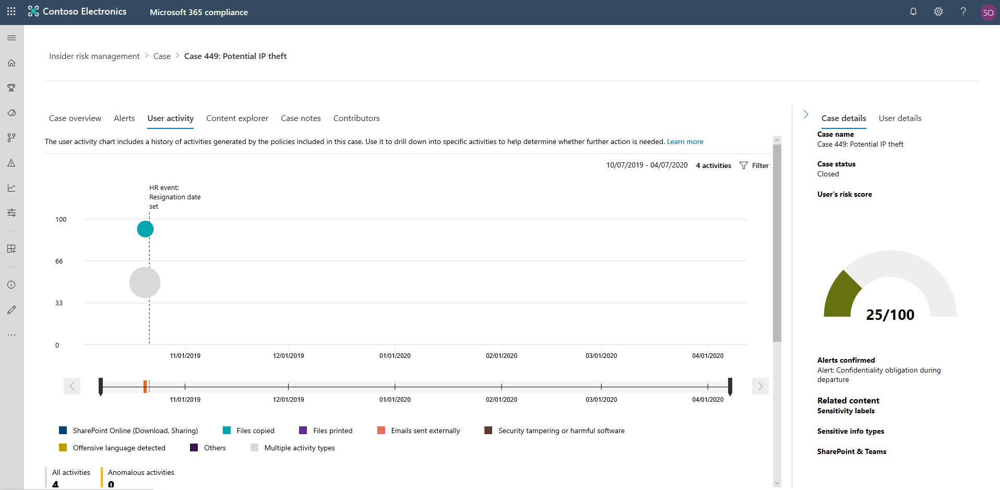
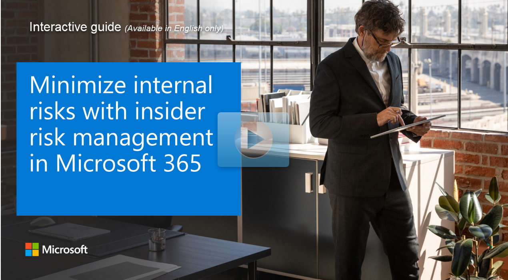

## Case overview

Alerts can be assigned to a case so that you can conduct a detailed investigation from the **Cases** section in the insider risk management console. You can review the individual signals that triggered the case in a timeline, review the affected content, add notes, or invite additional contributors in the investigation in order to reach a conclusion.

A case investigation may end up with a notice being sent to the offending employee. Other cases might require you to create an eDiscovery case which will enable you to collect, preserve, review, analyze and export data related to the user in question in order to conclude whether there was an actual threat and its scope. In most cases, the eDiscovery case will be managed by a different person with the necessary roles and privileges to manage Advanced eDiscovery cases.

Once an investigation has concluded and the necessary actions have been taken, the case can be closed by resolving the case as either benign or a confirmed policy violation with specific actions taken.

To learn more about Advanced eDiscovery cases, see [Overview of Advanced eDiscovery in Microsoft 365](/microsoft-365/compliance/overview-ediscovery-20?azure-portal=true).

## Case dashboard

The insider risk management **Cases dashboard** allows you to view and take action on cases. The **Cases dashboard** displays information from the previous 30 days for the following widgets:

- **Active cases:** The total number of active cases under investigation.
- **Cases over the past 30 days:** The total number of cases created, sorted by **Active** and **Closed** status.
- **Statistics:** Average time of active cases, listed in hours, days, or months.

The case queue lists all active and closed cases for your organization, in addition to the current state of the following case attributes:

- **Case name:** The name of the case, defined when an alert is confirmed and the case is created.
- **Status:** The status of the case, either **Active** or **Closed**.
- **User:** The employee for the case.
- **Time case opened:** The time that has passed since the case was opened.
- **Total policy alerts:** The number of policy matches included in the case. This number may increase if new alerts are added to the case.
- **Last updated:** The time that has passed since there has been an added case note or change in the case state.
- **Last updated by:** The name of the insider risk management analyst or investigator that last updated the case.

 

The Search control is used to search case names for specific text and use the case filter to sort cases by the following attributes:

- **Status**
- **Time case opened**, start date, and end date
- **Last updated**, start date, and end date

## Working with cases

Selecting a case opens the case management tools and allows analysts and investigators to dig into the details of cases. Let's examine each of the tabs available to you.

### Case overview

The **Case overview** tab summarizes the alert activity and risk level history for the case.

The **Alerts** widget shows the policy matches for the case, the status of the alert, the alert risk severity, and when the alert was detected.

The **Risk level history** chart displays the user risk level over the last 30 days. The line chart allows analysts and investigators to quickly see the trend in overall user risk over time.

The **Risk activity content** widget summarizes the types of data and content contained in alerts added to the case. This widget gives an all-up view of the entire data and content set at risk in the case.

The **Case details** pane summarizes the case details for risk analysts and investigators and includes the following areas:

- **Case name:** The name of the case, prefixed with an autogenerated case sequence number and the name of the risk associated with the policy template that the first confirmed alert matches.
- **Case status:** The current status of the case, either **Active** or **Closed**.
- **User's risk score:** The current calculated risk level of the user for the case. This score is calculated every 24 hours and uses the alert risk scores from all active alerts associated to the user.
- **Alerts confirmed:** List of alerts for the user confirmed for the case.
- **Content at risk:** List of content, sorted by content sources and types. For example, for case alert content in SharePoint Online, you may see folder or file names listed that are associated with the risk activity for alerts in the case.

### Alerts

The **Alerts** tab summarizes the status, severity, and time detected for current alerts included in the case. New alerts may be added to an existing case and added to the **Alert** queue as they are assigned. 
Selecting an alert from the queue displays the **Alert detail** page.
The **Search** control can be used to search alert names for specific text while the **Filter** control can be used to sort cases by the following attributes:

- **Status**
- **Severity**
- **Time detected**, start date, and end date

### User activity

The **User activity** tab is one of the most powerful tools for internal risk analysis and investigation for cases in the insider risk management solution. This tab is structured to enable quick review of a case, including a historical timeline of all alerts, alerts details, the current risk score for the user in the case, and controls to take effective action to contain the risks in the case.
 

- **Date and window time filters:** By default, the last six months of alerts confirmed in the case are displayed in the User activity chart. You can filter the chart view with either the slider controls at both ends of the chart window, or by defining specific start and end dates in the chart filter control.
- **Risk alert activity and details:** Risk activities are displayed as colored bubbles in the User activity chart. Bubbles are created for different categories of risk and the bubble size is proportional to the number of risk activities for the category. Selecting a bubble displays the following details for each risk activity:
  - **Date** of the risk activity.
  - **Risk activity category**. For example, Email(s) with attachments sent outside the organization or File(s) downloaded from SharePoint Online.
  - **Risk score** for the alert. This score is the numerical score for the alert risk severity level.
  - **Number of events** associated with the alert. Links to each file or email associated with the risk activity is also available.
- **Risk activity legend:** Across the bottom of the user activity chart, a color-coded legend helps you quickly determine risk category for each alert.
- **Risk activity chronology:** The full chronology of all risk alerts associated with the case are listed, including all the details available in the corresponding alert bubble.
- **Case actions:** Options for resolving the case are on the case action toolbar. You can resolve a case, send an email notice to the employee, or escalate the case for a data or employee investigation.

### Content explorer

The **Content explorer** tab allows risk analysts and investigators to review copies of all individual files and email messages associated with risk alerts. For example, if an alert is created when an employee downloads hundreds of files from SharePoint Online to a USB device and the activity triggers a policy alert, all the downloaded files for the alert are captured and copied to the insider risk management case from original storage sources.

  

**Content explorer** is a powerful tool with basic and advanced search and filtering features. To learn more about using the content explorer, see [Insider risk management content explorer](/microsoft-365/compliance/insider-risk-management-content-explorer?azure-portal=true).

### Case notes

The **Case notes** tab enables risk analysts and investigators to comment, feedback, and add insight about their work for the case. Notes are permanent additions to a case and cannot be edited or deleted after the note is saved. When a case is created from an alert, the comments entered in the **Confirm alert and create insider risk case** dialog are automatically added as a case note.

### Contributors

The **Contributors** tab in the case is where risk analysts and investigators can add other reviewers to the case. By default, all users assigned the **Insider Risk Management Analysts** and **Insider Risk Management Investigators** roles are listed as contributors for each active and closed case.
All insider risk management cases must be managed with appropriate access controls in place to maintain confidentiality and integrity of the investigation. To help maintain access control of cases, users are assigned one of two types of access to cases:

- **Permanent access**. Permanent access is automatically granted to users with the **Insider Risk Management Analysts** and **Insider Risk Management Investigators** roles when the case is created from an alert. Permanent access grants full control of the case for the lifetime of the case and grants the ability to add other case contributors.
- **Temporary access**. Temporary access is only granted to users by contributors that have permanent access for the case. Typically, this access level is granted to users that needs to add notes to a case. Contributors with temporary access have all case management control except:
  - Permission to confirm or dismiss alerts
  - Permission to edit the contributors for cases
  - Permission to view files and messages in the Content Explorer

## Case actions

Risk analysts and investigators can take action on a case in one of several methods, depending on the severity of the case, the history of risk of the employee, and the risk guidelines of your organization. In some situations, you may need to escalate a case to an employee or data investigation to collaborate with other areas of your organization and to dive deeper into risk activities. Insider risk management is tightly integrated with other Microsoft 365 compliance features such as Advanced eDiscovery to help you with end-to-end resolution management.

### Send a notice

In most cases, employee actions that create policy match alerts are inadvertent or accidental. Sending a reminder notice to the employee via email is an effective method for documenting case review and action, as well as a method to remind employees of corporate policies or point them to refresher training. Notices are generated from notice templates that you create for your insider risk management infrastructure.
It's important to remember that sending a notice to an employee *does not* resolve the case as **Closed**. In some cases, you may want to leave a case open after sending a notice to an employee to look for additional risk activities without opening a new case. If you want to resolve a case after sending a notice, you must select the **Resolve case** as a follow-on step after sending a notice.

### Escalate for investigation

Cases may need to be escalated in situations where additional legal review is needed for the employee's risk activity. This escalation opens a new Advanced eDiscovery case in your Microsoft 365 organization. Advanced eDiscovery provides an end-to-end workflow to preserve, collect, review, analyze, and export content that's responsive to your organization's internal and external legal investigations. It also lets your legal team manage the entire legal hold notification workflow to communicate with custodians involved in a case. Assigning a reviewer as a custodian in an Advanced eDiscovery case created from an insider risk management case helps your legal team take appropriate action and manage content preservation. After the insider risk management case has been escalated to a new employee investigation case, you can review the new case in the **eDiscovery> Advanced** area in the Microsoft 365 compliance center.

### Resolve the case

After risk analysts and investigators have completed their review and investigation, a case can be resolved to take action on all the alerts currently included in the case. Resolving a case adds a resolution classification, changes the case status to **Closed**, and automatically adds the resolution action added to the case notes queue on the **Case notes** dashboard. Cases are resolved as either:

- **Benign:** The classification for cases where policy match alerts are evaluated as low risk, non-serious, or false positive.
- **Confirmed policy violation:** The classification for cases where policy match alerts are evaluated as risky, serious, or the result of malicious intent.

## Insider risk management notice templates

**Insider risk management notice templates** allow you to send email messages to employees when their activities generate a policy match and alert. Notices serve as simple reminders to employees to be more careful or to provide links or information for refresher training or corporate policy resources. Notices can be an important part of your internal compliance training program and can help create a documented audit trail for employees with recurring risk activities.

The **Notices templates dashboard** displays a list of configured notice templates and allows you to create new notice templates. The notice templates are listed in reverse date order with the most recent notice template listed first.

If you'd like to create more than a simple text-based email message for notifications, you can create a more detailed message by [using the HTML in the message body field](/microsoft-365/compliance/insider-risk-management-notices?html-for-notices?azure-portal=true) of a notice template.

[Learn more about creating, updating, and deleting notice templates.](/microsoft-365/compliance/insider-risk-management-notices?azure-portal=true)

### Explore how to minimize internal risks

View a [video version](https://www.microsoft.com/videoplayer/embed/RE4yghe?azure-portal=true) of the interactive guide (captions available in more languages).

  

Be sure to click the full-screen option in the video player.
