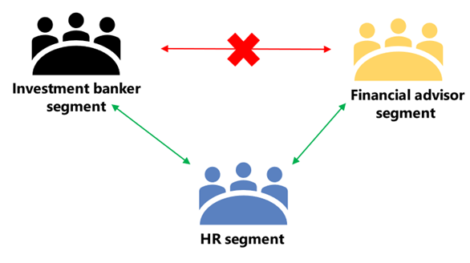

## Overview of information barriers

Information barriers in Microsoft 365 are policies that a compliance administrator or information barriers administrator can configure to prevent individuals or groups from communicating with each other. In general, they are useful when one department is handling information that should not be shared with other departments or a group needs to be prevented, or isolated, from communicating with anyone outside of that group.

The primary driver for information barriers comes from the financial services industry. The Financial Industry Regulatory Authority (FINRA) reviews conflicts of interest within member firms and provides guidance as to how to manage such conflicts (FINRA 2241, [Debt Research Regulatory Notice 15-31](http://www.finra.org/sites/default/files/Regulatory-Notice-15-31_0.pdf?azure-portal=true)); for instance, to avoid insider trading between different department users in the organization.

However, since introducing information barriers, many other areas have found them to be useful. Other common scenarios include:

- Education: Students in one school aren't able to look up contact details for students of other schools.
- Legal: Maintaining confidentiality of data obtained by the lawyer of one client from being accessed by a lawyer for the same firm representing a different client.
- Government: Information access and control is limited across departments and groups.

For all these example scenarios (and more), information barrier policies can be defined to prevent or allow communications in Microsoft Teams. Such policies can prevent people from calling or chatting with those they should not or enable people to communicate only with specific groups in Microsoft Teams. With information barrier policies in effect, whenever users who are covered by those policies attempt to communicate with others in Microsoft Teams, checks are done to prevent or allow communication as defined by the policies).

It should be noted that information barriers are based on [Exchange address book policies](/exchange/address-books/address-book-policies/address-book-policies?azure-portal=true) and the two cannot be used simultaneously. Before you define and apply information barrier policies, make sure your organization does not have or require address book policies to be in effect.

> [!NOTE]
> This feature is a capability included with:
>
> - Microsoft 365 E5
> - Microsoft 365 E5 Compliance
> - Microsoft 365 E5 Insider Risk Management
>
> Please review [Microsoft 365 licensing guidance for security & compliance](/office365/servicedescriptions/microsoft-365-service-descriptions/microsoft-365-tenantlevel-services-licensing-guidance/microsoft-365-security-compliance-licensing-guidance?azure-portal=true) to identify required licenses for your organization.

## What happens with information barriers?

Information barriers apply to Microsoft Teams chats and channels. In Microsoft Teams, information barrier policies determine and prevent the following kinds of unauthorized communications:

- Searching for a user
- Adding a member to a team
- Starting a chat session with someone
- Starting a group chat
- Inviting someone to join a meeting
- Sharing a screen
- Placing a call

If the people involved are included in an information barrier policy to prevent the activity, they will not be able to proceed. In addition, potentially, everyone included in an information barrier policy can be blocked from communicating with others in Microsoft Teams. When people affected by information barrier policies are part of the same team or group chat, they might be removed from those chat sessions and further communication with the group might not be allowed.

> [!IMPORTANT]
> Information barriers only supports two-way restrictions. One-way restrictions, such as allowing your marketing personnel to communicate with day traders but restricting day traders from communicating with marketing personnel, is not supported.

## Concepts of information barrier policies

With information barriers, you define policies that are designed to prevent certain segments of users from communicating with each other or allow specific segments to communicate only with certain other segments.

For example, Sergio belongs to the Banking segment and Pradeep belongs to the Financial advisor segment. Sergio and Pradeep can't communicate with each other because the organization's Information Barrier policy blocks communication and collaboration between these two segments. However, Sergio and Pradeep can communicate with Lee in HR.

When you define policies for information barriers, you will work with user account attributes, segments, "block" and/or "allow" policies, and policy application.

- **User account attributes** are defined in Azure Active Directory (or Exchange Online). These attributes can include department, job title, location, team name, and other job profile details.
- **Segments** are sets of users that are defined in the Microsoft 365 Defender portal using a selected **user account attribute**. (See the [list of supported attributes](/microsoft-365/compliance/information-barriers-attributes?azure-portal=true).)
- Information barrier policies determine communication limits or restrictions. When you define information barrier policies, you choose from two kinds of policies:
  - **Block** policies prevent one segment from communicating with another segment.
  - **Allow** policies allow one segment to communicate with only certain other segments.
- **Policy application** is done after all information barrier policies are defined, and you are ready to apply them in your organization.
