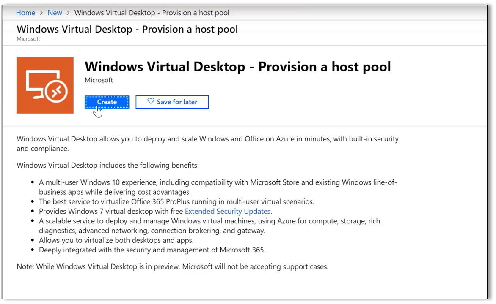
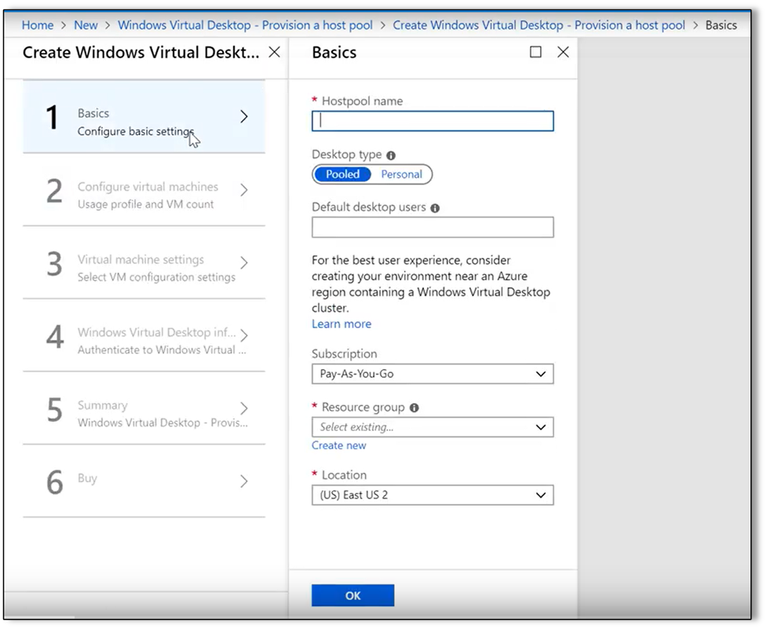
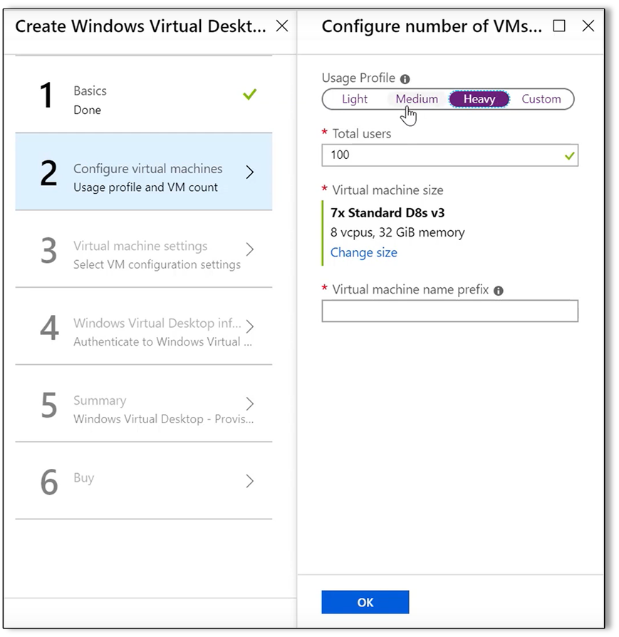
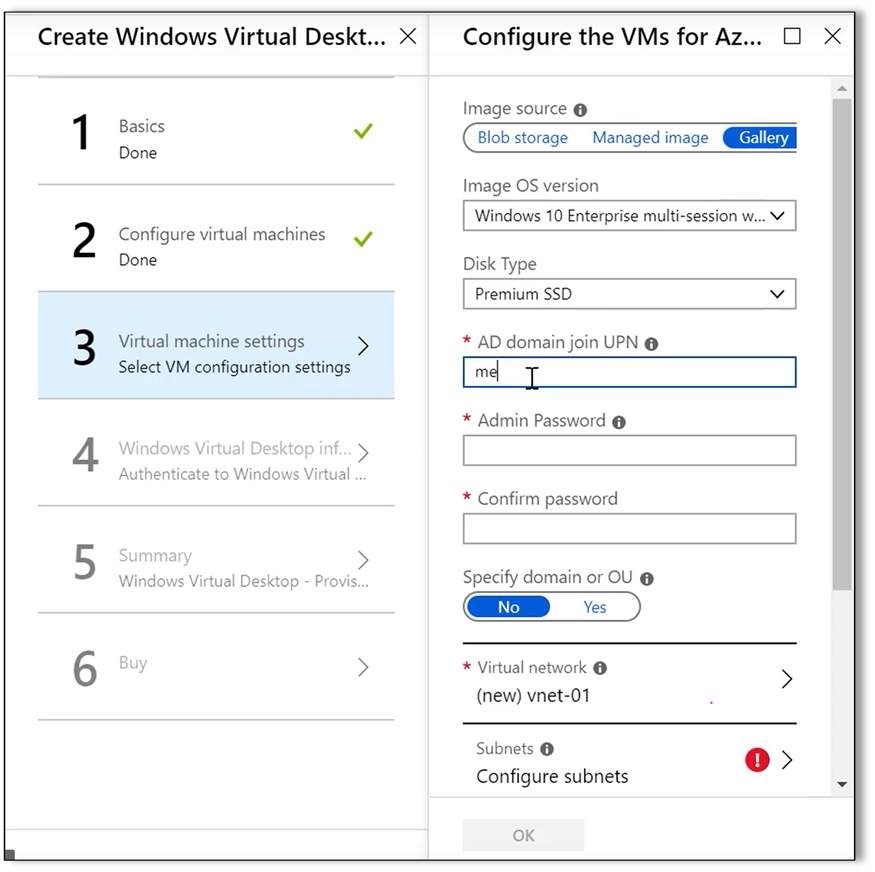
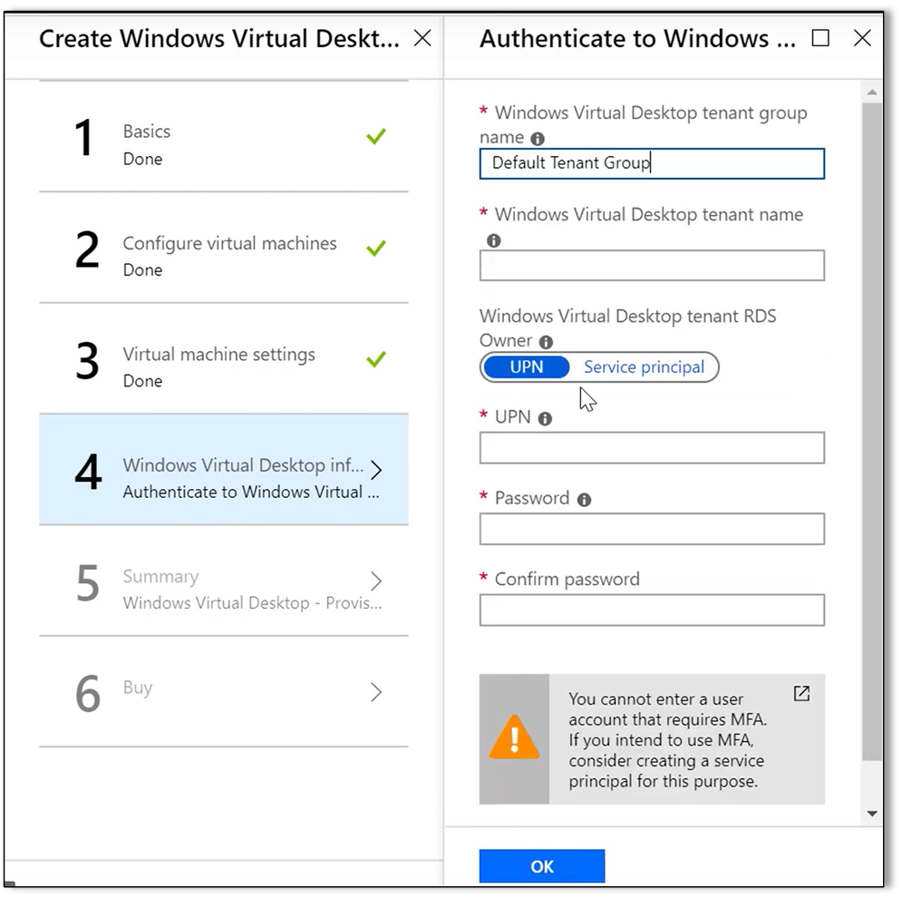
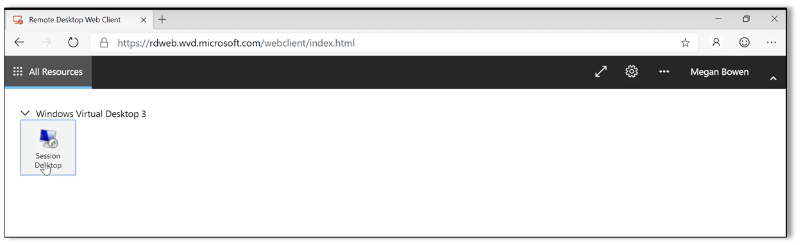

Now that your Windows Virtual Desktop tenant is available and you've set up the other prerequisites, you're ready to build your first host pool. You can use your host pool to provision full desktops and remote apps for users.   

There's a Resource Manager template in the Azure marketplace that helps you build out Windows Virtual Desktop environments in repeatable way. The template includes the basic steps that you need to go through. Start by finding the template:

1. Sign in to the [Azure portal](https://portal.azure.com). 
2. In the upper-left corner, select **Create a Resource.**
3. In **Search the Marketplace**, search for "Windows Virtual Desktop." 
4. In the search results, select **Windows Virtual Desktop – Provision a host pool**. 
   >
5. Select **Create** to open the configuration wizard. 

## Step 1: The Basics 

1. Give the host pool a name – like "My first host pool." 
   >
2. Now, you have your first choice – do you want a **personal** or **pooled** desktop?
   - A **personal desktop** is where each user has their own personal VM. This is useful if each user needs a dedicated  VM. For example, when a user needs local administrators permissions on the VM. Users can install apps and save configuration changes to their VMs.
   - A **pooled desktop** allows multiple users to sign in to the same VM at the same time. Pooled desktops are more efficient and less expensive from a cost per user perspective. Because several users share the same VM, users can't be local admins. You’ll need another process to install applications and configure the VM. 
3. Select **pooled** to maximize resource utilization. Later you’ll select a corresponding Windows 10 Enterprise multi-session image for the host pool. 
4. Next, define the **Default desktop users**. This is a comma-separated list of user email accounts from your Azure Active Directory. You can add a single email address, also known as a *User Principal Name* (UPN), or several UPNs with commas between them.  
5. Select the same **Azure subscription** you used when you set up the prerequisites. 
6. For **Resource Group**, create a new resource group. Give it a name without spaces or special characters. 
7. In the **Location** field, select the region you want to use.

## Step 2: Configure the virtual machines

1. Your first choice is the **Usage Profile**. As you make changes, watch the **Virtual Machine Count** value change, indicating how many VMs you need for **Light**, **Medium**, and **Heavy** usage. These are recommended settings that you can override based on what you need.
   >
2. Specify the number of **total users** (the default is 100). As you change the number, you’ll see the recommended VM count change. For example, if you choose **25** users with a **Medium** usage profile, you’ll see the VM count go to 1. 
3. If you want to change the recommended VM size, select **change size**. Select your VM size. If you want to save costs or are using free Azure credits with a trial, choose a less powerful VM.  
4. Provide a **Virtual Machine name prefix**, for example "WVD", and then select **OK**. 

## Step 3: Virtual machine settings 

1. Select the Windows image you want to use. The **image source** can be: 
   - One of your own images stored in Azure blob storage. Enter the **imageURI**, which is the fully qualified path to the image and the VHD filename.  
   - A **managed image** that you’ve customized and defined as managed. Enter the image name and the resource group. 
   - A **gallery** image, one of the pre-configured images from Microsoft. There are several images available for Windows Virtual Desktop. For example:
      - Windows 10 Enterprise multi-session
      - Windows 10 Enterprise
      - Windows Server 2016 
   
   Choose **Windows 10 Enterprise multi-session with Office 365 ProPlus**. 
   >
2. Select the disk type. For the best results, use the default, **Premium SSD**. 
3. Enter the credentials used for automated domain join with AD DS. These are usually the credentials you use to sign in to your on-premises domain. You can use a different domain or organizational unit. 
4. For the **virtual network**, select a VNET where VMs can communicate with the domain and directory services. Select the subnet you want to use.

## Step 4: Windows Virtual Desktop tenant information

Configure authentication to the tenant you created in [Set up the Windows Virtual Desktop tenant](https://docs.microsoft.com/learn/modules/m365-prepare-for-wvd/set-up-wvd-tenant). 

1. Leave the default **Windows Virtual Desktop tenant group name** name, "Default Tenant Group," and enter the name of the tenant you created for the **Windows Virtual Desktop tenant name**.
   >
2. Enter either a **User Principal Name (UPN)** or **service principal** account. If you're using an automated scenario, we recommend using service principals. If you’re using multi-factor authentication, you’ll need to use a service principal account.  
3. To keep things simple for your first host pool, use a UPN from your Azure AD. If you’re using Azure AD DS, use an AD DS administrator account. 
4. Enter the password for the account. Enter it again to  confirm the password. 
5. Select **OK**. 

## Step 5: Summary

Review the configuration information on the confirmation page. If everything looks right, select **OK**. 

## Step 6: Buy
Select **Create** to start the provisioning process. In most cases, creating the tenant takes a few minutes. When finished, you’ll have a full desktop environment. Azure will notify you when it's done provisioning the environment. 

## Validate the basic Windows Virtual Desktop environment 
The last step is to sign in to Windows Virtual Desktop from your browser to validate the deployment. 

1. In an InPrivate or Incognito browser window, go to [https://aka.ms/wvdweb](https://aka.ms/wvdweb). 
   >
2. Sign in using the account you specified in **Step 1: The Basics**. 
3. You’ll see the **Windows desktop** option for the image you deployed. 
4. Open the desktop, and then enter the credentials again to authenticate with AD DS. You'll see a desktop with Windows 10 Enterprise multi-session with Office 365 ProPlus. 
5. Look at the **Start** menu to see the available apps. You can also click on apps in the **Taskbar**. 
6. After you confirm that the desktop is configured correctly and has the apps you expect, close the session by closing the browser window.  