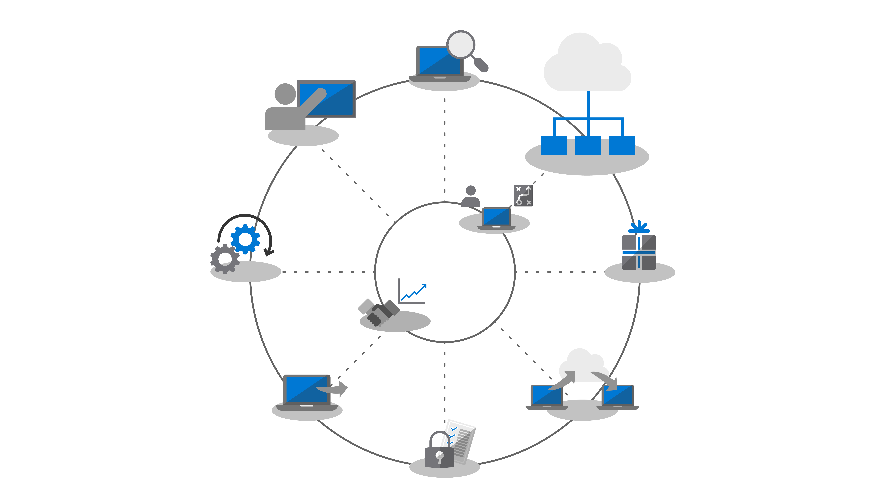
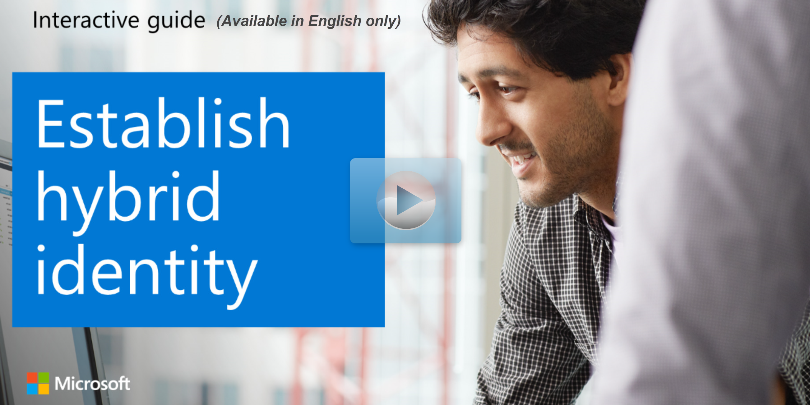

Azure AD is Microsoft’s cloud-based identity and access management service – it enables end users to access internal and external resources. Azure AD controls access to your apps and app resources by requiring multi-factor access authentication to internal assets and by protecting user identities and credentials. Once you have Azure AD in place your users can sign into and activate their Office 365 ProPlus apps, and you can use Microsoft Intune or Windows Autopilot to automate deploying apps and policy.

If your organization already uses Office 365 services like Exchange Online or SharePoint Online, Microsoft Intune, or other Microsoft online services, you’re already using Azure AD. If you’re not currently using Azure AD but have on-premises directories, you can use the **Azure AD Connect** tool to integrate Azure AD with your on-premises directories. This lets your users use a common identity to access both on-premises resources and cloud services like Office 365.

### Try it

>Learn about establishing hybrid identity with this interactive guide:
>
>   
>
>Be sure to click the full-screen option in the video player, to make it easier to see all of the great Microsoft features. When you're done, use the **Back** arrow in your browser to come back to this page. 
