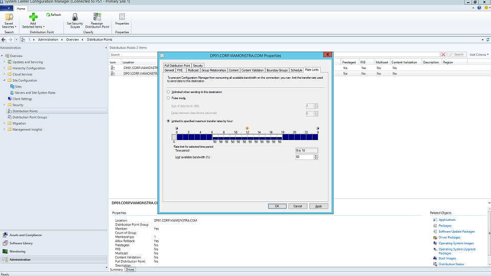

## Microsoft tools for bandwidth management

Microsoft offers tools and solutions to make it easier to manage the network impact of a large-scale desktop deployment including BITS to limit bandwidth traffic, LEDBAT to optimize use of available bandwidth, and peer-to-peer (P2P) options to move deployment traffic away from the center of the network and out to the perimeter.

**Limiting bandwidth with BITS.** One way to limit the impact of deployment-related traffic on the network is to throttle it using the Background Intelligent Transfer Service (BITS) setting on clients. BITS uses an Adaptive Bit Rate (ABR) to adjust bandwidth available for deployment purposes; it can be configured on clients using Group Policy.

Within System Center Configuration Manager, you can also configure BITS-enabled Distribution Points or enable multicast with Windows Deployment Services (WDS). Throttling specific traffic means that normal network traffic is less impacted by PCs downloading updates and applications. While carving out a certain percentage of bandwidth for these tasks helps ensure that productivity isn’t impacted by Windows or Office deployment and that processes continue to run as needed, it can worsen deployment-related downtime with users locked out of their PCs while a deployment runs.

**Scavenging bandwidth with LEDBAT.** Low Extra Delay Background Transport (LEDBAT), supported in Windows Server 2019 and System Center Configuration Manager version 1806, is designed to optimize network traffic to Windows clients. Unlike traditional throttling, LEDBAT can use all available network bandwidth as a background task, instantly yielding bandwidth when other traffic requests it. Unlike BITS, there is no delay. Everything is automated, so no manual tuning or scheduling is required-and everything is set up on the server side. This affords potentially massive performance gains.

**Leveraging Peer-to-Peer solutions.** Peer-to-Peer options are increasingly being used in Windows 10 migrations, for PC imaging, software updates, and user personalization. They are also valuable in facilitating build-to-build upgrades after your initial Windows 10 deployment. It is important to help move Windows 10 and Office-related traffic away from the center of the network, reducing the need for classic throttling approaches, and allowing PCs to find the update files they need on peers in their local network rather than downloading them from a distribution point or the internet.

- **BranchCache.** BranchCache can help you download content in distributed environments without saturating the network. It comes in two options: Hosted Cache Mode, which lets you use local servers to cache content, and Distributed Cache Mode (a mode supported in System Center Configuration Manager), which lets clients share already downloaded content with each other.

- **Peer Cache.** Clients supported by System Center Configuration Manager can also make use of Peer Cache. This allows PCs that are reliably available on the network to host source for content distribution. You won’t want to enable this on all your PCs – only target devices with reliable network connections as hosts (e.g. desktop, mini-tower, or tower PCs). Peer Cache can even work for deployment tasks running in Windows PE phases during setup. BranchCache and Peer Cache are complementary and can work together in the same environment.

- **Delivery optimization.** Delivery optimization is another peer-to-peer caching technology, providing network-based controls for deployments. Windows 10 delivery optimization is used to update built-in UWP apps, to install applications from the Microsoft Store, and for software updates using Express Updates. This technology has been recently integrated with System Center Configuration Manager. Since Windows 10 version 1803, new configuration options mean you can now independently set bandwidth limits for background updates and foreground jobs such as app install from the Store. Windows delivery optimization also supports Office 365 ProPlus during client updates.

## Reducing network load in Office 365 ProPlus deployments

These three items can help reduce your Office 365 ProPlus deployment network load.

- **Binary Delta Compression.** Office 365 ProPlus uses Binary Delta Compression to reduce bandwidth when updating from the most recent release of Office 365 ProPlus to the next release. By only pulling the binary level changes from the previous release, the impact from month-over-month growth of cumulative updates is minimized. To use this capability, you cannot skip releases. If you do skip a release, you must download the full cumulative update. 

- **Outlook data files settings.** Outlook is often configured to cache users’ entire mailbox locally for use offline. In any Windows deployment, except an in-place upgrade, this requires the users’ Outlook data files to rebuild themselves after the upgrade. This is an automated process, but with Outlook mailbox limits typically set to up to 100GB, re-caching the entire mailbox locally for all users means a lot of data transfer. To reduce the network load you may want to consider using Group Policy to reduce the “Mail to keep offline” setting from the default 12 months to one to six months. Changing this setting does not affect the size of the online mailbox, and the entire mailbox can still be searched via Outlook when online.

- **OneDrive Files on Demand and Known Folder Move.** OneDrive is a great way to synchronize and protect user files from PCs and other devices in the cloud. With Known Folder Move, you can enforce file sync from a user’s desktop, documents, and pictures folders to OneDrive making those files available when signing into a new device or reimaged PC. Remember though, due to the sheer size and number of files kept in desktop, documents, and pictures locations, you’ll want to have a plan for the rollout of policies enabling and enforcing OneDrive on your PCs. One option is to use Group Policy Network controls to throttle bandwidth used by the OneDrive sync service.

>[!NOTE]
>If you haven’t already rolled out OneDrive, the shift from Windows 7 to Windows 10 is a perfect opportunity to enable OneDrive as it integrates seamlessly with Office 365 ProPlus. Consider starting this roll-out while working through your app and device readiness. This will give file sync a head start before you start moving Windows images and deploying apps over your network.

