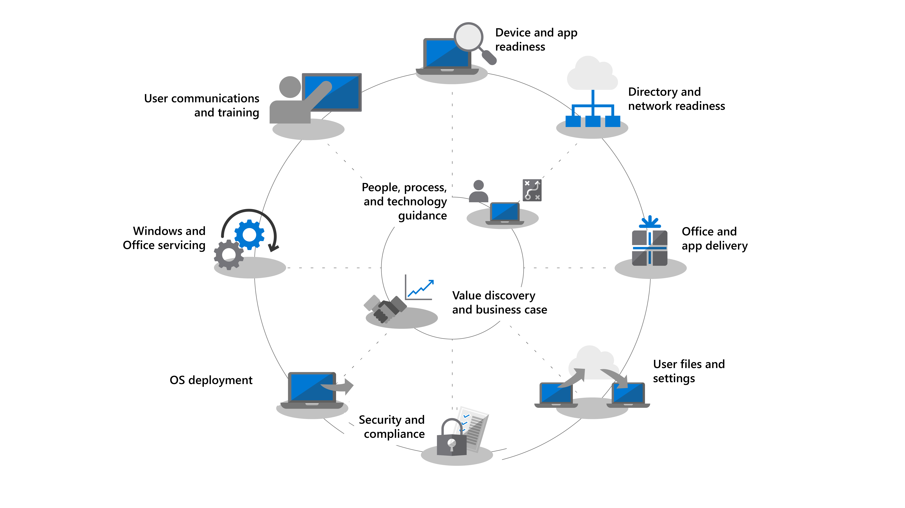

To help you through the deployment process, we've developed the **desktop deployment wheel**. The wheel guides you through the recommended steps for your shift to Windows 10 and Microsoft 365 Apps.

Before you get started, you'll want to create a high-level plan and get the necessary sponsors on board. The desktop deployment wheel outlines critical steps to help you to identify core team members and resources to manage in the following deployment areas.

|  |  |
|-----------|--------|
|  | **Step 1: Analyze your device and app readiness.** For a successful deployment, you must first take an inventory of your devices and apps and verify compatibility, leveraging the Microsoft tools available.  |
|  |**Step 2: Analyze your directory and network readiness.** You'll need to implement Azure Active Directory for identity and access management while also preparing your network for the movement of system images, application packages, user files, and updates across it. |
|  |**Step 3: Deliver Office and business apps.** Microsoft 365 Apps and Office 2019 clients use Click-to-Run installation technology, and you may also  want to make a range of UWP or MSIX-based business apps available. Plan for Office and app delivery whether your apps deploy using Click-to-Run, MSIX, conventional MSI, or are UWP apps deployed from a Microsoft Store. |
|  |**Step 4: Migrate user files and settings.** Ensuring users' files, data, and settings move successfully and are preserved over the migration is critical in any PC replacement or refresh project. You have the option of using traditional methods like the User State Migration Tool and the Microsoft Deployment Toolkit, or modern options like a OneDrive Known Folder Move. |
|  |**Step 5: Update your security and compliance configuration.** Moving to Windows 10 and Microsoft 365 Apps allows organizations to take advantage of security features not available in earlier Windows versions. Whether it's using the built-in capabilities of Windows 10 with virtualization-based security or cloud services like Microsoft Defender for Endpoint, securing and protecting endpoints, identity, and data is critical. |
|  |**Step 6: Deploy, upgrade, and migrate your OS.** Tools like Microsoft Endpoint Configuration Manager can help automate and control OS deployments. Microsoft recommends phased deployments, first targeting and deploying to an *early adopter group* in your organization with a representative set of hardware and apps. You can then use the data from those devices and users to target more PCs to scale your deployment. |
|  |**Step 7: Learn about servicing models.** With the move to Windows 10 and Microsoft 365 Apps, you can move to managing Windows and Office as a service, bringing new capabilities, experiences, and protections to your end users. Semi-annual feature updates deliver new capabilities in the fall and spring of each year, while monthly cumulative quality updates contain security, reliability, and bug fixes. |
|  |**Step 8: Train users on new features.** Rolling out user communications and training is critical to driving changes in how people use new capabilities in Office, Windows, or other business apps and services. |
