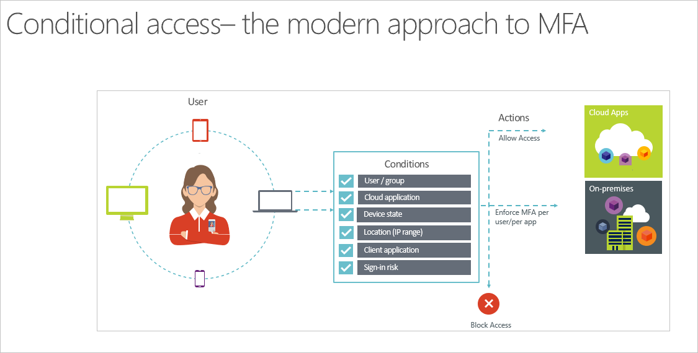
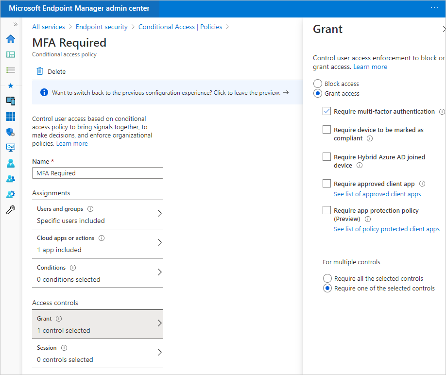
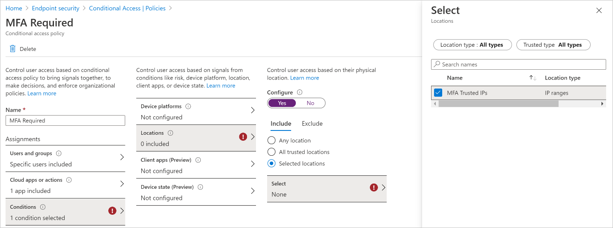
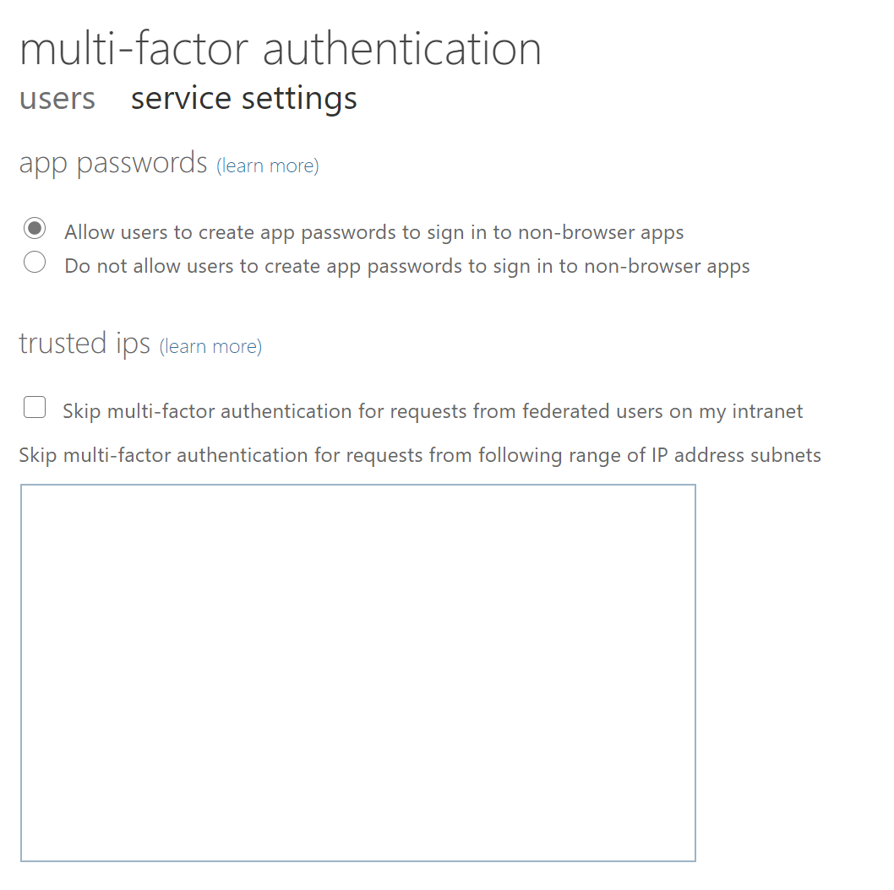

Multi-factor authentication (MFA) is a process where users are prompted during a sign-on event for additional forms of identification. This prompt could be to enter a code they receive on their cellphone or provide a fingerprint scan. Requiring a second form of authentication increases security since this additional authentication factor is far more difficult for an attacker to obtain or duplicate than a password.

Traditionally, Azure MFA would be enabled “per user.” In a per user environment, users enabled for MFA are prompted each time they sign into an application (except on a trusted network). This results in a poor user experience, because it doesn’t consider any other factors – such as device type, sign-on behavior, or client application.

A better way is to enable and use Azure MFA is with Conditional Access policies. Conditional Access lets you create and define policies that react to sign-on events and request additional actions before a user is granted access to an application or service. Azure MFA and Conditional Access policies give you the flexibility to enable MFA for users during specific sign-on events.

Conditional Access policies can be granular and specific, with the goal of empowering users to be productive wherever and whenever, but also protecting your organization. The following requirements are necessary to create a Conditional Access policy:

- A group of users need to be assigned to the policy.
- Once a group of users are assigned, you can define the cloud apps or actions that trigger the policy. These cloud apps or actions are the scenarios you decide that require additional processing, such as prompting for MFA. For example, you could decide that access to a financial application or use of management tools requires an additional verification prompt.
- You can also optionally specify a list of conditions, such as the device platform or location.
- After all the assignments are configured (Azure AD group, cloud app or actions, and/or conditions), you can select which controls are required to access the assignments. In the following example, we selected **Require multi-factor authentication**, which enforces MFA if a user meets our assignments.

The **Require multi-factor authentication** control can be resolved by:

- Presence of the following claim in a token issued by the trusted federation service:
  - https://schemas.microsoft.com/ws/2008/06/identity/claims/authenticationmethod = http://schemas.microsoft.com/claims/multipleauthn
- Windows Hello for Business Primary Refresh Token (PRT) with strong authentication:
  - “ACR”: 2
- Azure MFA Service

One of the optional conditions you can configure for Conditional Access policies is **Locations**. For example, you can exclude a set of IP Ranges (such as your corporate network) from the MFA Required policy. Note that when you select the Locations condition in Conditional Access, there is an MFA Trusted IPs option:

This refers to the Trusted IPs options that you can configure in the per-user MFA settings:

