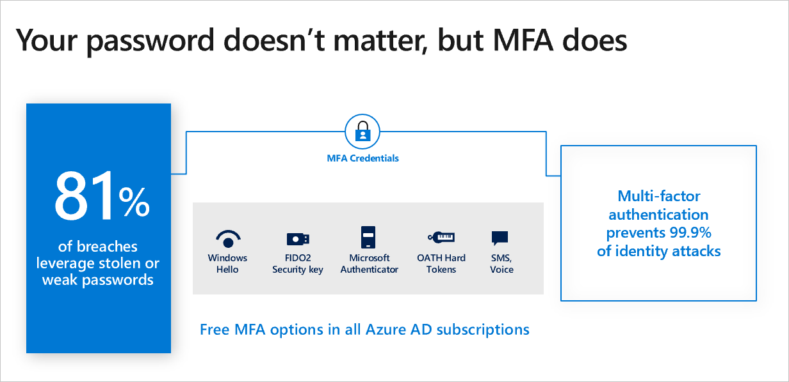
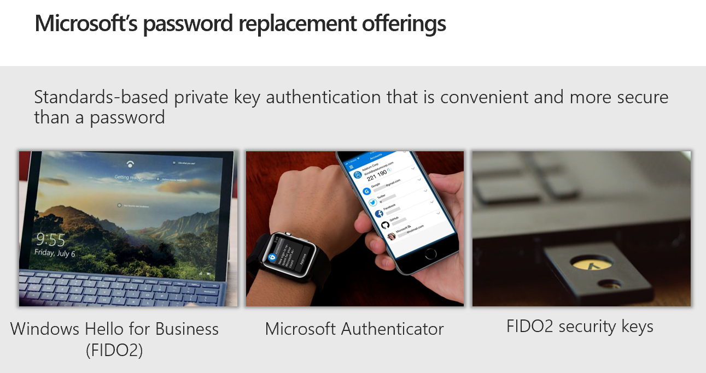
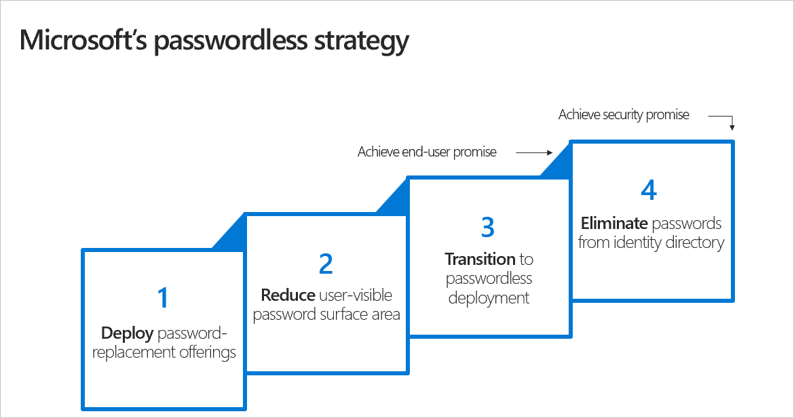

Since an average of one in every 250 corporate accounts is compromised each month, we know that relying on passwords isn’t a good enterprise defense strategy. As companies continue to add more business applications to their portfolios, the cost of passwords only goes up. In fact, companies are dedicating 30 to 60 percent of their support desk calls to password resets. Given how ineffective passwords can be, it’s surprising how many companies haven’t turned on multi-factor authentication (MFA) for their customers or employees. 

Password-less authentication is a form of multi-factor authentication that replaces the password with a secure alternative. This type of authentication requires two or more verification factors to sign in and are secured with a cryptographic key pair. The device creates a public and private key when registered. The private key can only be unlocked using a local gesture such as a biometric or PIN. Users have the option to either sign in directly via biometric recognition—such as fingerprint scan, facial recognition, or iris scan—or with a PIN that’s locked and secured on the device.

Microsoft Authenticator supports push notifications, one-time passcodes, and biometrics for any Azure AD-connected app and is free to download from the Apple and Android app stores. It also supports passwordless authentication. Windows Hello and Hello for Business are other secure and convenient options (both require Windows 10).

Passwordless technology is here—and users are adopting it as the best experience for strong authentication. More than over 150 million people are already signing in using passwordless methods each month. According to our recent survey, the use of biometrics for work accounts is set to double this year, with nearly a quarter of companies already using or planning to deploy biometrics soon, signaling an increased desire to ditch the archaic password system.

Whether you’re ready to roll out a passwordless authentication strategy today or in a few years, these steps will help get your organization ready:

1. **Develop password-replacement offerings**. Deploy alternatives that coexist with passwords, such as Windows Hello for Business and FIDO. While these offerings coexist with passwords, some workflows and applications will still require passwords. This early stage is about deploying an alternative and getting users used to it. 

2. **Reduce user visible password-surface area**. User environments and workflows need to stop asking for passwords. This includes the entire lifecycle of a user’s identity.  
 
   - A user's identity lifecycle includes such steps as provisioning of an account, setting up a brand-new device, using the account/device to access apps and websites, and recovery. 
   - Workflows need to ensure these steps work with password-replacements. 
   - The goal is to create an environment where the user knows they have a password but never has to use it, thereby helping to decondition users from providing a password every time a password prompt shows on their computer, which is how passwords are phished.

3. **Transition to passwordless deployment**. Once user-visible password surfaces have been eliminated, the next step is for organizations to transition to passwordless deployment where users never type, change, or even know their passwords. This means deploying policies so that users never see the password credential provider on Windows, not in the out-of-box-experience (OOBE), not on sign-on, and not in settings. The user signs on to Windows 10 using Windows Hello for Business and enjoys single sign-on to Azure and Active Directory. If the user is forced to authenticate, they use Windows Hello for Business or FIDO. 

4. **Eliminate passwords from the identity directory**. This final step entails deleting passwords from the identity directory so they simply do not exist. 
