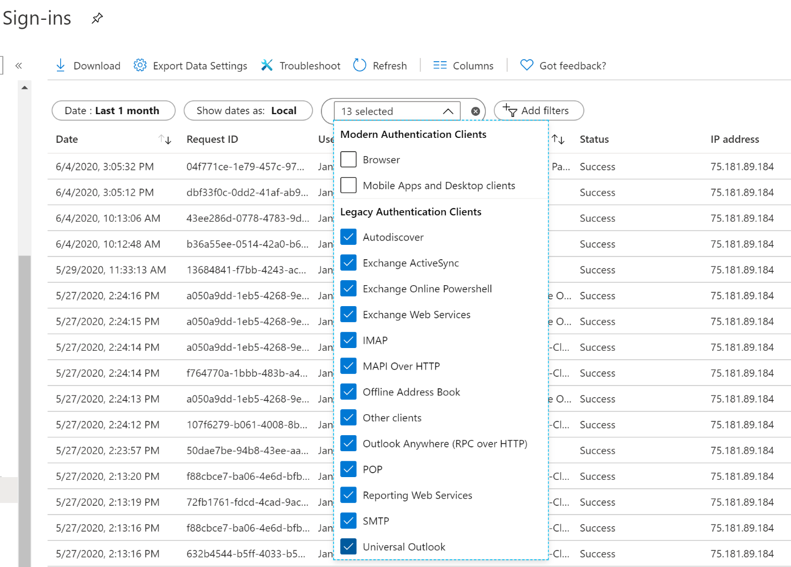
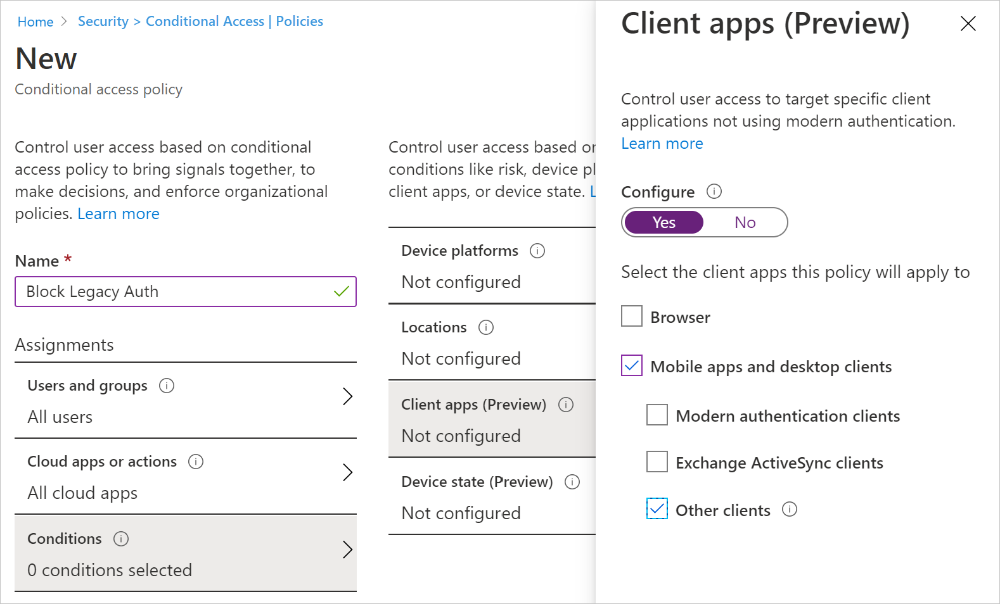
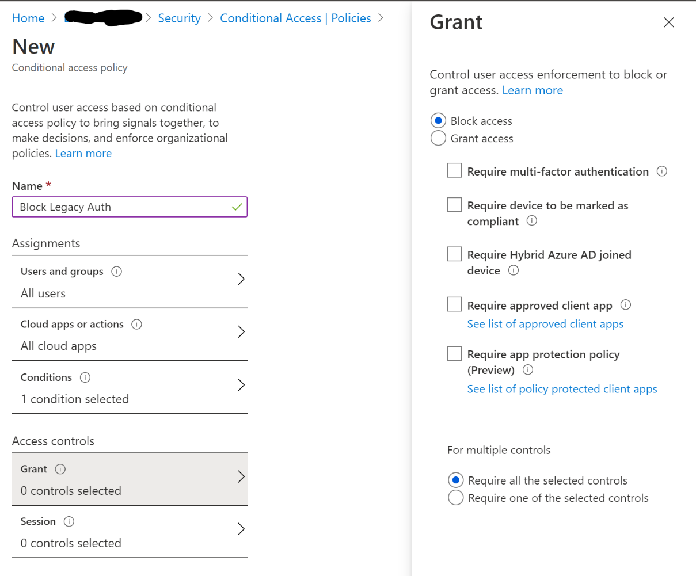

Before you can block legacy authentication in your directory, you need to first understand if your users have apps that use legacy authentication and how it affects your overall directory. Azure AD sign-in logs can be used to determine if you're using legacy authentication.

1. Navigate to the **Azure portal > Azure Active Directory > Sign-ins**.
2. Add the Client App column if it is not shown by clicking on **Columns > Client App**.
3. Filter by **Client App** > check all the **Legacy Authentication Clients** options presented.
4. Filter by **Status > Success**.

Filtering will only show you successful sign-on attempts that were made by the selected legacy authentication protocols. Clicking on each individual sign-on attempt will show you additional details. The Client App column or the Client App field under the Basic Info tab after selecting an individual row of data indicates which legacy authentication protocol was used. These logs indicate which users are still depending on legacy authentication and which applications are using legacy protocols to make authentication requests. For users that do not appear in these logs and are confirmed to be not using legacy authentication, implement a Conditional Access policy: block legacy authentication for these users only.

To create a Conditional Access policy to block legacy authentication, perform the following steps:

1. Create a new Conditional Access policy.
2. Target the users and groups who can be blocked.
3. Select **All Cloud apps**.
4. Under Conditions, select **Client apps (preview)**, set Configure to **Yes**, and check only the boxes **Mobile apps and desktop clients > Other clients**.

  

5. Finally, under Access controls, select **Grant > Block.**

  

You should enable this policy as Report-only first, so you can learn which users are using legacy authentication.

Once you have a better idea who is using legacy authentication in your directory and which applications depend on it, the next step is upgrading your users to modern authentication. The following steps provide an overview of the path to modern authentication:

1. **Enable modern authentication**. Modern authentication is enabled by default for directories created on or after August 1, 2017. If your directory was created prior to this date, you'll need to manually enable modern authentication for your directory using PowerShell. For organizations actively using basic authentication for Exchange Online, be aware that basic authentication will be disabled for all tenants in the second half of 2021.

  The following PowerShell commands can be used to enable modern authentication:

  - Exchange Online:
    **Set-OrganizationConfig -OAuth2ClientProfileEnabled $True**
  - Skype for Business Online
    **Set-CsOAuthConfiguration -ClientAdalAuthOverride Allowed**

2. **Update applications**. Once you have enabled modern authentication in your directory, you can start updating applications by enabling modern authentication for Office clients. Office 2016 or later clients support modern authentication by default. No extra steps are required.

For Office 2013, the following registry keys are required:

  HKCU\SOFTWARE\Microsoft\Office\15.0\Common\Identity\EnableADAL
    Type REG_DWORD
	Value 1
  HKCU\SOFTWARE\Microsoft\Office\15.0\Common\Identity\Version
	Type REG_DWORD
	Value 1

3. **Enable Exchange Online modern authentication**. In order for Windows-based Outlook clients to use modern authentication, Exchange Online must be modern authentication-enabled as well. If modern authentication is disabled for Exchange Online, Windows-based Outlook clients that support modern authentication (Outlook 2013 or later) will use basic authentication to connect to Exchange Online mailboxes.

SharePoint Online is enabled for modern authentication default. For directories created after August 1, 2017, modern authentication is enabled by default in Exchange Online. However, if you had previously disabled modern authentication or if you are using a directory created prior to this date, you will need to manually enable modern authentication.

4. **Enable Skype for Business Online modern authentication**. To prevent legacy authentication requests made by Skype for Business, it's necessary to enable modern authentication for Skype for Business Online. For directories created after August 1, 2017, modern authentication for Skype for Business is enabled by default. We suggest you transition to Microsoft Teams, which supports modern authentication by default.

5. **Block legacy authentication on your mobile device applications**. Applications on your mobile device need to block legacy authentication as well. We recommend using Outlook for Mobile. Outlook for Mobile supports modern authentication by default and will satisfy other MFA baseline protection policies.
